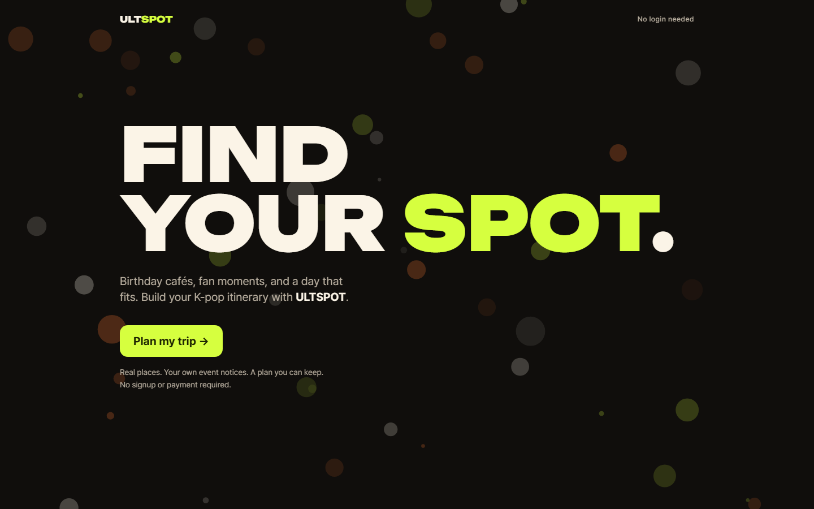

# ULTSPOT

지도 연동 검토: `node scripts/review/travel-contract.mjs <검사할-checkout-경로>`. 실제 API 호출 없이 서버 계약을 검사합니다. [수정·통합 기준](docs/handoff/kiro-integration-review.md)을 참고하세요.

> **FIND YOUR SPOT.** — 여행 날짜에 맞춰 생일카페·팝업 이벤트를 매칭해주는, 글로벌 K팝 팬을 위한 AI 덕질 여행 플래너



**데모: https://ultspot.vercel.app** · 모바일 우선 **반응형 웹앱**입니다. 보여지는 것이 핵심인 서비스라, 모든 화면 작업은 3개 뷰포트 캡처와 함께 기록됩니다.

| | |
|---|---|
| 프레임워크 | Next.js 16 (App Router, Turbopack) · React 19 · TypeScript |
| 스타일 | Tailwind CSS 4 + 브랜드 토큰 (`src/styles/theme.css`) |
| 백엔드 | Supabase (`@supabase/ssr`) |
| 추천 | TypeSafe Jev — 주변 후보의 **취향 순위만**. 시간·영업시간·이동 계산은 코드가 한다 |
| 장소·경로 | 카카오 로컬(주변 검색)·카카오 길찾기(대중교통·도보) · 한국관광공사 TourAPI(영업시간·사진) |
| 지도 | Google Maps(키가 있으면) · 없으면 카카오 지도 |
| 분석 | Vercel Analytics · Google Analytics 4 |
| 테스트·캡처 | Playwright (Chromium) |
| 패키지 매니저 | pnpm 10 · Node 24 |

---

## 무엇을 하나

1. **최애 고르기 → SPOT 고르기 → 기간 정하기** — 검수한 K팝 장소·생일카페 중 갈 곳을 담는다.
2. **일정 받기** — 운영시간이 확인된 곳만 시간표에 넣는다. 이동시간은 카카오 길찾기로 재고, 못 잰 구간은 "미확인 · 계획용 여유"로 따로 보여준다.
3. **빈 시간 채우기** (T-049~T-051) — 확정 일정 사이·끝에 한 시간 이상 비면 주변 식사·카페·관광을 이어서 넣는다. 한국관광공사 영업시간을 아는 곳은 여는 시각·브레이크 타임·휴무일에 맞추고, 사진과 공공누리 출처를 붙인다. 모르는 곳은 "영업시간 미확인"으로 구분한다. 추천은 캘린더·파일로 내보내지 않는다.
4. **여러 날 여정·현장 기록** — 날짜별 일정, 체크인·가계부·발자취 카드.

추천 결과를 LLM이 만들지 않는다. 순위만 Jev가 매기고, 들어갈 수 있는지는 코드가 계산한다. 같은 입력이면 같은 결과가 나오고, 없는 영업시간·이동시간을 지어내지 않기 위해서다.

## 빠른 시작

```bash
pnpm install
cp .env.example .env.local        # Supabase 키가 없어도 화면은 뜹니다
pnpm dev                          # http://localhost:3000
```

- `/` — 비회원 플래너 진입
- `/plan` — 실제 장소·개인 행사 입력·일정 생성/수정·기기 저장/복원·다운로드. 클라우드 저장 연결은 [설정 안내](docs/setup-cloud-trips.md) 참조.
- `/design-system` — 디자인 토큰·컴포넌트 확인 화면

화면 캡처·E2E를 돌리려면 최초 1회 브라우저를 설치합니다.

```bash
pnpm exec playwright install chromium
```

## 스크립트

| 명령 | 하는 일 |
|------|---------|
| `pnpm dev` | 개발 서버 |
| `pnpm build` / `pnpm start` | 프로덕션 빌드 / 실행 |
| `pnpm lint` | ESLint |
| `pnpm typecheck` | `tsc --noEmit` |
| `pnpm test:e2e` | 전체 E2E (mobile 390·tablet 768·desktop 1440). 외부 API는 화면 스펙에서 고정값으로 막는다 |
| `pnpm test:data` | 수집 데이터 검사 |
| `pnpm capture T-NNN [화면,...]` | 3개 뷰포트 스크린샷 → `docs/tasks/T-NNN/screenshots/` |
| `pnpm check:prod <URL>` | 배포 주소에 E2E 전체를 돌린다. `main` 머지 뒤 `https://ultspot.vercel.app`로 실행 |

## 배포

`main`에 머지되면 Vercel이 프로덕션에 자동 배포합니다. PR 브랜치는 미리보기로 배포됩니다.

- **공개·제출용 주소는 프로덕션 도메인만** 씁니다. 배포별(`ultspot-<hash>-tlstkdgus.vercel.app`)·브랜치별(`ultspot-git-<branch>-…`) 주소는 Vercel 로그인이 먼저 뜹니다.
- 배포 후 `pnpm check:prod <프로덕션 URL>`로 확인합니다.
- 환경 변수는 Vercel 프로젝트 설정 → Environment Variables에 넣습니다 (`.env.local`은 로컬 전용).
- 대회 제출 요건과 마감 전 체크리스트: [docs/specs/submission-requirements.md](docs/specs/submission-requirements.md)

## 환경 변수

`.env.example`을 `.env.local`로 복사해 채웁니다.

발급 방법과 키 제한 설정은 `.env.example`의 각 항목에 있습니다. **Vercel 유형**: `NEXT_PUBLIC_` 변수는 빌드에 들어가야 해서 **Config**, 서버 키는 **Secret(Sensitive)** 입니다. Secret으로 넣은 `NEXT_PUBLIC_` 값이 빌드에 들어가지 않은 적이 있습니다. 값을 바꾼 뒤에는 재배포해야 반영됩니다.

| 변수 | 노출 | Vercel | 없으면 |
|------|------|--------|--------|
| `NEXT_PUBLIC_SUPABASE_URL` · `NEXT_PUBLIC_SUPABASE_PUBLISHABLE_KEY` | 브라우저 | Config | 클라우드 저장 없음. 실제 보호는 RLS |
| `NEXT_PUBLIC_ENABLE_CLOUD_TRIPS` | 브라우저 | Config | 기본 false ([설정](docs/setup-cloud-trips.md)) |
| `KAKAO_REST_API_KEY` | **서버** | Secret | 이동시간이 전부 "미확인 · 계획용 여유". 주변 추천은 TourAPI 후보만 |
| `NEXT_PUBLIC_KAKAO_JS_KEY` | 브라우저 | Config | 카카오 지도 대신 링크만 |
| `TYPESAFE_API_KEY` | **서버** | Secret | 주변 추천이 거리순 |
| `TOUR_API_KEY` | **서버** | Secret | 영업시간·사진 없이 카카오 후보만 (전부 "영업시간 미확인") |
| `GOOGLE_MAPS_API_KEY` | **서버** | Secret | Google 장소 사진 없음 |
| `NEXT_PUBLIC_GOOGLE_MAPS_JS_KEY` | 브라우저(리퍼러 제한) | Config | 일정 지도가 카카오. Google 사진도 쓰지 않음(Places 약관) |
| `NEXT_PUBLIC_GA_MEASUREMENT_ID` | 브라우저(공개 값) | Config | GA 없음 |
| `OPENAI_API_KEY` | **서버** | — | 쓰지 않음. 시간 계산을 LLM에 맡기지 않기로 했다(T-049) |

서버 쪽 외부 호출에는 일일 상한이 있습니다: 카카오 경로 800 · 주변 검색 600 · Jev 300 · TourAPI 검색 400·영업시간 600 · Google 사진 30. 인스턴스마다 따로 세는 메모리 상한입니다.

## 폴더 구조

```
src/
  app/                  라우트 (App Router)
    design-system/      토큰·컴포넌트 확인 화면
  components/
    ui/                 Button · Badge · Chip · DateChip · Card · AvatarStack · Eyebrow
    brand/              Wordmark · SpotPin · DotField · DotLoader
  design-system/
    tokens.ts           CSS 토큰의 JS 사본 (canvas·meta 전용)
  styles/
    theme.css           디자인 토큰 단일 원천 (Tailwind @theme)
  lib/
    cn.ts               className 병합 (커스텀 스케일 등록된 tailwind-merge)
    supabase/           client · server · proxy(세션 갱신)
  proxy.ts              요청 앞단 Supabase 세션 갱신 (Next 16의 middleware)
e2e/
  routes.ts             캡처·smoke·공개 접근 검사 대상 화면 목록
docs/
  specs/                기획서·제출 요건
  design-system.md      디자인 시스템 사용 규칙
  tasks/                태스크별 기록과 스크린샷
scripts/
  capture.mjs           pnpm capture 진입점
  check-prod.mjs        pnpm check:prod 진입점
```

## 문서

T-011: `/plan`의 Your spots에서 아티스트 검색·다중 선택·저장이 가능합니다. 현재 공개 범위와 부분 날짜/회차별 예매 데이터 규칙은 [카탈로그 조건](docs/data/catalog-conditions.md)에 정리했습니다. 별도 API 키·migration 추가는 없습니다.

새 수집 CSV의 접수·보완 검토는 `pnpm data:audit <CSV 폴더> <접수-ID> <YYYY-MM-DD>`로 수행합니다. 원본 해시·변환 후보·추가 메모·오류 보고서를 Git 제외 폴더에 보관하며 업로드하지 않습니다. `event_conditions`는 선택 탭이며 원문 조건을 보존합니다. 미지원 CSV(예: changelog)는 audit의 sidecar에 원본 바이트로 보관하고, strict check/prepare는 누락 방지를 위해 해당 CSV가 있는 폴더를 거부합니다. 검수한 candidate JSON을 사용하세요. [두 번째 수집 검토](docs/data/second-collection-review.md)를 참고하세요.

수집 원본은 `.local-data/incoming/`에 넣습니다(Git 제외). `pnpm data:check <CSV 폴더 또는 JSON>`으로 검증하고 `pnpm data:prepare <경로> <batch-id>`로 비공개 적재 SQL을 생성합니다. 테스트는 `pnpm test:data`. [적재 안내](docs/data/intake.md)에 DB 적용·검수 절차가 있습니다. 엑셀·문서는 별도 변환이 필요합니다.

데이터 수집 담당자에게는 [수집 요청서](docs/data/collection-brief.md)와 [복사용 프롬프트](docs/data/collection-prompt.md)를 함께 전달하세요. 제품 반영 범위와 미구현 기능은 [여러 아티스트 지원 계획](docs/specs/multi-artist-data.md)에 정리했습니다.

| 문서 | 내용 |
|------|------|
| [CONTRIBUTING.md](CONTRIBUTING.md) | **브랜치 · 커밋 · PR · 캡처 · 태스크 기록 규칙** — 작업 전에 먼저 읽어주세요 |
| [docs/specs/submission-requirements.md](docs/specs/submission-requirements.md) | **원티드 AI 챔피언십 제출 요건** (마감 9/20) — 설치·키 발급 없이 체험, 서버 전용 키, 접속 가능 상태 |
| [docs/specs/prd.md](docs/specs/prd.md) | **PRD** — 목표·범위(P0/P1/P2)·지표. 짝 문서: [기능명세서](docs/specs/functional-spec.md) · [유저플로우](docs/specs/user-flow.md) |
| [docs/design-system.md](docs/design-system.md) | 토큰·컴포넌트 사용법과 브랜드 가이드 규칙 |
| [docs/tasks/](docs/tasks/README.md) | 태스크 목록과 작업 기록 |
| [docs/tasks/T-055](docs/tasks/T-055/README.md) | 최근 impeccable UI 감사(17/20)와 남은 과제 |

### Jev 추천 평가

합성 데이터 30건의 오프라인 검사: `node scripts/jev/evaluate.mjs`. 요청 생성·결과 채점과 실제 평가 전제는 [Jev 평가 계약](docs/specs/jev-evaluation.md)을 참고하세요. 기본 실행은 외부 API를 호출하지 않습니다.
일본어·중국어 장소 데이터: [번역 계약](docs/specs/localized-place-data.md). 여러 날 여행 확장: [구현 계약 초안](docs/specs/multi-day-product-contract.md).

여러 날 일정 저장 모듈과 DB 적용 순서: [journey-storage](docs/specs/journey-storage.md).

체크인·공간 현황·포인트·가계부의 권한·동의·삭제 계약과 적용 절차: [on-site-records](docs/specs/on-site-records.md). 이 문서는 결정 C-12의 개정 기록도 담고 있습니다.
