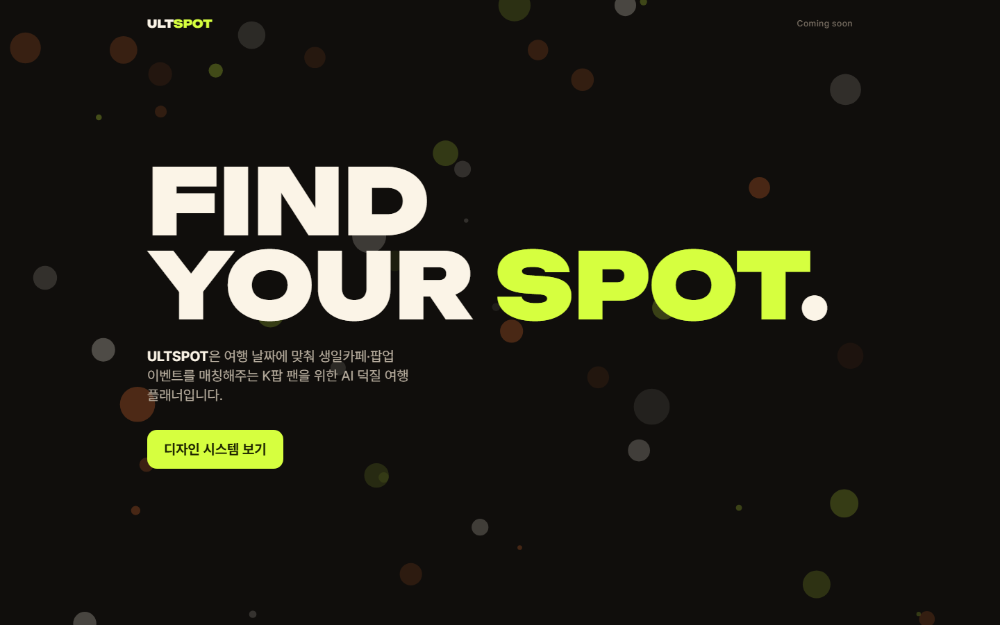

# ULTSPOT

> **FIND YOUR SPOT.** — 여행 날짜에 맞춰 생일카페·팝업 이벤트를 매칭해주는, 글로벌 K팝 팬을 위한 AI 덕질 여행 플래너



**데모: https://ultspot.vercel.app** · 모바일 우선 **반응형 웹앱**입니다. 보여지는 것이 핵심인 서비스라, 모든 화면 작업은 3개 뷰포트 캡처와 함께 기록됩니다.

| | |
|---|---|
| 프레임워크 | Next.js 16 (App Router, Turbopack) · React 19 · TypeScript |
| 스타일 | Tailwind CSS 4 + 브랜드 토큰 (`src/styles/theme.css`) |
| 백엔드 | Supabase (`@supabase/ssr`) |
| AI | OpenAI API (예정) |
| 테스트·캡처 | Playwright (Chromium) |
| 패키지 매니저 | pnpm 10 · Node 24 |

---

## 빠른 시작

```bash
pnpm install
cp .env.example .env.local        # Supabase 키가 없어도 화면은 뜹니다
pnpm dev                          # http://localhost:3000
```

- `/` — 임시 랜딩
- `/design-system` — 디자인 토큰·컴포넌트 확인 화면

화면 캡처·E2E를 돌리려면 최초 1회 브라우저를 설치합니다.

```bash
pnpm exec playwright install chromium
```

## 스크립트

| 명령 | 하는 일 |
|------|---------|
| `pnpm dev` | 개발 서버 |
| `pnpm build` / `pnpm start` | 프로덕션 빌드 / 실행 |
| `pnpm lint` | ESLint |
| `pnpm typecheck` | `tsc --noEmit` |
| `pnpm test:e2e` | 반응형 smoke + 토큰 일치 검사 (mobile·tablet·desktop) |
| `pnpm capture T-NNN [화면,...]` | 3개 뷰포트 스크린샷 → `docs/tasks/T-NNN/screenshots/` |
| `pnpm check:prod <URL>` | 배포 주소를 시크릿 창 조건으로 검사 (로그인·비밀번호 화면 없이 열리는지 + smoke + 토큰) |

## 배포

`main`에 머지되면 Vercel이 프로덕션에 자동 배포합니다. PR 브랜치는 미리보기로 배포됩니다.

- **공개·제출용 주소는 프로덕션 도메인만** 씁니다. 배포별(`ultspot-<hash>-tlstkdgus.vercel.app`)·브랜치별(`ultspot-git-<branch>-…`) 주소는 Vercel 로그인이 먼저 뜹니다.
- 배포 후 `pnpm check:prod <프로덕션 URL>`로 확인합니다.
- 환경 변수는 Vercel 프로젝트 설정 → Environment Variables에 넣습니다 (`.env.local`은 로컬 전용).
- 대회 제출 요건과 마감 전 체크리스트: [docs/specs/submission-requirements.md](docs/specs/submission-requirements.md)

## 환경 변수

`.env.example`을 `.env.local`로 복사해 채웁니다.

| 변수 | 노출 | 설명 |
|------|------|------|
| `NEXT_PUBLIC_SUPABASE_URL` | 브라우저 | Supabase 프로젝트 URL |
| `NEXT_PUBLIC_SUPABASE_PUBLISHABLE_KEY` | 브라우저 | `sb_publishable_…` 키. 실제 보호는 RLS가 합니다 |
| `OPENAI_API_KEY` | **서버 전용** | 예정. `NEXT_PUBLIC_`을 절대 붙이지 않습니다 |

## 폴더 구조

```
src/
  app/                  라우트 (App Router)
    design-system/      토큰·컴포넌트 확인 화면
  components/
    ui/                 Button · Badge · Chip · DateChip · Card · AvatarStack · Eyebrow
    brand/              Wordmark · SpotPin · DotField · DotLoader
  design-system/
    tokens.ts           CSS 토큰의 JS 사본 (canvas·meta 전용)
  styles/
    theme.css           디자인 토큰 단일 원천 (Tailwind @theme)
  lib/
    cn.ts               className 병합 (커스텀 스케일 등록된 tailwind-merge)
    supabase/           client · server · proxy(세션 갱신)
  proxy.ts              요청 앞단 Supabase 세션 갱신 (Next 16의 middleware)
e2e/
  routes.ts             캡처·smoke·공개 접근 검사 대상 화면 목록
docs/
  specs/                기획서·제출 요건
  design-system.md      디자인 시스템 사용 규칙
  tasks/                태스크별 기록과 스크린샷
scripts/
  capture.mjs           pnpm capture 진입점
  check-prod.mjs        pnpm check:prod 진입점
```

## 문서

| 문서 | 내용 |
|------|------|
| [CONTRIBUTING.md](CONTRIBUTING.md) | **브랜치 · 커밋 · PR · 캡처 · 태스크 기록 규칙** — 작업 전에 먼저 읽어주세요 |
| [docs/specs/submission-requirements.md](docs/specs/submission-requirements.md) | **원티드 AI 챔피언십 제출 요건** (마감 9/20) — 설치·키 발급 없이 체험, 서버 전용 키, 접속 가능 상태 |
| [docs/specs/prd.md](docs/specs/prd.md) | **PRD** — 목표·범위(P0/P1/P2)·지표. 짝 문서: [기능명세서](docs/specs/functional-spec.md) · [유저플로우](docs/specs/user-flow.md) |
| [docs/design-system.md](docs/design-system.md) | 토큰·컴포넌트 사용법과 브랜드 가이드 규칙 |
| [docs/tasks/](docs/tasks/README.md) | 태스크 목록과 작업 기록 |
