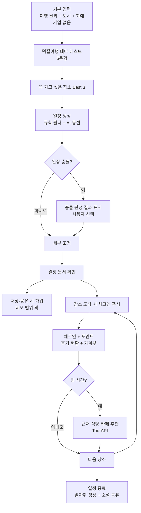

# ULTSPOT 프로덕트 기획안 v0.5

Sep 17, 2026 · v0.4(@Someone) 기반 개정 초안 — **검토 필요**

ULTSPOT은 글로벌 K팝 팬이 최애를 따라 한국을 여행하도록 일정 설계부터 현장 체크인, 여행 기록까지 이어주는 AI 덕질 여행 플래너다.

| 항목 | 내용 |
|------|------|
| 제품명 | ULTSPOT (확정) |
| 컨셉 | 글로벌 K팝 팬들을 위한 AI 덕질 여행 플래너 |
| 문서 상태 | 초안 v0.5 — 제출 요건·데이터 확보 방식·데모 범위 반영 |
| 제출 | **원티드 AI 챔피언십 · 마감 2026-09-20(일) 23:59:59** |
| 데모 | https://ultspot.vercel.app |
| 이전 문서 | 프로덕트 기획안 v0.4 (2026-09-17), v0.3 (Google Docs) |
| 참고 | 브랜드 가이드 v1.0 · [제출 요건](submission-requirements.md) · [테마 테스트 초안](theme-test.md) · [장소 데이터 확보 방안](../data/place-data-sourcing.md) |
| 다음 단계 | v0.5 오픈 이슈 확정(10.2) → 3일 구현 → 제출 |

> 표기: 본문의 **[v0.5]** 는 이번 개정에서 바뀌거나 새로 들어간 내용이다.

---

## 개정 이력

v0.5는 제품 컨셉을 바꾸지 않는다. v0.4가 "미정"으로 남긴 **제출 조건·일정·데이터 확보 방식**이 확인되면서, 해커톤 데모를 실제로 만들 수 있는 범위로 좁히고 그 과정에서 드러난 제약을 기획에 반영한 개정이다.

### v0.5 — 제출 조건·데이터 현실 반영

| 항목 | v0.4 | v0.5 | 근거 |
|------|------|------|------|
| 제출 조건 | 제출일·심사 기준 미정 (10.2) | 원티드 AI 챔피언십. **웹 데모 링크 제출**, 설치·환경 설정·API 키 발급 없이 체험, 심사 기간 접속 유지 | 운영진 공지 (2026-09-16) |
| 일정 | 주차 단위 3주 | **3일 역산** (9/17~9/20) | 마감 확인 |
| 가입 | 회원 기반. 플로우가 회원가입으로 시작 | **데모는 가입 없이 핵심 흐름 전체 체험.** 가입은 저장·공유 시점으로 미룸 (데모 범위 외) | 팀 판단 — 가입 이탈 리스크(1장), v0.4 오픈 이슈. *공지 요건은 아님* |
| 팬 이벤트 데이터 | 추출·제휴 / 데모는 수작업 큐레이션 | **X API로 주최자 공지 수집 → AI 포스터 추출 → 사람 검수.** 국내 아그리게이터 크롤링·복제 금지 | 원출처가 주최자 X 공지. 팝가 약관은 자동·수동 추출 모두 금지 |
| 주변 식당·카페 추천 | 목업 | **한국관광공사 TourAPI로 실제 동작 가능** (P1) | 무료, 이용허락범위 제한 없음 |
| 테마 테스트 | 문항·테마 미정 | **5문항·테마 4종 초안**, 규칙 기반 계산 | [theme-test.md](theme-test.md) |
| AI의 역할 | 일정 생성·테마 해석 전반 | **날짜 필터·충돌 판정·거리 계산은 규칙(코드), AI는 동선 구성과 설명.** AI 실패 시 대체 일정 | 헛걸음 방지(2.2)는 틀리면 안 되는 계산 |
| 데이터 BM | 공간 방문 데이터 B2B·B2G 판매 | **X에서 얻은 데이터는 판매 대상에서 제외.** 판매는 ULTSPOT 체크인·방문 기록만 | X 개발자 정책: 제3자 제공은 ID만 |
| 데모 지역 | 홍대·성수·강남·건대 | **조정 필요** — 확인된 상설 스키즈 장소가 강남·송파에 몰려 있음 | 장소 조사 (6장·7.2) |
| 데모 날짜 | 스트레이 키즈 생일 구간 9/12~9/24 | 실제 이벤트 + **심사 기간용 샘플 이벤트("Sample" 표시)** | 9/24 이후 심사 시 결과 0건 위험 |
| 경쟁 지형 | 10개 서비스 | 네이버 지도(팝업스토어 업종), Offmate·Saengca Day 추가 | 6장 |

### v0.4 — 컨셉 전환: ULTSPOT (요약)

"팬 이벤트 발견·번역 레이어"에서 "AI 덕질 여행 플래너"로 범위를 넓혔다. 계획 → 현장 → 기록 전 과정을 다루고, 가정 5·6과 Basic/Premium → 공간 방문 데이터 BM을 신설했다.

### v0.3 — 1차 MVP 구체화 (요약)

- 스트레이 키즈 생일 구간(9/12~9/24)을 1차 검증 대상으로 확정
- 페르소나 3종, 성공·반증 지표, 타겟 리서치 계획 수립

### v0.2 — 경쟁 지형 반영 (요약)

- 한국어권에는 덕플레이스·팝가가 이미 존재함을 확인. 공백을 외국인 대응 영역으로 한정
- 공급측(대관 카페) 자발적 등록이 작동 중임을 확인하고 리스크 등급 하향

---

## 0. 문서 목적과 검증 가정

이 문서는 확정안이 아니라 ULTSPOT이 성립하기 위해 검증해야 할 가정을 기술한다. **[v0.5]** 데이터 확보 방식이 정해지면서 공급 측 가정 1개를 추가해 7개가 됐다.

| 구분 | 가정 | 검증 상태 | 출처 |
|------|------|-----------|------|
| 가정 1 | 팬 이벤트 포스터에서 여행에 필요한 정보를 신뢰할 수준으로 추출할 수 있다 | 미검증 → **[v0.5] X 수집 파이프라인의 검수 결과로 측정** | v0.3 유지 |
| 가정 2 | 외국인 팬은 팬 이벤트·덕질 장소에 가고 싶지만 정보 접근 문제로 못 간다 | 미검증 | v0.3 유지 |
| 가정 3 | 주최자와 대관 카페는 외국인 유입을 원한다 | 부분 검증 | v0.3 유지 |
| 가정 4 | 기존 한국어 서비스가 있어도 외국인 팬 전용 레이어에 수요가 있다 | 미검증 | v0.3 유지 |
| 가정 5 | 외국인 팬은 장소 목록이 아니라 "실행 가능한 일정"을 원하며, 이를 위해 취향 입력을 감수한다 | 미검증 | v0.4 신설 · **[v0.5] "가입"을 뺌** (데모는 가입 없음) |
| 가정 6 | 팬은 포인트·해제 보상이 있으면 현장에서 체크인하고 후기를 남긴다 (데이터 BM의 전제) | 미검증 | v0.4 신설 |
| **가정 7** | **팬 이벤트의 원출처(주최자 X 공지)에서 서비스에 필요한 수의 이벤트를, 정책을 지키며 수집할 수 있다** | 미검증 | **v0.5 신설** |

가정 5와 6이 v0.4의 핵심이고, **가정 7은 v0.5에서 가장 먼저 확인할 가정이다.** 가정 7이 무너지면 제휴(덕플레이스·팝가 등) 외에 이벤트 정보를 확보할 합법적 경로가 없다.

---

## 1. 시장 배경

방한 유입은 콘텐츠가 이미 만들고 있고, 병목은 체류·확산과 디지털 입구에 있으며, 팬덤은 그 병목을 푸는 검증된 지렛대다. v0.3의 근거를 그대로 유지한다.

| 관점 | 근거 | ULTSPOT 시사점 |
|------|------|----------------|
| 유입은 해결됨 | 2025년 방한 외래관광객 1,870만 명, 2026년 2,036만 명 전망. 방문객 약 40%가 한류 접촉 후 관심 [1][3] | 인지·유입 촉진이 아니라 방한 이후 경험에 집중 |
| 병목은 체류·확산 | 체류 기간 2019년 대비 0.085일 증가에 그침. 서울 77.3% 집중 [2] | 동선·일정 설계가 체류 연장과 지역 분산에 기여 → B2G 근거 |
| 이탈은 디지털 입구 | 한국 불편의 27.8%가 디지털 영역(가입·인증 13.1%, 결제 11.5%, 앱 오류 10.4%) [4] | 가입·결제 장벽이 제품의 최대 이탈 지점. 온보딩 설계에 반영 |
| 팬덤은 예외적으로 강함 | 글로벌 한류 소비액 전년 대비 54.6% 증가. BTS 부산 공연 기간 해외 여행객 평균 체류 5.7일 [5][6] | 최애 기반 여행은 체류·소비 모두 크다 → 데이터 가치도 크다 |

**[v0.5]** "가입·인증 13.1%"는 해커톤 심사 환경에서도 그대로 재현된다. 심사자가 가입 단계에서 멈추면 핵심 기능을 보지 못한다. 그래서 데모는 **결과를 먼저 보여주고 가입은 저장·공유 시점으로 미룬다.** 이 결정은 공지 요건이 아니라 이 근거에 따른 팀 판단이다.

---

## 2. 문제 정의

외국인 K팝 팬은 "어디가 있는지"를 알게 되더라도, 그것을 자신의 여행 날짜 안에서 실행 가능한 일정으로 만들지 못한다. v0.3은 탐색 단계의 단절을, v0.4는 탐색 이후의 계획·실행·기록까지를 문제 범위로 본다.

### 2.1 여행 단계별 문제

| 단계 | 팬이 겪는 문제 | 기존 대안의 한계 |
|------|----------------|------------------|
| 탐색 | 정보가 한국어·포스터 이미지·팬덤 은어로 존재. 영어 탐색 경로에 노출되지 않음 | 덕플레이스·팝가 등은 한국어 중심. **[v0.5]** 네이버 지도는 공식 팝업만 정리하고 생일카페는 정리하지 않음 |
| 계획 | 3~5일짜리 이벤트, 상설 장소, 공연 일정이 서로 겹침. 무엇을 포기할지 판단하기 어려움 | 기존 서비스는 아티스트 기준 조회. 날짜 충돌 판정 기능 없음 |
| 현장 | 동선 사이 빈 시간에 먹을 곳을 따로 찾아야 함. 특전 소진·운영시간 변동을 모름 | 지도 앱과 X를 오가며 수동 확인 |
| 기록 | 사진·지출·방문 장소가 여러 앱에 흩어짐. "최애 따라간 여행"을 한 번에 보여줄 방법이 없음 | 인스타그램·가계부 앱 등에 개별 기록 |

### 2.2 원칙

- **날짜가 먼저다.** 외국인 팬은 여행 날짜를 고정한 뒤 장소를 찾는다. ULTSPOT의 온보딩도 일정 입력으로 시작한다.
- **번역이 아니라 행동으로 옮긴다.** "선착 100명 럭드" 같은 조건은 "무엇을 하면 무엇을 받는가"로 재기술한다.
- **공간 사생활을 지킨다.** 숙소·자택·사옥 등 개인·업무 공간은 추천·체크인 대상에서 제외한다.
- **[v0.5] 원출처를 존중한다.** 이벤트 정보는 주최자 공지를 기준으로 하고 원문 링크를 함께 보여준다. 원문이 삭제되면 ULTSPOT에서도 내린다. 다른 서비스가 모은 목록은 허락 없이 가져오지 않는다.
- **[v0.5] 틀리면 안 되는 계산은 AI에 맡기지 않는다.** 운영 기간·영업시간·충돌 판정은 규칙으로 계산하고, AI는 그 결과를 바탕으로 동선과 설명을 만든다.

---

## 3. 제품 컨셉 — ULTSPOT

ULTSPOT은 "최애 + 날짜 + 도시"를 넣으면 AI가 덕질 여행 일정을 만들고, 현장에서는 체크인과 기록을 돕고, 여행이 끝나면 발자취를 공유 가능한 형태로 돌려주는 서비스다.

### 3.1 여행 단계별 기능 구조

| 단계 | 핵심 기능 | 사용자가 얻는 것 | ULTSPOT이 얻는 것 |
|------|-----------|------------------|-------------------|
| 계획 (Before) | 기본 입력, 덕질여행 테마 테스트, Best 3 선택, AI 일정 생성, 충돌 판정, 세부 조정, 일정 문서 | 날짜 안에서 실행 가능한 일정표 | 취향·일정 데이터 |
| 현장 (During) | 위치 기반 체크인 푸시, 포인트, 공간 커뮤니티, 가계부, 빈 시간 식당·카페 추천 (**[v0.5] TourAPI**) | 헛걸음 방지, 실시간 현황, 지출 관리 | 공간 방문·체류·지출 데이터 |
| 기록 (After) | 사진 자동 수집, "최애 따라 N km" 발자취, 소셜 공유 카드 | 여행 기록물, 자랑거리 | 바이럴 유입 |

### 3.2 v0.3 레이어 구조와의 관계

| v0.3 레이어 | v0.5에서의 위치 |
|-------------|-----------------|
| 데이터층 (이벤트 정보 확보) | 장소 DB. **[v0.5]** 팬 이벤트는 **X API(주최자 공지) 수집 + AI 추출 + 사람 검수**, 상설 장소는 출처 교차 확인 큐레이션, 주변 식당·관광지는 **TourAPI**. 아그리게이터는 제휴 대상으로만 둔다 |
| 변환층 (다국어·은어 변환) | 장소 카드와 공간 커뮤니티의 기본 원칙으로 유지 |
| 소비층 (날짜 기준 조회) | AI 일정 생성으로 확장 |
| 판매층 (지자체·상권 제안) | 공간 방문 데이터 B2B·B2G 판매로 구체화 (5장). **[v0.5] X 유래 데이터 제외** |

### 3.3 AI와 규칙의 역할 분담 **[v0.5 개정]**

v0.4는 일정 생성·테마 해석·정보 변환 모두를 "AI가 필요한 이유"로 들었다. v0.5는 **결과가 틀리면 사용자가 헛걸음하는 계산**과 **해석·생성이 필요한 작업**을 나눈다.

| 작업 | 담당 | 이유 |
|------|------|------|
| 여행 기간과 운영 기간 겹침, 영업시간 필터 | **규칙** | 틀리면 헛걸음. 항상 같은 결과여야 함 |
| 일정 충돌 판정 ("A와 B 중 선택") | **규칙** | 판단 근거를 사용자에게 설명할 수 있어야 함 |
| 이동 거리·"최애 따라 N km" | **규칙** | 좌표 계산 |
| 테마 테스트 → 장소 가중치 | **규칙** (점수표) | 같은 답에 같은 결과. 조합 1,024개로 전부 설명 가능 ([theme-test.md](theme-test.md)) |
| 하루 동선 구성·순서, 일정 설명 문장 | **AI** | 여러 조건을 동시에 고려한 조합과 자연어 설명 |
| 포스터 이미지 → 이벤트 정보 추출 | **AI** + 사람 검수 | 이미지·은어 해석. v0.3에서 확인한 AI의 핵심 가치 |
| 팬덤 은어 → 행동 단위 재기술 | **AI** | 번역이 아니라 재기술 |

**AI 실패 대비:** AI 호출이 실패하거나 사용 한도에 걸리면 규칙으로 만든 기본 일정(가중치 순 + 동선 근접 순)을 보여준다. 심사 중 AI 장애가 "빈 화면"이 되지 않게 한다.

### 3.4 브랜드

제품명과 톤앤매너, 비주얼은 ULTSPOT 브랜드 가이드(v1.0, Neon Lime × Sunset Orange, 다크 전용)를 따른다. 화면·공유 카드 설계 시 해당 가이드를 기준 문서로 사용한다. 코드 토큰과 사용 규칙: [design-system.md](../design-system.md)

---

## 4. 핵심 사용자 플로우

플로우는 계획 → 현장 반복 → 기록의 세 구간으로 나뉘며, 현장 구간은 장소마다 반복된다.
**[v0.5]** 첫 단계가 "회원가입"에서 "기본 입력(가입 없음)"으로 바뀌고, 가입은 저장·공유 시점으로 이동한다.

### 4.1 계획 구간

| 단계 | 사용자 행동 | 시스템 처리 | 설계 메모 |
|------|-------------|-------------|-----------|
| 1. 기본 입력 | 여행 일정, 방문 도시, 최애(그룹·멤버) 선택 | 해당 기간 운영 중인 이벤트·상설 장소 후보 추출 (**규칙**) | 날짜를 첫 입력으로 둔다 (2.2). **[v0.5] 가입 없음** |
| 2. 테마 선택 | 심리테스트형 5문항에 답해 덕질여행 테마 결정 | 점수표로 테마·장소 유형 가중치·하루 장소 수·대기 허용도 계산 (**규칙**) | **[v0.5] 초안 확정:** 테마 4종 — Cup Sleeve Collector / Scene Stealer / Bias Taste Tour / Pop-up Raider |
| 3. Best 3 선택 | 후보 중 꼭 가고 싶은 3곳 선택 | 정렬 점수 = 유형 가중치 × 날짜 적합도 × 최애 일치 (**규칙**) | 우선순위가 명확해야 충돌 판정이 가능. 기간 한정 이벤트를 상설 장소보다 앞에 |
| 4. 일정 제공 | 생성된 일정 확인 | 이동 시간·운영 시간 반영(**규칙**) → 날짜별 동선·설명(**AI**) → 겹치면 판정 결과 표시 | "A와 B 중 선택" 형태로 판단을 사용자에게 넘긴다. AI 실패 시 기본 일정 |
| 5. 세부 조정 | 장소 추가·삭제·순서 변경 | 변경 시 일정 재계산 (**규칙**, AI 재호출 없음) | 조정마다 AI를 부르지 않아 빠르고 비용이 들지 않는다 |
| 6. 일정 문서 | 확정 일정을 인쇄·PDF로 받기 | 원문 링크·주소·운영시간 포함 문서 생성 | Basic 산출물의 기준 |

### 4.2 현장 구간 (장소마다 반복)

| 단계 | 트리거 | 사용자 행동 | 보상·데이터 |
|------|--------|-------------|-------------|
| 체크인 | 장소 반경 진입 시 푸시 "체크인 하시겠어요?" | 체크인 | 기본 포인트 / 방문 시각·장소 |
| 커뮤니티 기록 | 체크인 직후 | 현황(대기, 특전 잔여), 후기, 사진 작성 | 추가 포인트 / 실시간 현황·후기 |
| 가계부 | 체크인 직후 또는 수시 | 쓴 금액 기록 | 공간별 지출 데이터 |
| 빈 시간 추천 | 점심 시간 또는 일정상 공백 | 근처 식당·카페 선택 | 추천 수락률. **[v0.5] 후보는 TourAPI 음식점·카페** |

### 4.3 기록 구간

- 모든 일정 종료 시 장소별로 남긴 사진을 자동으로 모아 여행 기록을 만든다.
- "최애 따라 몇 km" 형태로 이동 거리와 방문 장소를 발자취로 시각화한다.
- 발자취는 소셜 공유용 카드로 내보낼 수 있으며, 공유 카드가 신규 유입 경로가 된다. **[v0.5]** 테마 테스트 결과 카드와 같은 틀을 재사용한다.

---

## 5. 비즈니스 모델

초기에는 여행자 대상 2티어(Basic/Premium)로 시작하고, 확장 단계에서 공간 방문 데이터를 B2B·B2G에 판매한다. 초기 BM은 사용자를 모으고, 포인트제 커뮤니티는 데이터를 쌓고, 확장 BM은 그 데이터로 매출을 만든다.

### 5.1 초기 BM — 여행자 대상

| 티어 | 제공 가치 | 제공 방식 | 수익 구조 |
|------|-----------|-----------|-----------|
| Basic | 원하는 장소만 골라 AI가 일정을 짜주고 문서화해 제공 | AI 일정 생성 + 일정표 문서(PDF 등) | 과금 여부·가격 미정 (10장) |
| Premium | 사용자 일정·취향에 맞는 한국인 가이드 매칭 + 견적 제안 | Basic 일정을 바탕으로 가이드가 견적 제안 | 가이드 매칭 수수료 추정. 비율 미정 |

Premium은 Basic의 산출물(확정된 일정표)을 견적 요청서로 그대로 쓰기 때문에, 가이드는 요구사항 파악 비용 없이 바로 견적을 낼 수 있다.

### 5.2 확장 BM — 공간 방문 데이터

| 구매자 | 활용 목적 (예상) | 제공 데이터 |
|--------|------------------|-------------|
| B2G (지자체·관광 기관) | 외국인 팬덤 관광 동선 파악, 지역 분산 정책, 관광 예산 집행 근거 | 국적·기간별 방문 동선, 체류 시간, 지역 분포 |
| B2B (상권·카페·팝업 운영사) | 외국인 팬 유입 규모 확인, 대관·마케팅 의사결정 | 공간별 방문 수, 시간대, 지출 규모 |
| B2B (엔터사·브랜드) | 해외 팬덤의 오프라인 행동 이해, 팝업·이벤트 기획 | 아티스트별 방문 장소, 이벤트 반응 |

**[v0.5] 판매 데이터의 범위:** 판매 대상은 **ULTSPOT 사용자가 만든 데이터(체크인·방문·체류·지출, 동의 기반)** 로 한정한다. X API로 수집한 이벤트 정보와 게시물은 X 개발자 정책상 제3자에게 게시물·사용자 ID 외에는 제공할 수 없으므로 판매 데이터에 포함하지 않는다. 이벤트 목록 자체는 판매 상품이 아니라 서비스 기능이다.

### 5.3 데이터 수집 장치 — 포인트제 공간 커뮤니티

1. 장소마다 공간별 커뮤니티가 있다.
2. 체크인하면 포인트, 후기·현황을 남기면 추가 포인트를 받는다.
3. 포인트로 다른 공간의 커뮤니티(정보·후기)를 해제할 수 있다.
4. 사용자는 더 많은 공간 정보를 얻기 위해 기록을 남기고, 그 기록이 방문 데이터로 쌓인다.

이 구조는 가정 6(보상이 있으면 기록한다)에 전적으로 의존한다. 체크인율과 후기 작성률이 낮으면 데이터 BM의 규모가 성립하지 않으므로, 8장에서 가장 먼저 측정한다.

### 5.4 BM 관련 유의사항

- 개인 위치 데이터 판매가 아니라 익명·집계 데이터로 제공해야 한다. 개인정보보호법 및 위치정보법 검토가 필요하다.
- 비공식 팬 이벤트 데이터의 상업적 판매는 팬덤 반발 가능성이 있다. 수집 목적과 활용 범위를 가입 시 명시한다.
- Premium 가이드의 자격·안전 검증 방식이 필요하다.
- **[v0.5] 외부 데이터 사용 조건:**

  | 출처 | 조건 | ULTSPOT 대응 |
  |------|------|--------------|
  | X API | 선불 종량제. 저장 시 원문과 동기화(삭제·수정 반영), 표시 시 임베드 또는 최신 버전, 제3자 제공은 ID만, 오프-X 매칭은 명시적 동의 필요 | 이벤트마다 원 게시물 ID 연결·주기적 확인, 원문 링크 병기, 판매 제외, 주최자 계정과 사용자 연결 금지 |
  | 한국관광공사 TourAPI | 무료, 이용허락범위 제한 없음 | 식당·카페·관광지 추천에 사용 |
  | 팝가 | 약관상 동의 없는 자동·**수동** 데이터 추출과 영리 이용 금지 | 사용하지 않음. 제휴 문의 대상 |
  | 덕플레이스 | 공개 API 없음. 약관 원문 미확인 | 사용하지 않음. 제휴 문의 대상 |

---

## 6. 경쟁 지형

조사 대상은 **[v0.5] 13개** 서비스·채널로, 어느 곳도 "외국인 팬 + 여행 일정 생성 + 현장 체크인·기록"을 한 흐름으로 제공하지 않는다. 다만 각 구간을 부분적으로 해결하는 서비스가 많아, 차별점은 개별 기능이 아니라 연결된 흐름에 있다.

### 6.1 유형별 정리

| 유형 | 서비스 | 주요 기능 | 언어 | ULTSPOT과 겹치는 구간 |
|------|--------|-----------|------|------------------------|
| 국내 팬 이벤트 아그리게이터 | 덕플레이스 DUKPLACE | 아티스트별 생일카페 지도, 특전·조건 정리, 후기, 대관 | 한국어 (**[v0.5]** 영·일·중 페이지 확인) | 탐색 |
| 국내 팬 이벤트 아그리게이터 | 팝가 POPGA | 팝업·생일카페 정보, 동네 코스 추천, 지도 연동 | 한국어 | 탐색, 동선 |
| 국내 팬 이벤트 아그리게이터 | 파이브덕/오덕친 (fiveduck.kr) | 팬 이벤트·덕질 정보 (세부 기능 재확인 필요) | 한국어 (추정) | 탐색 |
| **[v0.5]** 팬 이벤트 앱 | Offmate | K-컬처 이벤트·생일카페 트래킹 (해외 팬 가이드에서 추천) | 재확인 필요 | 탐색 |
| **[v0.5]** 팬 이벤트 캘린더 | Saengca Day | 생일카페 일정 캘린더 (해외 팬 가이드에서 추천) | 재확인 필요 | 탐색 |
| **[v0.5]** 지도 플랫폼 | 네이버 지도·플레이스 | 2025.6~ 팝업스토어 업종 노출(운영 기간·사전 예약·굿즈), 팝가 등록 팝업 자동 반영. 생일카페 별도 분류 없음 | 한국어 중심 | 탐색 (공식 팝업) |
| SNS 이벤트 계정 | cup sleeve events (@krcupsleeve) | X에서 한국 컵슬리브·생일카페 이벤트 공지 공유 | 영어 | 탐색 (외국인 대상) |
| SNS 이벤트 계정 | 해외 도시별 계정 (@Chi_CupSleeve 등) | 각국 현지 팬 주최 컵슬리브 이벤트 공유 | 영어·현지어 | 없음. 수요 증거 |
| 외국인 대상 여행 플랫폼 | Trazy | 외국인 대상 한국 투어·액티비티 예약, K팝 관련 상품, 촬영지 가이드 블로그 | 다국어 | 가이드·투어 (Premium) |
| 외국인 대상 여행 플랫폼 | NOL World (인터파크 계열) | 방한 외국인 대상 여행·티켓·공연 예매, 주간 팝업·생일카페 기사 | 다국어 | 공연 예매, 여행 상품, 이벤트 소개 |
| 공식 팬 플랫폼 | Weverse | 아티스트 커뮤니티, 공지, 멤버십, 굿즈 | 다국어 | 공식 일정 정보, 팬 커뮤니티 |
| 공식 팬 플랫폼 | Whosfan (한터글로벌) | 팬 커뮤니티, 투표, 콘텐츠 | 다국어 | 팬 커뮤니티 |
| 데이터 서비스 | K-POP Radar | 아티스트 SNS·유튜브 지표 데이터 | 다국어 | 없음. 확장 BM의 데이터 비교 대상 |

각 서비스의 기능 설명은 공개 정보 기반 요약이며, 제출 전 직접 접속해 현행 기능을 재확인한다.

### 6.2 포지셔닝

| 축 | 국내 아그리게이터 | 여행 플랫폼 (Trazy, NOL World) | 팬 플랫폼 (Weverse, Whosfan) | **[v0.5]** 네이버 지도 | ULTSPOT |
|----|------------------|------------------------------|-----------------------------|------------------|---------|
| 비공식 팬 이벤트 | 강함 | 약함 (기사 수준) | 없음 | 없음 | 강함 (**원출처 수집**·제휴) |
| 외국인 대응 | 부분 | 강함 | 강함 | 약함 | 강함 |
| 날짜 기준 일정 생성 | 없음 | 상품 단위 | 없음 | 없음 | 핵심 |
| 현장 체크인·기록 | 후기 수준 | 없음 | 없음 | 리뷰 | 핵심 |
| 공간 방문 데이터 | 부분 (등록 데이터) | 예약 데이터 | 온라인 활동 데이터 | 검색·방문 데이터 | 오프라인 방문 데이터 |

### 6.3 경쟁 분석이 주는 판단

- **정보 확보는 원출처 수집과 제휴를 병행한다. [v0.5]** 덕플레이스·팝가는 경쟁자이자 데이터 파트너 후보지만, 허락 없이 데이터를 가져올 수 없다(5.4). 제휴 전까지는 주최자 X 공지를 원출처로 직접 수집한다.
- 해외 컵슬리브 계정의 존재는 수요 증거다. 동시에 v0.3 반증 지표("영문 계정으로 이미 해결됨")의 점검 대상이다.
- Trazy·NOL World는 Premium의 경쟁자이자 판매 채널 후보다. 가이드 매칭을 직접 운영할지, 기존 여행 플랫폼 상품과 연결할지 결정이 필요하다.
- Weverse는 가장 큰 잠재 위협이다. 다만 비공식 팬 이벤트는 공식 플랫폼이 다루기 어려운 영역이다.
- **[v0.5] 네이버 지도는 공식 팝업을 이미 정리하고 있다.** ULTSPOT이 공식 팝업 정보로 차별화하기는 어렵다. 차별점은 **생일카페 등 비공식 팬 이벤트 + 외국어 + 날짜 기준 일정**의 결합에 둔다.

---

## 7. 해커톤 MVP 범위

해커톤 데모는 "계획 구간을 실제로 동작시키고, 현장·기록 구간은 시나리오로 보여주는" 구성이다. 전체 플로우를 다 만들기보다 AI 일정 생성의 품질을 보여주는 것이 심사에서 가장 설득력 있다.

### 7.0 제출 조건 **[v0.5 신설]**

출처: 원티드 AI 챔피언십 운영진 공지 (2026-09-16). 상세: [submission-requirements.md](submission-requirements.md)

| 공지 요건 | ULTSPOT 대응 | 상태 |
|-----------|--------------|------|
| 설치 파일 직접 다운로드 불가 → 스토어 링크 또는 웹 데모 링크 | 반응형 웹앱, Vercel 배포 | https://ultspot.vercel.app 배포됨 |
| 심사 기간 동안 링크 접속 가능 | 배포 후 자동 점검(`pnpm check:prod`), 무료 플랜 일시 중지 조건 확인 | 점검 도구 준비됨. 일시 중지 조건 미확인 |
| Vercel 배포 시 로그아웃·시크릿 모드에서 로그인 화면 없음 | **프로덕션 도메인으로 제출** (배포별·브랜치별 주소는 Vercel 로그인으로 넘어감) | 확인됨 |
| GitHub 저장소 링크는 실행 링크가 아님 | 레포 링크를 제출하지 않음 | — |
| 설치·환경 설정·**별도 API 키 발급** 없이 핵심 기능 체험 | 모든 키(OpenAI·X·Supabase·TourAPI)는 서버에만. 데모 데이터 사전 적재 | 설계 반영 |

### 7.1 기능별 구현 수준과 우선순위 **[v0.5 개정]**

3일 안에 끝내기 위해 우선순위를 붙였다. **P0가 없으면 제출하지 않는다.**

| 기능 | 구현 수준 | 우선순위 | 이유 |
|------|-----------|----------|------|
| 일정·도시·최애 입력 (가입 없음) | 실제 동작 | **P0** | 데모의 시작점 |
| 덕질여행 테마 테스트 (5문항) | 실제 동작 | **P0** | 차별 포인트, 규칙 기반이라 구현 부담 낮음 |
| Best 3 선택 | 실제 동작 | **P0** | 일정 생성의 입력 |
| 일정 생성 + 충돌 판정 | 실제 동작 (규칙 + AI, 실패 시 기본 일정) | **P0** | 핵심 기술 데모 |
| 영어 UI | 실제 동작 | **P0** | 외국인 대상 (7.2) |
| 이벤트·장소 데이터 적재 | X 수집·검수 + 큐레이션 + 샘플 이벤트 | **P0** | 데이터가 없으면 일정도 없음 |
| 세부 조정 (추가·삭제·순서) | 실제 동작 | P1 | 규칙 재계산이라 AI 없이 가능 |
| 일정 문서화 (Basic 산출물) | 인쇄·PDF | P1 | BM을 눈으로 보여줌 |
| 발자취·소셜 공유 카드 | 샘플 데이터로 실제 생성 | P1 | 시각적 임팩트, 바이럴 논리 |
| 빈 시간 식당·카페 추천 | TourAPI로 실제 조회 또는 목업 | P1 | 공공데이터로 실제 동작 가능 |
| 체크인 푸시·포인트·커뮤니티 | 목업 화면 시나리오 | P2 | 위치 기반 기능은 데모 환경에서 재현 어려움 |
| 가계부 | 목업 화면 시나리오 | P2 | 부가 기능 |
| Premium 가이드 매칭 | 견적 요청 화면까지만 | P2 | 공급자(가이드) 풀 없음 |
| B2B·B2G 데이터 대시보드 | 목업 | P2 | 확장 BM 설명용 |

### 7.2 데모 데이터 범위 **[v0.5 개정]**

| 항목 | v0.5 | 메모 |
|------|------|------|
| 아티스트 | 스트레이 키즈 | v0.3 리서치 재활용. 9월 생일 멤버: 필릭스(9/15), 승민(9/22) |
| 도시 | 서울 | — |
| 지역 | **확정 필요** | v0.4의 홍대·성수·강남·건대 중 홍대·성수·건대에서 출처로 확인된 상설 스키즈 장소가 거의 없음. 확인된 곳은 강남(청담·삼성·신논현)·송파(석촌). 생일카페 대관은 홍대에 몰려 있음 |
| 장소 유형 | 생일카페·팝업(기간 한정) + 촬영지·멤버 방문 식당(상설) | 테마 테스트의 유형 4종과 1:1 |
| 언어 | 영어 UI | — |
| 팬 이벤트 입력 | **X API 수집 → AI 포스터 추출 → 사람 검수** | 필릭스·승민 2026 생일카페. 예상 비용 약 $10 (게시물 2,000건 추정) |
| 상설 장소 입력 | 출처 2개 이상 교차 확인한 곳 우선 (A등급) | 현재 A등급 1곳(청담 골목식당), B·C등급 4곳. [place-data-sourcing.md](../data/place-data-sourcing.md) §6 |
| 주변 식당·카페 | TourAPI | P1 |
| **샘플 이벤트** | 실존 대관 카페 + 실제 특전 형식 + **데모용 날짜**, 화면에 "Sample event" 표시 | 심사가 9/24 이후면 실제 생일카페는 모두 끝나 결과가 0건이 되는 문제 대응 |

### 7.3 만들지 않는 것

- 실제 결제, 실제 가이드 매칭
- 실시간 위치 추적
- 다국어 (영어 외)
- 사옥·숙소 등 사생활 침해 우려 장소
- **[v0.5]** 회원가입·로그인 (데모 범위 외. 저장·공유 시 가입은 이후 단계)
- **[v0.5]** 국내 아그리게이터 데이터 크롤링·복제 (5.4)
- **[v0.5]** X 수집의 상시 자동화 — 데모는 수동 실행 배치로 수집하고, 원문 존재 확인만 주기적으로 한다

### 7.4 기술 구성 **[v0.5 신설]**

| 구성 | 사용처 | 비고 |
|------|--------|------|
| Next.js · React · TypeScript · Tailwind CSS | 반응형 웹앱 | 브랜드 가이드 토큰 적용 완료 |
| Vercel | 호스팅, main 머지 시 자동 배포 | 제출 주소 `ultspot.vercel.app` |
| Supabase | 이벤트·장소 DB, (이후) 사용자 데이터 | 무료 플랜 일시 중지 조건 확인 필요 |
| OpenAI API | 일정 동선·설명 생성, 포스터 추출 | 서버 전용 키, 사용 한도 설정, 실패 시 기본 일정 |
| X API | 주최자 공지 수집 | 서버 전용 토큰, 수동 실행 배치 |
| 한국관광공사 TourAPI | 주변 식당·카페·관광지 | 무료, 개발계정 1,000건/일 |
| 지도 API (카카오·네이버·구글 중 택1) | 주소 → 좌표 | **선택 필요.** 결과 저장 허용 여부 약관 확인 필요 |

---

## 8. 검증 계획

v0.3의 트랙 1~3과 설문 A는 유지하고, 가정 5·6을 검증하는 트랙 4를 둔다.
**[v0.5]** 마감까지 3일이라 **제출 전에는 트랙 1(추출 정확도)만 데이터 수집과 함께 측정**하고, 설문·인터뷰·사용성 테스트는 제출 후로 옮긴다. 가정 7은 X 수집 결과로 바로 확인한다.

### 8.1 트랙 구성

| 트랙 | 검증 대상 | 방법 | 시점 |
|------|-----------|------|------|
| 1 | 가정 1, 4 — 추출 정확도·기존 서비스 커버리지 | **[v0.5]** X에서 수집한 스트레이 키즈 2026 생일카페 포스터의 AI 추출 결과를 사람 검수와 비교 (필드별 정확도) | **제출 전** |
| 2 | 가정 2, 4, 5 — 외국인 팬 수요 | 온라인 설문 A (목표 200~300명) + 신규 문항 | 제출 후 |
| 3 | 가정 3 — 공급측 | 대관 카페 인터뷰 5~8곳 | 제출 후 |
| 4 | 가정 5, 6 — 일정 생성 가치, 체크인·기록 의향 | 데모 사용성 테스트 + 설문 문항 | 제출 후 |
| **7 (신설)** | 가정 7 — 원출처 수집 가능성 | X 검색으로 찾은 이벤트 수 / 알려진 이벤트 수, 게시물당 비용, 삭제율 | **제출 전** |

### 8.2 설문 A 추가 문항

| 문항 | 질문 | 검증 가정 |
|------|------|-----------|
| D1 보기 추가 | 내 날짜·최애에 맞춘 여행 일정 자동 생성 | 가정 5 |
| D1 보기 추가 | 방문한 장소에서 체크인하고 포인트 받기 | 가정 6 |
| D1 보기 추가 | 여행 발자취를 모아 SNS에 공유하기 | 공유 바이럴 |
| F1 신설 | 가장 최근 방한 때 여행 일정을 어떻게 짰습니까? (직접 조사 / 여행사·투어 / 친구 / 앱 / 계획 없음) | 가정 5 — 현재 대체재 |
| F2 신설 | 여행 중 방문한 장소의 후기나 사진을 어디에 남겼습니까? | 가정 6 — 기록 행동 존재 여부 |
| F3 신설 | 방한 중 한국인 가이드를 고용하거나 투어를 이용한 적이 있습니까? | Premium 수요 |
| **F4 신설 [v0.5]** | 방한 전 팬 이벤트(생일카페·팝업) 정보를 어디서 찾았습니까? (X / 덕플레이스 등 앱 / 네이버 지도 / 친구 / 찾지 않음) | 가정 2, 7 — 정보 출처 |

v0.3 설계 원칙(과거 행동 중심, 유도 질문 배제)을 그대로 따른다.

### 8.3 트랙 4 — 데모 사용성 테스트

| 지표 | 측정 방법 | 기준 (제안) |
|------|-----------|-------------|
| 온보딩 완주율 | 기본 입력 → Best 3 선택까지 완료 비율 (**[v0.5]** "가입 →"에서 변경) | 60% 이상 |
| 일정 수용률 | 생성된 일정을 큰 수정 없이 저장한 비율 | 50% 이상 |
| 체크인 의향 | "실제 여행에서 체크인하겠다" + 이유 인터뷰 | 정성 판단 |
| 공유 의향 | 발자취 카드를 실제로 저장·공유한 비율 | 30% 이상 |

### 8.4 반증 지표

아래 중 두 가지 이상이 관측되면 컨셉을 재설계한다.

- 날짜 필터·일정 기능을 쓰지 않고 장소 목록만 본다 — 플래너가 아니라 조회 도구로 충분
- 온보딩 완주율 30% 미만 — 입력 부담이 가치보다 크다
- 체크인·후기 작성 의향이 보상과 무관하게 낮다 — 데이터 BM 불성립
- 영문 팬 계정으로 이미 충분히 해결되고 있다 (v0.3 유지)
- **[v0.5]** X 검색으로 알려진 이벤트의 절반 이상을 찾지 못한다 — 원출처 수집 경로 불성립, 제휴가 선결 조건

---

## 9. 리스크 및 대응

v0.4에서 가장 큰 리스크는 기능 범위 확대로 인한 실행 부담과 위치 데이터 판매 BM에 대한 신뢰 문제였다. **[v0.5]** 여기에 **3일 일정과 데이터 확보**가 가장 큰 리스크로 더해진다.

| 리스크 | 내용 | 대응 | 구분 |
|--------|------|------|------|
| **일정 부족** | 3일 안에 계획 구간 실동작 + 데이터 적재 + 배포 점검 | P0만 먼저 끝내고 P1·P2는 남은 시간에 (7.1) | v0.5 신설 |
| **데이터 확보 실패** | X에서 9월 이벤트가 충분히 안 잡히거나 추출 오류가 많음 | 사람 검수 필수, 샘플 이벤트("Sample" 표시)로 데모 보완 | v0.5 신설 |
| **외부 데이터 정책 위반** | 아그리게이터 크롤링·복제, X 콘텐츠 재배포·미동기화 | 원출처·공공데이터만 사용, 원 게시물 ID 동기화, X 유래 데이터 판매 제외 (5.4) | v0.5 신설 |
| **AI 장애·비용** | 심사 기간 요청 폭증, 사용 한도 소진 | 규칙 기반 계산 분리(3.3), 실패 시 기본 일정, 사용 한도·빈도 제한 | v0.5 신설 |
| **심사 기간 접속 불가** | 무료 플랜 일시 중지, 배포 회귀, 잘못된 링크 제출 | 프로덕션 도메인 제출, 배포 후 `check:prod`, 마감 직전 머지 자제 | v0.5 신설 |
| **데모 날짜 불일치** | 9/24 이후 심사 시 실제 생일카페 전부 종료 | 샘플 이벤트, 날짜 선택 기본값 | v0.5 신설 |
| **2차 출처 오류** | 블로그·검색 요약의 사실 오류(연도 착오, 잘못된 장소 설명) | 원문 확인, 출처 수로 신뢰 등급 표시 | v0.5 신설 |
| 범위 과다 | 계획·현장·기록 전 구간을 다 만들다 어느 것도 완성도가 없음 | 해커톤은 계획 구간 실동작에 집중 (7장) | v0.4 신설 |
| 위치·개인정보 | 체크인·동선 데이터 수집과 판매에 대한 법적·정서적 거부감 | 익명·집계 판매, 수집 동의 명시, 위치정보법 검토 | v0.4 신설 |
| 체크인 참여 저조 | 포인트 보상만으로는 현장 기록이 쌓이지 않음 | 해제 가치가 큰 정보(실시간 특전 잔여 등)를 보상으로 설계 | v0.4 신설 |
| 가입 이탈 | 한국 디지털 입구 문제(1장)가 그대로 재현 | **[v0.5] 데모는 가입 없음**, 이후 소셜 로그인·저장 시 가입 | v0.4 신설 |
| 가이드 품질·안전 | Premium 가이드의 자격·사고 책임 | 초기에는 검증된 파트너(여행 플랫폼) 연계 검토 | v0.4 신설 |
| 공식 플랫폼 확장 | Weverse 등이 오프라인 기능 추가 시 유입 선점 | 비공식 팬 이벤트·현장 기록에 집중 | v0.4 신설 |
| 차별성 부족 | 기존 서비스에 번역만 붙이면 대체 가능. **[v0.5]** 네이버 지도가 공식 팝업을 이미 정리 | 일정 생성과 현장·기록 연결, 비공식 팬 이벤트를 핵심으로 유지 | v0.2 유지 |
| 사생활 침해 | 사옥·숙소 등 부적절한 장소로 유도 | 개인 공간 제외 정책 문서화. 멤버 방문 식당은 방송·공식 SNS에 공개된 곳만 | v0.2 유지 |
| 정보 부정확 | 잘못된 날짜·장소로 헛걸음 | 원문 링크 병기, 커뮤니티 현황 업데이트, **[v0.5]** 날짜·영업시간은 규칙 계산 | v0.2 유지 |
| 저작권·팬덤 정서 | 포스터 재게시, 비공식 이벤트 상업화 거부감 | 추출 정보만 제공, 원문은 임베드·링크, 주최자 옵트인, 초기 광고 배제 | v0.2 유지 |

---

## 10. 향후 일정과 오픈 이슈

### 10.1 제출까지 일정 **[v0.5 개정]**

| 날짜 | 작업 | 산출물 |
|------|------|--------|
| **9/17 (목)** | 기획안 v0.5 검토·확정, 오픈 이슈 결정, 키 준비(X·OpenAI·Supabase·TourAPI), 데이터 스키마 | 확정 v0.5, 환경 변수 |
| **9/18 (금)** | X 수집·AI 추출·검수, 상설 장소·샘플 이벤트 적재 / 입력 → 테마 테스트 → Best 3 화면 | 데모 데이터, 계획 구간 앞부분 |
| **9/19 (토)** | 일정 생성·충돌 판정·세부 조정·결과 화면, AI 실패 대비 / 일정 문서, 발자취 카드 (P1) | 동작하는 계획 구간 |
| **9/20 (일)** | 현장 목업(P2), 전체 `check:prod`, 시크릿 창 모바일·데스크톱 확인, 제출 (**23:59:59 전, 마감 직전 머지 금지**) | 제출물 |
| 제출 후 | 설문 A·인터뷰·사용성 테스트(트랙 2~4), 경쟁사 재확인, 덕플레이스·팝가 제휴 문의 | 검증 데이터 |

### 10.2 오픈 이슈

**v0.4에서 해결 또는 초안이 나온 것**

- ☑ 해커톤 제출일과 심사 기준 → **9/20(일) 23:59:59, 웹 데모 링크.** 심사 기준 세부는 여전히 미확인
- ◐ 덕질여행 테마 종류와 테스트 문항 수 → **5문항·4테마 초안** ([theme-test.md](theme-test.md)) — 검토 필요
- ◐ 가입 시점 → **데모는 가입 없음 (제안)** — 확정 필요
- ◐ 데모 대상 아티스트 → **스트레이 키즈 유지 (제안)** — 데이터 수집이 이 전제로 진행 중

**v0.4에서 이어지는 것**

- ☐ Basic을 무료로 둘지, 일정 문서화에 과금할지?
- ☐ Premium 수익 구조 — 매칭 수수료 비율 또는 건당 과금?
- ☐ 가이드를 직접 모집할지, Trazy 등 기존 플랫폼과 연계할지?
- ☐ 포인트로 해제되는 "다른 공간"의 범위 — 커뮤니티 열람만인가, 할인·특전까지인가?

**v0.5 신규 — 제출 전 결정 필요**

- ☐ **데모 지역** — 홍대·성수·강남·건대 유지 / 강남·송파 포함으로 조정?
- ☐ **샘플 이벤트 사용과 표기 방식** — "Sample event" 배지로 충분한가?
- ☐ **X 유래 데이터를 판매 데이터에서 제외**하는 BM 조정을 수용하는가?
- ☐ **지도 API 선택** — 카카오 / 네이버 / 구글
- ☐ 제출물에 피치덱·데모 영상이 필요한가? (v0.4 일정에는 있었으나 공지에는 언급 없음)
- ☐ 테마 4종이 기획 의도와 맞는가 — 공연·콘서트 중심 테마가 필요한가?
- ☐ 테마 결과 설명을 AI로 개인화할지, 고정 문구만 쓸지?
- ☐ "Bias Taste Tour"(멤버 방문 식당)를 테마로 둘 때 사생활 경계 — 방송·공식 SNS 공개 장소로 한정하는 기준을 수용하는가?

---

## 부록. 참고 자료

시장 통계와 v0.2~v0.3 경쟁 정보의 출처는 v0.3 원문 부록을 따른다. 인용 시 원문을 재확인한다.

- [1] 문화체육관광부, 「2025년 외래관광객 역대 최다 1,870만 명 돌파 전망」 보도자료 (2025.12.23.)
- [2] 나라살림연구소, 「2025년 광역별 방한 외국인 관광객 동향 분석」 (2026.1.)
- [3] 뉴스트래블, 「한류가 바꾼 인바운드 관광 ①」 (2026.1.)
- [4] 야놀자리서치, 「방한 관광객 불편 경험의 구조적 진단」 (2026.4.26.)
- [5] 한국관광공사 한국관광데이터랩, 글로벌 한류 소비액 통계 (2026.4. 기준)
- [6] 트립닷컴, BTS 부산 콘서트 기간 여행 데이터 분석 (2026.6.)
- [7] 이전 기획안 v0.3 — Google Docs 원문
- [8] ULTSPOT 브랜드 가이드 — 아티팩트
- **[9] [v0.5]** 원티드 AI 챔피언십 운영진 공지 「과제 제출 관련 필수 확인 사항 안내」 (2026.9.16.) — 정리: [submission-requirements.md](submission-requirements.md)
- **[10] [v0.5]** X API 요금·검색·개발자 정책 — https://docs.x.com/x-api/getting-started/pricing · https://docs.x.com/x-api/posts/search/introduction · https://docs.x.com/developer-terms/policy (2026.9.17. 열람)
- **[11] [v0.5]** 한국관광공사 국문 관광정보 서비스 (공공데이터포털) — https://www.data.go.kr/data/15101578/openapi.do
- **[12] [v0.5]** 팝가 서비스 이용약관 (2026.9.6. 시행) — https://popga.co.kr/terms/ko/service
- **[13] [v0.5]** 네이버 지도·플레이스 팝업스토어 정보 제공 (뉴시스 2025.6.27.) — https://www.newsis.com/view/NISX20250627_0003229974
- **[14] [v0.5]** 장소 데이터 확보 방안 조사 (출처 19개) — [place-data-sourcing.md](../data/place-data-sourcing.md)
- **[15] [v0.5]** 덕질여행 테마 테스트 초안 v0.1 — [theme-test.md](theme-test.md)

6장 신규 경쟁사(파이브덕/오덕친, 컵슬리브 계정, Trazy, NOL World, Weverse, Whosfan, K-POP Radar, **[v0.5]** Offmate, Saengca Day)의 설명은 공개 정보 기반 요약으로, 페이지를 직접 열어 확인하지 않았다. 네이버 지도 팝업 기능은 기사로만 확인했다.
