# ULTSPOT 유저플로우 — 해커톤 MVP v0.1

> **T-008 현재 UI:** `/plan` 내부 단계 1 Your day(날짜·시작/종료·페이스, Fine-tune 세부 설정) → 2 Your spots(실제 장소 카드·개인 행사) → 3 Your setlist(일정·다운로드). 이전 단계로 돌아가도 선택을 유지하며 입력 변경 시 결과를 무효화한다. 날짜 변경은 기존 장소 선택을 초기화한다. 저장본 복원은 결과 단계로 연결한다. 상단 단계 표시는 aria-current, 전환 시 제목 포커스를 제공한다. 저장/삭제는 Saved plans & storage에 모은다.

> **T-006 목표 흐름:** 여행 날짜·도시 → 여러 아티스트 검색/선택 또는 전체 K팝 탐색 → 조건에 맞는 검수 행사·장소 → 방문 조건 확인 → 일정 생성·수정 → 저장. 결과가 없으면 검수 데이터 부족 안내와 조건 변경·공통 장소 선택을 제공한다. [선택·관련성 규칙](multi-artist-data.md). 현재 `/plan`에는 아티스트 선택·필터가 아직 없다. 아래 기존 화면도는 초기 설계이며 이 확장 계약을 우선한다.

> **2026-09-19 T-005 적용:** [실제 비회원 플래너 계약](public-planner.md)이 현재 구현의 기준이다. 가상 행사 제출 결정을 철회하고 실제 장소·개인 행사 입력·일정 생성/수정·기기 저장을 구현한다. `/plan`을 로그인 없이 개방하는 1-A 방식이며, 아래의 샘플 제출 결정(D-06 등)은 폐기한다. AI·최신 팬 행사 수집·클라우드 운영 검증은 아직 완료되지 않았다.

| | |
|---|---|
| 버전 | v0.1 초안 (2026-09-17) — **기획 확인 필요** |
| 짝 문서 | [PRD](prd.md) · [기능명세서](functional-spec.md) — 화면 ID `S-xx`, 기능 ID `F-xx`, 규칙 `§4.x` 는 기능명세서 기준 |
| 근거 | [기획안 v0.5 §4](product-plan-v0.5.md#4-핵심-사용자-플로우) |

> 다이어그램은 GitHub에서 Mermaid로 렌더링된다. **[제안]** 표시는 기능명세서와 같다.

---

## 0. 기획안 v0.5 플로우와 달라진 점

| 기획안 v0.5 §4 | 이 문서 | 이유 |
|----------------|---------|------|
| 일정 생성 → 충돌? | **충돌 판정을 AI 호출 전**에 한다 (Best 3 확정 직후) | 불가능한 입력에 AI 비용·대기 시간을 쓰지 않는다. 사용자 눈에는 "생성 중" 화면 안에서 일어난다 |
| — | **데모 여행 바로가기** 경로 추가 [제안] | 심사자가 입력 없이 핵심 가치에 도달 |
| 체크인·커뮤니티·가계부 | 슬라이드형 **목업 시나리오** 한 화면(S-14) | P2, 위치 기반 재현 불가 |
| 발자취 = 일정 종료 후 | 일정 화면에서 바로 **미리보기** | 데모에서는 여행이 끝나지 않는다 |
| 일정을 서버에 저장하고 공유 링크 제공 | **브라우저에만 저장, 공유 링크 없음** [결정 2026-09-19] | 기능명세서 §9.1-3. 저장 API·공유 주소를 만들지 않아 마감까지 만들 양이 준다 |

---

## 1. 전체 화면 지도

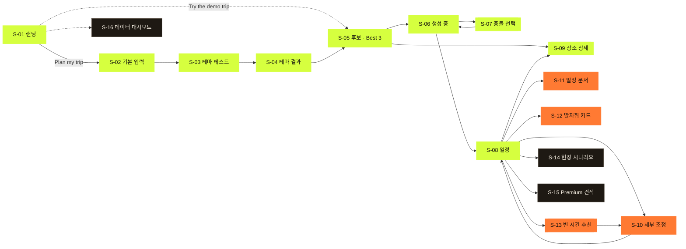

색: 라임 = P0 · 오렌지 = P1 · 회색 = P2(목업). 이중 테두리 = 시트(화면 위에 뜨는 패널).

| 구간 | 화면 | 사용자 목표 |
|------|------|-------------|
| 계획 | S-01 ~ S-08 | 내 날짜에 갈 수 있는 일정을 얻는다 |
| 다듬기 | S-09 · S-10 · S-11 · S-13 | 일정을 믿고 고치고 챙겨 간다 |
| 기록·확장 | S-12 · S-14 · S-15 · S-16 | 공유하고, 서비스의 다음 모습을 본다 |

---

## 2. 핵심 경로 A — 심사자 데모 여행 [제안]

로그아웃·시크릿 창으로 들어온 심사자가 **3분 안에** 입력 → 결과를 보는 경로. PRD G1.

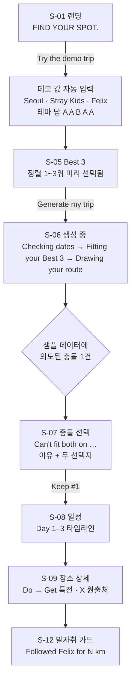

| 단계 | 탭 수 | 목표 시간 | 심사자가 확인하는 가치 |
|------|-------|-----------|------------------------|
| 랜딩 → Best 3 | 1 | 10초 | 무엇을 하는 서비스인지 |
| Best 3 → 생성 | 1 | 20초 이하 | 날짜 기준 후보 · 테마 가중치 정렬 |
| 충돌 선택 | 1 | 15초 | **규칙 기반 판단과 이유 설명** |
| 일정 확인 | 스크롤 | 60초 | AI 동선 · 운영시간 반영 |
| 장소 상세 | 1 | 30초 | 은어 → 행동 단위 재기술, 원출처 연결 |
| 발자취 | 1 | 20초 | 시각적 산출물, 공유 |

> 데모 샘플 데이터에 **충돌 1건을 의도적으로 넣는다** [제안] — 충돌 판정이 핵심 기술인데, 충돌이 안 나면 심사자가 볼 수 없다. 샘플 설계(D-06)에서 같이 확정.

---

## 3. 핵심 경로 B — 팬이 직접 계획

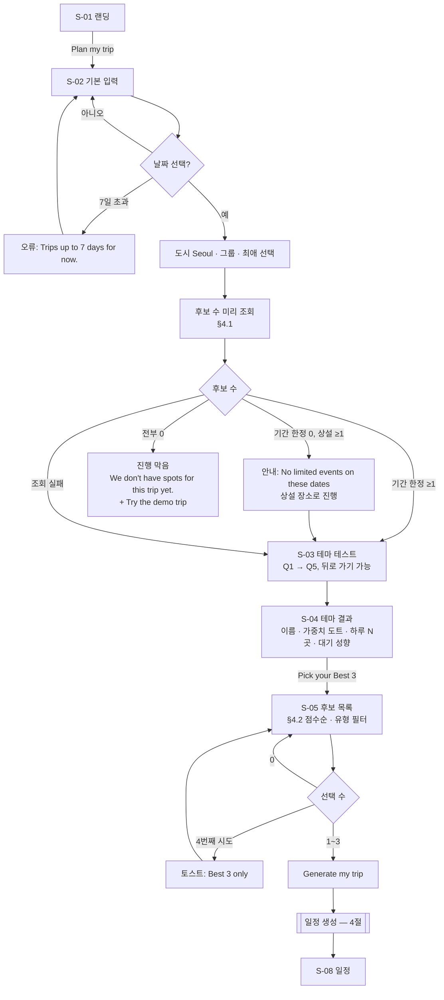

### 3.1 입력 단계 화면 규칙

| 화면 | 진입 조건 | 없으면 | 뒤로 가기 | 새로고침 |
|------|-----------|--------|-----------|----------|
| S-02 | 없음 | — | S-01 | 입력 유지 (sessionStorage) |
| S-03 | S-02 값 | S-02로 이동 | 이전 문항 / 1번이면 S-02 | 답 유지 |
| S-04 | 답 5개 | S-03 첫 미답 문항 | S-03 Q5 | 유지 |
| S-05 | S-02 값 + 테스트 결과 | 빠진 단계로 이동 | S-04 | 선택 유지 |
| S-06 | 생성 요청 중 | S-05 | **막음** (확인 `Stop generating?`) | S-05로 이동 |
| S-08 | 같은 브라우저에 저장된 일정 | `No trip on this device.` + `Plan a new trip` | S-05 (선택 유지) | `localStorage`에서 다시 읽음 |

sessionStorage를 못 쓰는 환경(C-11): 흐름은 메모리 상태로 계속 진행, 새로고침 시 S-02부터.

---

## 4. 일정 생성 — 시스템 흐름

사용자에게는 S-06 한 화면. 내부에서는 규칙 → (충돌 시 사용자) → AI → 검증 → 저장.

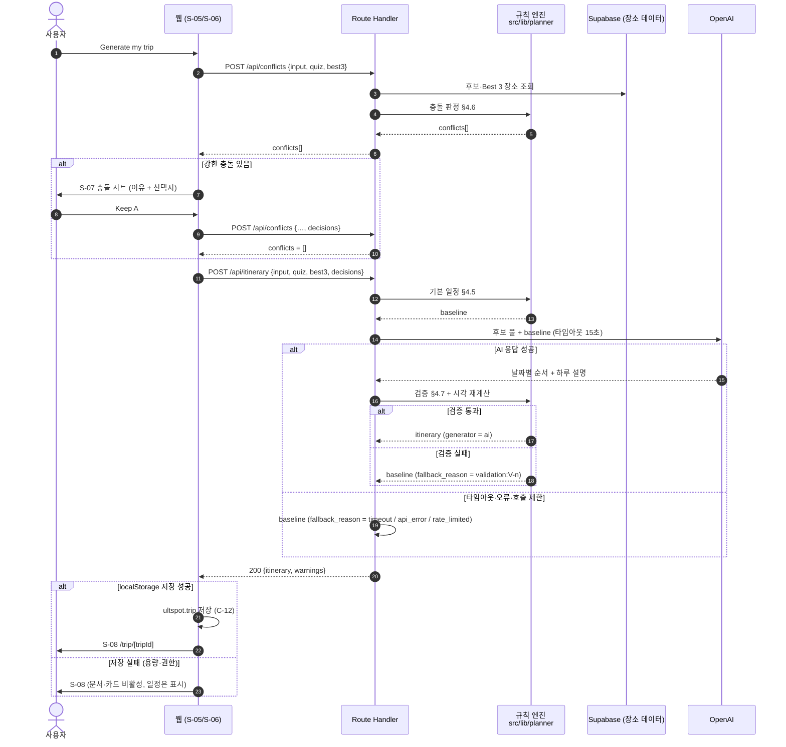

### 4.1 S-06에서 사용자가 보는 것

| 내부 상태 | 화면 문구 | 최대 대기 |
|-----------|-----------|-----------|
| check 요청 중 | `Checking dates…` | 3초 |
| 충돌 있음 | S-07 시트 (로더 정지) | 사용자 선택까지 |
| 생성 요청 중 (0~5초) | `Fitting your Best 3…` | — |
| 생성 요청 중 (5초~) | `Drawing your route…` | 20초 [제안] |
| 20초 초과 (네트워크 문제) | `This is taking longer than usual.` + `Try again` | — |
| check·생성 요청 자체 실패 (5xx·오프라인) | `Couldn't reach ULTSPOT. Check your connection.` + `Try again` | — |

AI 실패는 이 표에 없다 — 서버가 기본 일정으로 대체해 **정상 응답**을 주기 때문 (C-5).

---

## 5. 충돌 선택 — S-07

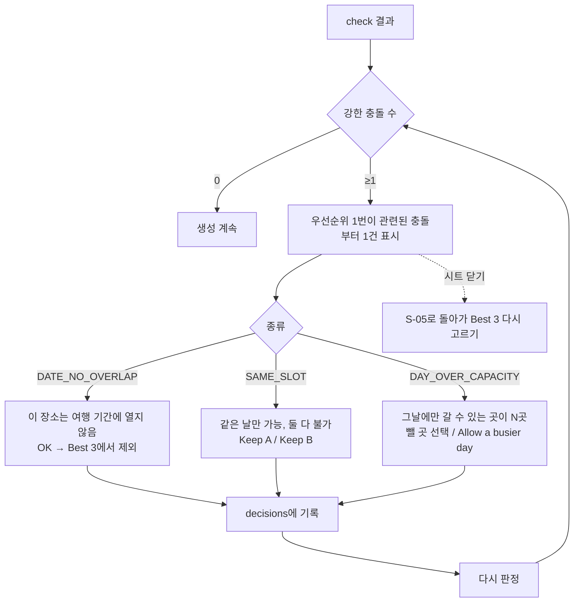

일정 화면(S-08)의 **약한 충돌**은 시트 없이 해당 방문에 배지로만:

| 코드 | 배지 | 제안 액션 |
|------|------|-----------|
| `QUEUE_RISK` | `Long queue likely` (warning) | 없음 — 정보만 |
| `LATE_ARRIVAL` | `Perks may run out` (warning) | `Move earlier` → S-10 해당 방문 선택 상태 |

---

## 6. 일정 화면에서의 흐름 — S-08

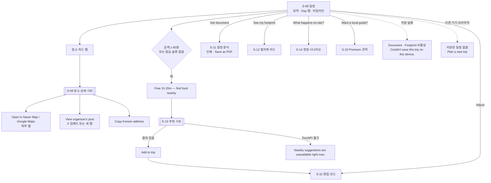

---

## 7. 세부 조정 — S-10

AI를 부르지 않는다. 조작마다 클라이언트가 규칙으로 즉시 재계산하고, 저장 시 서버가 다시 검증.

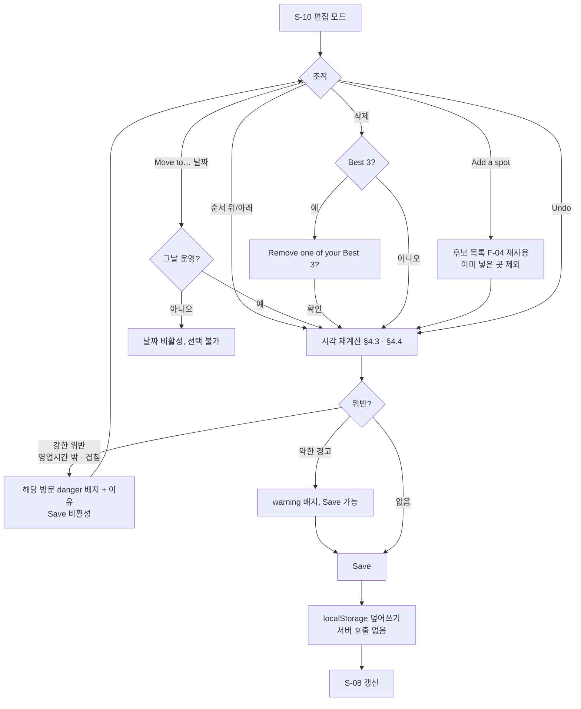

---

## 8. 기록 — S-12 발자취·공유

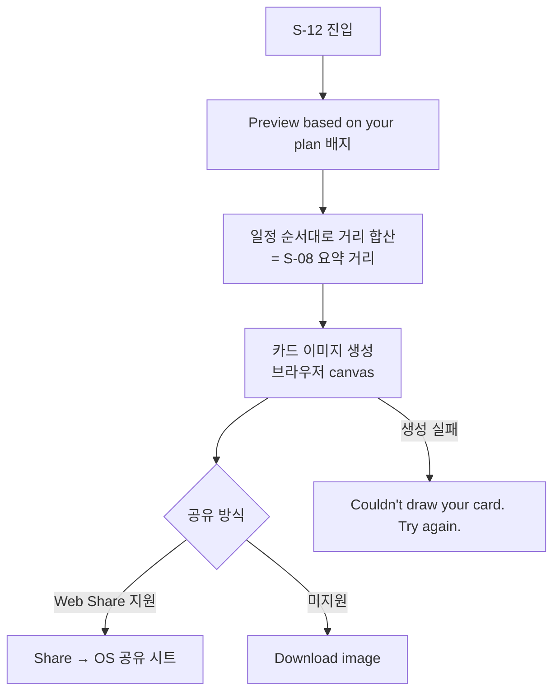

카드에는 날짜별 정확한 방문 시각을 넣지 않는다 (위치 노출 방지, 기능명세서 F-10).

---

## 9. 현장 시나리오 (목업) — S-14

실제 위치·푸시·저장 없음. 상단 고정 `Demo scenario — nothing here is saved.`

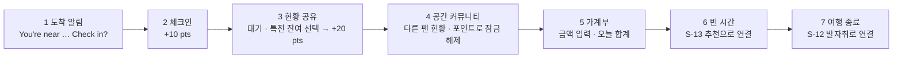

기획안 §4.2 현장 구간(장소마다 반복)을 한 번 순서대로 보여준다. 반복은 마지막 장면 문구로만 설명: `Repeat at every spot on your trip.`

---

## 10. 확장 BM 화면 (목업)

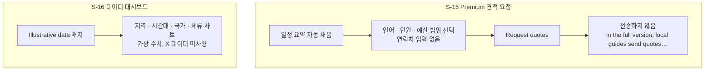

S-16 진입: 랜딩 하단 `For venues & cities` 링크 [제안]. 팬 흐름에는 넣지 않는다.

---

## 11. 운영자 흐름 — 데이터 적재 (D-01 ~ D-06)

사용자 화면이 아니라 팀이 제출 전에 실행하는 흐름. 프로덕션 웹에 관리자 화면 없음.

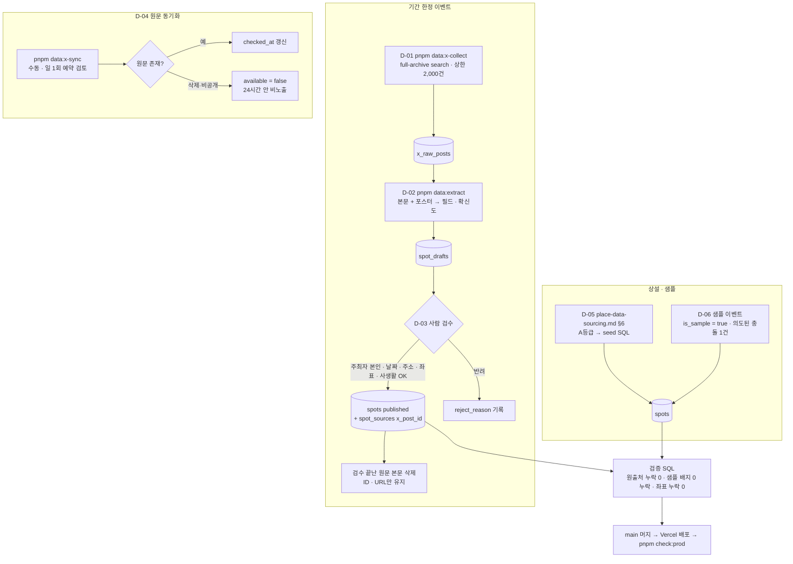

---

## 12. 상태별 화면 요약

화면마다 로딩·빈 상태·오류를 빠뜨리지 않기 위한 체크표.

| 화면 | 로딩 | 빈 상태 | 오류 | 부분 실패 |
|------|------|---------|------|-----------|
| S-02 | 후보 수 자리 스켈레톤 | 후보 0 → 안내 / 전부 0 → 진행 막음 | 후보 수 숨기고 진행 | — |
| S-04 | 없음 (즉시 계산) | — | — | — |
| S-05 | 카드 스켈레톤 3장 | `Nothing open on these dates.` + Change dates / demo | `Retry`, 3회 실패 시 demo 링크 | 필터 결과 0 → `No {type} on your dates.` |
| S-06 | DotLoader + 단계 문구 | — | 네트워크: `Couldn't reach ULTSPOT` | AI 실패 → 사용자에게 보이지 않음 |
| S-08 | 로더 없음 (브라우저 저장에서 읽음) | 빈 날 → `Free day — explore nearby` · 후보 0곳 → 빈 일정 안내 | 저장된 일정 없음 → `Plan a new trip` | 저장 실패 → 문서·카드 비활성 |
| S-09 | 시트 스켈레톤 | — | 원문 삭제된 장소 → 404 | X 임베드 실패 → 링크만 표시 |
| S-10 | — | — | 422 → 위반 배지 | — |
| S-11 | — | — | 저장된 일정 없음 → 진입 불가 | — |
| S-12 | 카드 자리 도트 로더 | — | `Couldn't draw your card` | Web Share 미지원 → 다운로드만 |
| S-13 | 리스트 스켈레톤 | `No places found within 1 km.` | `Nearby suggestions are unavailable right now.` | — |

---

## 13. 오픈 이슈

**[결정 2026-09-19]** 데모 여행 경로는 랜딩의 보조 버튼으로 넣고, 샘플 데이터에 강한 충돌 1건을 만든다 (기능명세서 D-06). 일정은 브라우저에만 저장한다.

- [ ] S-09를 페이지(`/spots/[id]`)로도 열지, 시트만 둘지 — 장소 링크를 공유할 일이 있으면 페이지
- [ ] S-16 진입 위치
- [ ] 기능명세서 §9.2 남은 오픈 이슈
