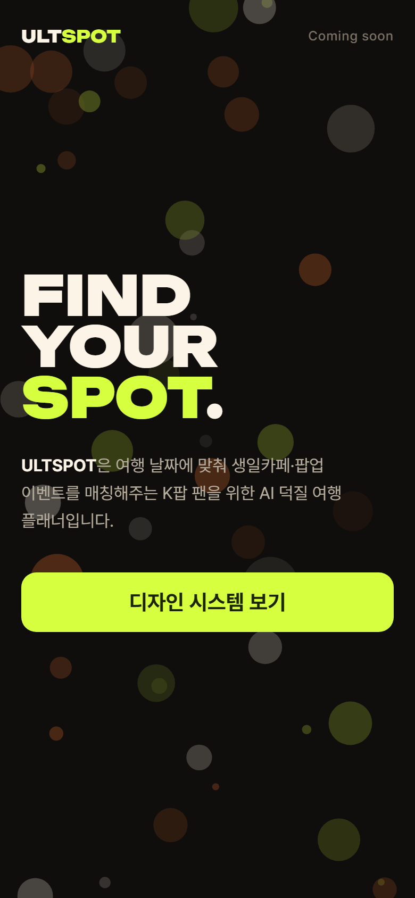
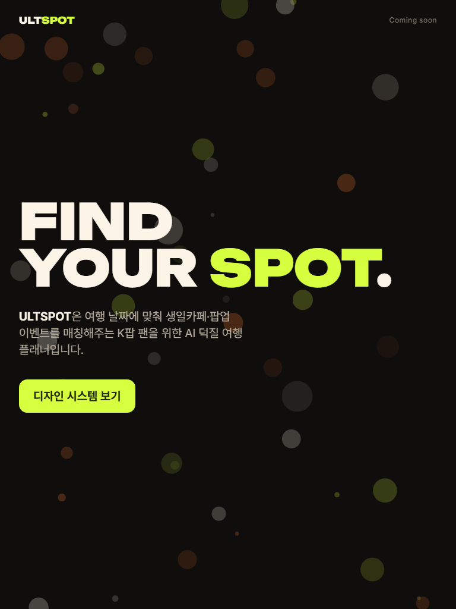
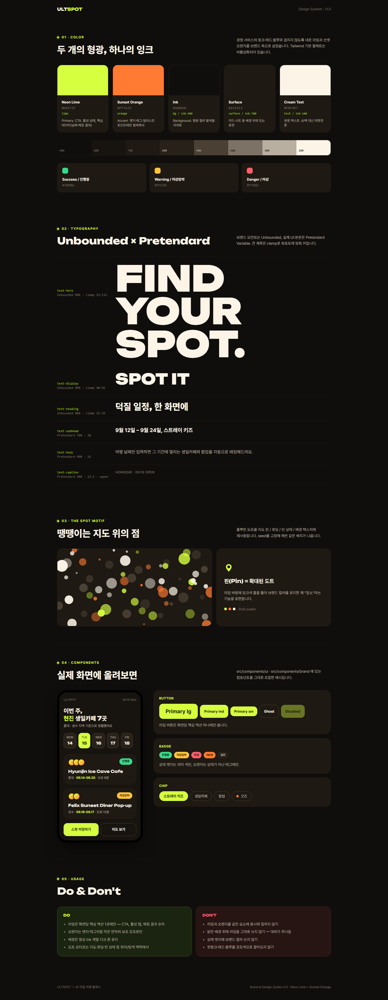

# T-001 프로젝트 기본 셋팅

| | |
|---|---|
| 상태 | 리뷰 중 |
| 브랜치 | `chore/T-001-project-setup` |
| PR | #1 |
| 기간 | 2026-09-16 |
| 근거 | ULTSPOT Brand & Design Guide v1.0 (2026.09) · 스택 결정: React · TS · Tailwind CSS · Next.js · Supabase, OpenAI 연동 예정 |

## 목표

기획서가 들어오기 전에, 화면 작업을 바로 시작할 수 있는 바닥을 깐다.
브랜드 가이드가 코드 토큰으로 강제되고, 작업마다 3개 뷰포트 캡처와 기록이 남는 흐름까지 포함한다.

## 진행 내역

| # | 커밋 | 내용 |
|---|------|------|
| 1 | `4c5c315` | create-next-app 16.3.5 템플릿 원본 커밋 (이후 diff를 깨끗하게 보기 위해) |
| 2 | `0f0a0a8` | 브랜드 가이드 → `theme.css` 토큰, UI·브랜드 컴포넌트 11개, `/design-system` 화면, 임시 랜딩 |
| 3 | `0982351` | Playwright 캡처 파이프라인(`pnpm capture`), 반응형 smoke·토큰 일치 검사, 첫 캡처 6장 |
| 4 | `9a47fa5` | Supabase SSR 클라이언트 3종 + `proxy.ts` 세션 갱신, `.env.example` (OpenAI 키 자리 포함) |
| 5 | (이 문서가 들어간 커밋) | CONTRIBUTING · README · 디자인 시스템 문서 · 태스크 기록 체계 · PR 템플릿 · `.gitattributes` |

## 결정

이후 작업에 계속 영향을 주는 것만.

- **Tailwind 기본 팔레트 비활성화.** 브랜드 팔레트 밖의 색은 클래스로도 못 쓴다. 새 색이 필요하면 `theme.css`에 토큰으로 추가하는 게 유일한 경로다.
- **다크 전용.** 라이트 모드는 만들지 않는다 (가이드 Don't: 밝은 배경 위 라임 금지).
- **상태 뱃지는 의미 색.** 가이드 목업(오렌지 Ongoing)과 규칙이 충돌해 규칙을 따랐다. 기획 확정 때 재확인 필요.
- **캡처는 프로덕션 빌드 + 3 뷰포트(390@2x / 768 / 1440)로, 저장소에 커밋.** 스크린샷 경로는 `docs/tasks/T-NNN/screenshots/`.
- **GitHub Flow + 태스크 번호 브랜치 + Rebase merge.** 작업 단위 커밋 본문을 `main`에 보존하기 위해 squash를 쓰지 않는다.
- **Supabase 키 없이도 앱과 캡처가 돈다.** proxy는 환경 변수가 없으면 통과시킨다.

## 하지 않은 것

- 실제 기능 화면(여행 날짜 입력, 이벤트 목록, 지도): 기획서 수신 후.
- Supabase 프로젝트 생성·스키마·타입 생성·로그인: 스키마 미정.
- OpenAI SDK 설치: 연동 시점에. 키 변수 자리만 잡았다.
- 픽셀 비교 회귀 테스트(`toHaveScreenshot`), CI 워크플로, 배포(Vercel 등) 설정.
- Prettier 등 포매터: ESLint만 둔 상태. 팀 합류 시 결정.

## 검증

- `pnpm lint` 경고·에러 0건, `pnpm typecheck` 통과, `pnpm build` 성공 (정적 라우트 `/` `/design-system` `/icon.svg`)
- `pnpm test:e2e` 9건 통과 (smoke 2화면 + 토큰 일치 1건) × 3뷰포트
  - Supabase 환경 변수 없이 1회, 가짜 URL·키로 빌드해 proxy 경로를 태운 상태로 1회
- `pnpm capture T-001` 6장 (2화면 × 3뷰포트), 캡처를 직접 열어 확인
  - 첫 캡처에서 한글이 음절 중간(이벤/트)에서 줄바꿈되는 것을 발견 → `word-break: keep-all` 추가 후 재캡처
- 확인하지 못한 것: 실제 Supabase 연결과 로그인 세션 갱신, Safari·Firefox 렌더링, 실기기

## 스크린샷

| 화면 | mobile (390) | tablet (768) | desktop (1440) |
|------|--------------|--------------|----------------|
| `/` |  |  |  |
| `/design-system` |  |  |  |

## 후속 작업

- 기획서 수신 → `docs/specs/`에 추가하고 화면 단위로 태스크 분할 (T-002~)
- Supabase 프로젝트 생성 후 `.env.local` 채우기, `supabase gen types`로 DB 타입 생성
- 상태 뱃지 색(목업 오렌지 vs 규칙 의미 색) 디자인 확인
- 배포 대상 정해지면 CI(lint·typecheck·test:e2e) 추가
