# T-015 한국어 기본 전환과 `/plan` 온보딩 개편

| | |
|---|---|
| 상태 | 완료·배포됨 |
| 브랜치 | `design/T-015-planner-polish` (기준: `feat/T-014-image-data-contract`) |
| PR | #16 (→ #17로 main 배포) |
| 기간 | 2026-09-20 |
| 근거 | [Claude UI 분담 최신 요구사항](../../claude-ui-handoff.md) · [이미지 데이터 계약](../../data/image-data-contract.md) · [비회원 플래너 계약](../../specs/public-planner.md) · 브랜드 가이드 v1.0 |

## 목표

한국어를 기본으로 하고 화면 어디서나 한국어/English를 고를 수 있게 한다. 첫 화면이 이 서비스가 지금 무엇을 하는지 사실대로 설명하고, `/plan`이 서류 작성이 아니라 "고르고 기대하는" 흐름이 되게 한다.

## 진행 내역

| # | 커밋 | 내용 |
|---|------|------|
| 1 | `395d1e4` | 언어 쿠키·사전·전환 UI, 첫 화면 재작성, 과장된 메타 설명 정정 |
| 2 | `1186043` | 아티스트 1단계 이동, 카드 운영 상태·사진 준비 중, 하단 고정 바, 앵콜 행, `.ics`, 지도 3종, 접근성 수정 |
| 3 | `6f8b94c` | 전후 캡처 27장 |

## 근거로 삼은 검토

작업 전 `/plan`을 Impeccable critique로 두 갈래로 평가했다. 디자인 리뷰와 자동 검사(탐지기·브라우저 실측)를 서로 보지 못하게 분리해 돌렸다.

- 종합 점수 25/40 (보통)
- 자동 검사에서 가로 스크롤 0, 콘솔 오류 0, 포커스 표시는 모든 탭 정지에서 확인됨
- 탐지기 지적 1건은 오탐(단계 탭 밑줄을 둥근 카드 강조선으로 오인)
- 실제 문제로 좁힌 것: 아티스트 선택이 결과에 영향 없음, 모바일에서 핵심 버튼이 3,000px 아래, 결과가 실패 상자로 끝남, 보이는 문구와 접근성 이름 불일치, 44px 미만 터치 영역, 날짜 변경 시 선택이 조용히 사라짐

경쟁 서비스(덕플레이스·팝가·NOL World·K-Pop Tracker)를 직접 열어 확인한 내용은 [아래](#경쟁-서비스에서-가져온-것)에 적었다.

## 결정

- **언어 선택은 쿠키에 둔다.** localStorage면 서버가 모른 채 먼저 그려서 언어가 바뀌는 깜빡임이 생긴다. 대신 첫 화면도 요청마다 렌더된다.
- **언어 전환은 클라이언트 상태만 바꾼다.** 새로고침·`router.refresh()`를 하지 않아 입력 중인 일정이 유지된다.
- **데이터 원문은 번역하지 않는다.** 장소·행사 이름, 설명(Do/Get), 주소, 출처명은 원문 그대로 두고 `lang` 속성만 붙였다. 아티스트는 데이터에 있는 공식 한글 표기만 쓴다.
- **lib이 만든 영어 문장은 원문을 키로 하는 표로 옮긴다.** 표에 없으면 원문을 그대로 보여준다. `src/lib/trip`은 변경 금지 범위라 문구를 그쪽에서 고치지 않았다.
- **운영 상태 판정은 화면에서 다시 구현하지 않는다.** `unavailableReason`이 원천이고 화면은 사유를 뱃지로 나누기만 한다.
- **핵심 마무리 행동을 `.ics`로 바꾼다.** 로그인·푸시 없이 경쟁 서비스의 "찜 + 알림"에 해당하는 값을 주는 가장 싼 방법이다.
- **날짜 변경 시 선택 초기화는 유지한다** (T-008 계약). 대신 몇 곳이 비워졌는지 알린다.

## 경쟁 서비스에서 가져온 것

| 확인한 것 | 이번에 반영 | 근거 |
|---|---|---|
| 카드마다 진행 상태 라벨 | 그날 운영 / 휴무 / 운영시간 미확인 / 예약 필요 | 팝가 상태 표시, 덕플레이스 날짜 필터 |
| 네이버·카카오 지도 길찾기 연결 | 지도 3종 링크 | 팝가, NOL World |
| 찜 + 오픈 알림 | 로그인 없이 `.ics` 내보내기로 대체 | 팝가 알림, 덕플레이스 푸시 |
| 참여 조건 안내(음료 구매·현금·선착순) | "생일카페가 처음이라면" 일반 안내 | The Kraze 가이드 |
| 이미지·기간·지역·다음 행동이 한눈에 | 카드 정보 순서 재배치 | 덕플레이스·NOL World 카드 |

가져오지 않은 것: 실시간 랭킹, 대기 현황, 후기·댓글, 공개 이벤트 제보. 지금 데이터로는 지어내야 한다.

## 하지 않은 것

- 장소 설명·지역명의 한국어화 — `src/lib/trip/catalog.ts`가 변경 금지 범위다. 아래 Codex 요청 사항 참고.
- URL 경로 분리(`/ko`, `/en`)와 Accept-Language 자동 감지 — 제출 주소를 하나로 유지한다.
- 언어 전환 즉시 `document.title` 갱신 — 다음 이동·새로고침에 서버가 맞는 제목을 준다.
- 아티스트 생일 달력 — 데이터에 생일이 없다(`artists.ts`는 생일 미수집을 명시).
- 클라우드 저장 경로의 실제 검증 — 키가 없어 E2E 3건은 skip 상태 그대로다.

## Codex에 요청

`src/lib/trip`과 수집 파이프라인은 이번 작업에서 건드리지 않았다. 아래가 채워지면 화면은 바로 받을 수 있다.

1. 장소·행사의 한국어 필드(`title_ko`, `do_ko`, `get_ko`, 지역명). 지금 한국어 화면에도 이 값들은 영어 원문으로 나간다.
2. 교통 안내(가까운 역·출구·도보 시간). 경쟁 서비스가 모두 제공하는 정보다.
3. 참여 조건 필드(가격대, 현금 필요 여부, 선착순 수량, 럭키드로우). 지금은 일반 안내로만 다룬다.
4. 아티스트 생일. 덕플레이스의 핵심 탐색 축이다.
5. 이미지 `asset_id` 연결. 화면은 "사진 준비 중" 상태를 이미 갖췄고, 승인된 자산이 오면 그 자리에 들어간다.

## 검증

- E2E **51건 통과**, 3건 skip(클라우드 키 없음). `pnpm test:e2e`
- typecheck 오류 **0**, lint 오류 **0** (경고 94건은 변경 전과 같은 수)
- 캡처 **27장**(전 12 · 후 15)을 3개 뷰포트에서 찍고 직접 열어 확인
- 새로 넣은 검증: 한국어 기본과 쿠키 유지, 언어 전환 시 날짜·선택·단계 보존, 고르기 전 운영 상태 노출, `.ics` 시각(11:00 KST = `20260922T020000Z`), 날짜 변경 안내
- **프로덕션 검사 `pnpm check:prod https://ultspot.vercel.app` — 51건 통과**, 3건 skip(클라우드 키 없음). 2026-09-20, main 머지(#17) 후 실행
  - 로그인·비밀번호 없이 열림(`/`, `/plan`, `/design-system`), 가로 스크롤 0, 색 토큰 일치
  - 배포본 제목이 `ULTSPOT — 서울 K팝 하루 일정 만들기`로 바뀐 것과 `lang="ko"`를 직접 확인
- 돌리지 않은 것: 실제 브라우저 수동 점검(시크릿 창) — 캡처와 자동 검사로 대신했다. 마감 전 사람이 한 번 더 해야 한다.

## 스크린샷

| 화면 | mobile | tablet | desktop |
|------|--------|--------|---------|
| 1단계 하루 정하기 | 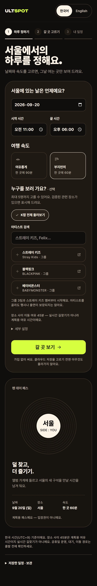 | 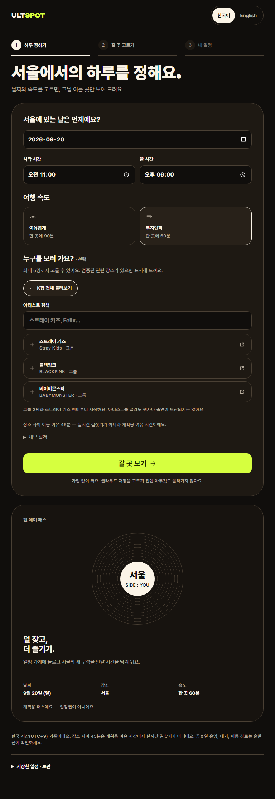 | 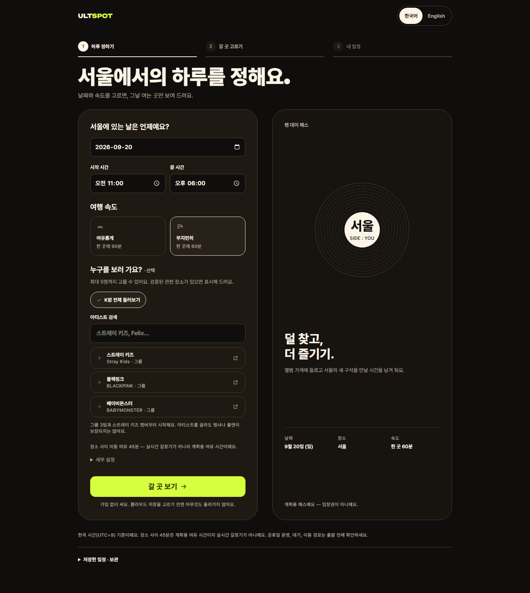 |
| 2단계 갈 곳 고르기 | 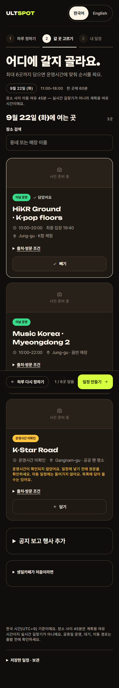 | 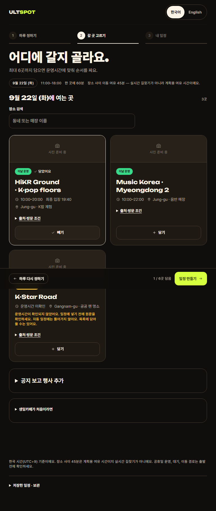 | 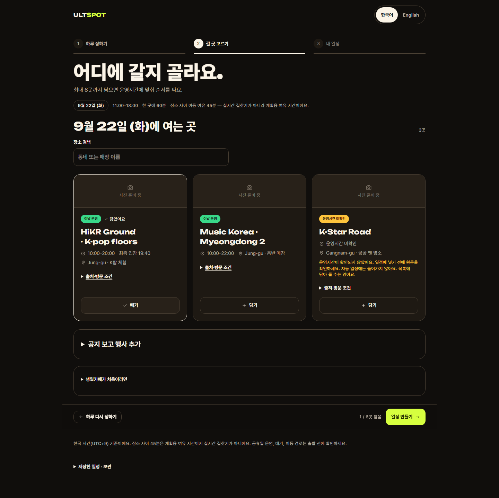 |
| 아티스트 선택 | 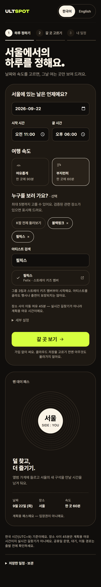 | 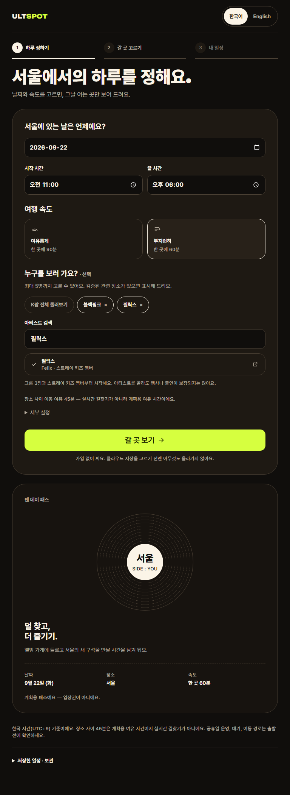 | 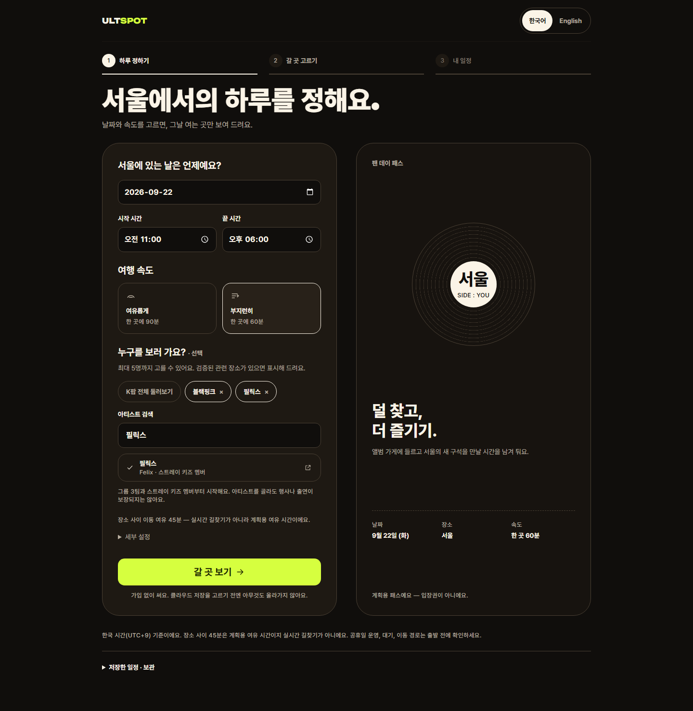 |
| 3단계 내 일정 | 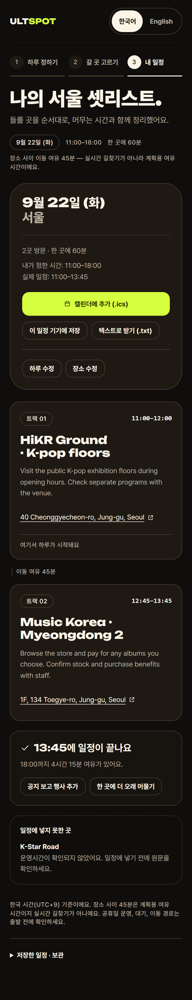 | 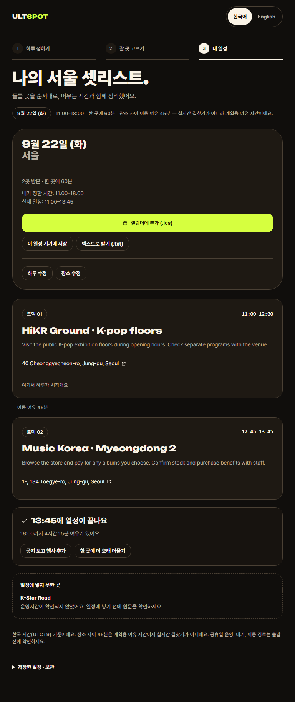 | 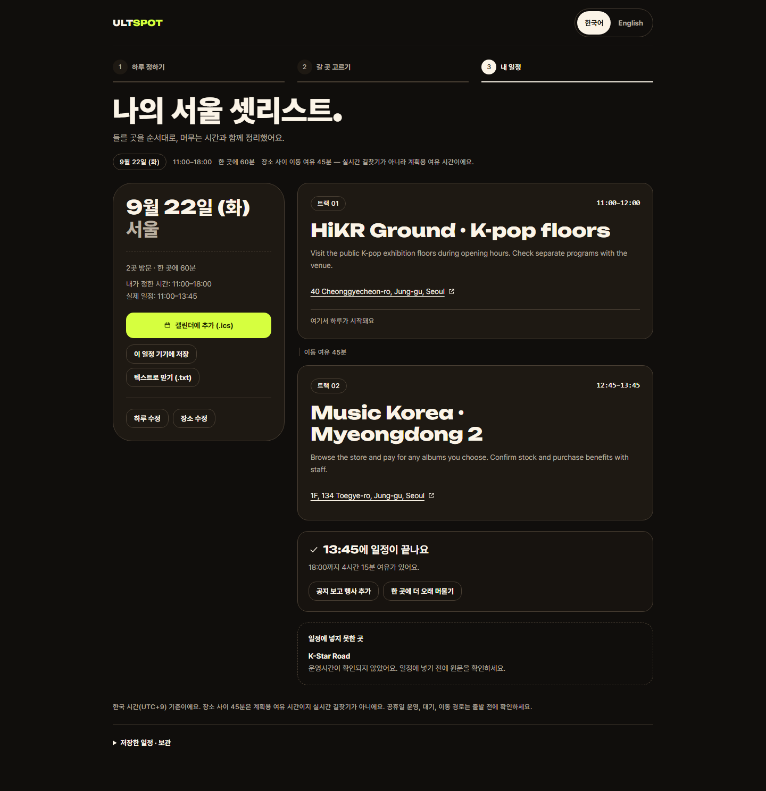 |
| 영어 화면 | 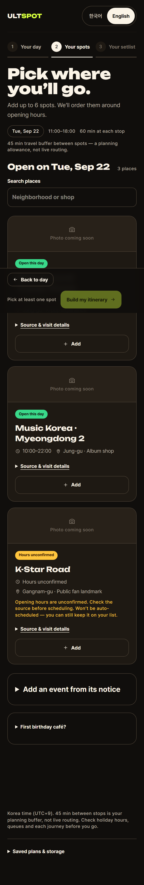 | 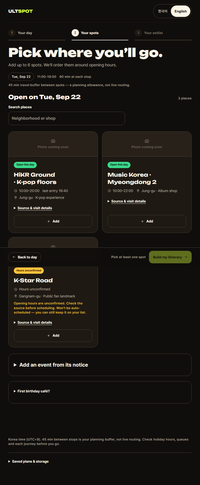 | 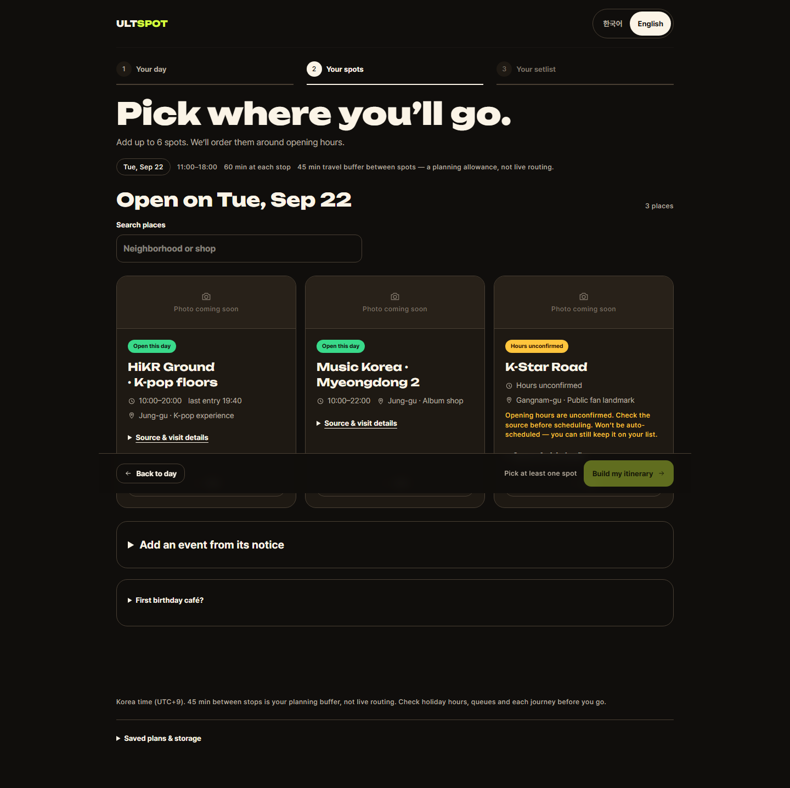 |
| 변경 전 | 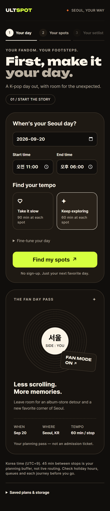 | 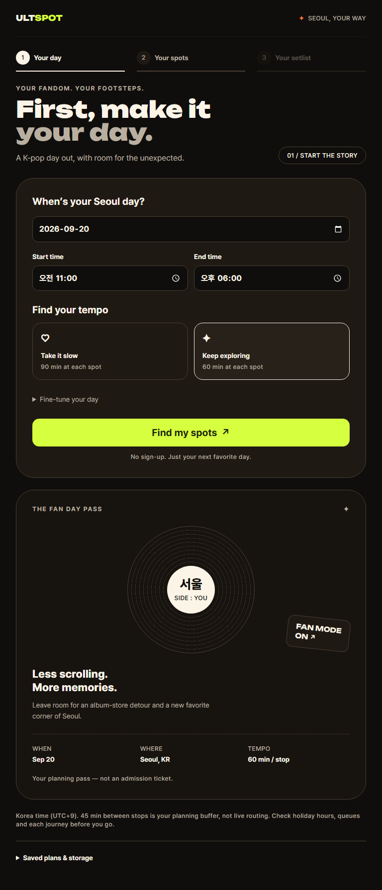 | 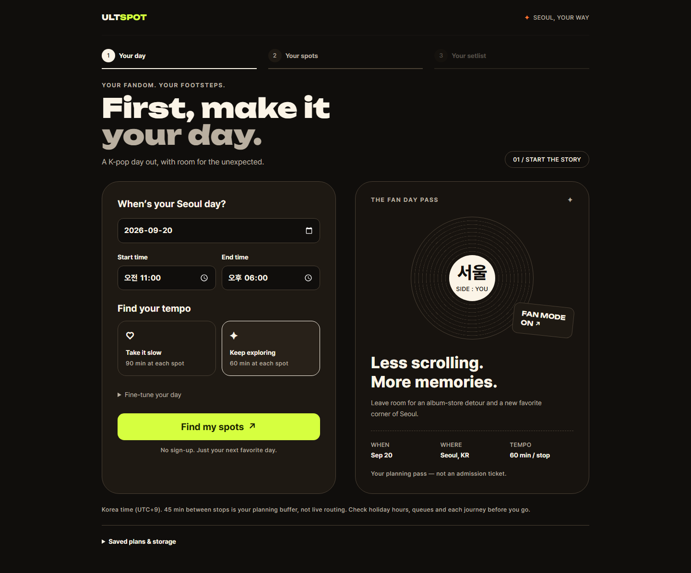 |

## 후속 작업

- Codex 요청 5건이 반영되면 카드·언어 연결
- 클라우드 저장 경로를 키가 있는 환경에서 검증
- critique 재실행으로 점수 변화 확인
