# T-016 critique 재실행에서 나온 문제 수정

| | |
|---|---|
| 상태 | 완료·배포됨 |
| 브랜치 | `design/T-016-critique-fixes` (기준: `main`) |
| PR | #22 |
| 기간 | 2026-09-20 |
| 근거 | [T-015](../T-015/README.md) 이후 critique 재실행 · [디자인 시스템](../../design-system.md) · 브랜드 가이드 v1.0 |

## 목표

T-015 배포본을 다시 critique해 남은 문제를 고친다. 특히 제출 심사자가 휴대폰으로 볼 때 걸리는 것부터.

## 근거로 삼은 검토

디자인 리뷰와 자동 검사를 서로 보지 못하게 분리해 다시 돌렸다.

- **29/40** (T-015 이전 25/40, **+4**)
- 자동 검사 실측: 가로 스크롤 0, 콘솔 오류 0, 모든 포커스 정지에 표시 있음, 2단계 하단 고정 바의 `일정 만들기`가 390px 최상단에서 스크롤 없이 화면 안(아래 12px 여유)
- 탐지기 소스 검사 0건. 다만 일부러 나쁜 CSS를 넣은 대조 파일로 검사기가 살아 있음을 확인했고, 페이지에 주입한 검사에서는 6건이 나왔다. "소스에 흔한 나쁜 패턴이 없다"는 뜻이지 "문제가 없다"가 아니다.
- 오탐으로 제외: 검사기가 자기 오버레이 배지를 검출한 것(그림자·가림), 닫힌 `
` 안의 줄 길이, 비활성 컨트롤 대비(WCAG 면제)

## 고친 것

| 문제 | 근거 | 조치 |
|---|---|---|
| "사진 준비 중" 대비 **3.37:1** (기준 4.5:1) | 자동 검사 실측. 화면에서 유일한 실제 위반 | `text-text-faint` → `text-text-muted` |
| `Button` `sm`이 36px | 결과 화면 버튼 6개 + 하단 바 뒤로가기가 전부 해당 | `h-9` → `h-11` |
| 날짜 입력 label-in-name (WCAG 2.5.3) | `aria-label`이 보이는 라벨을 덮어씀. T-015에서 같은 종류를 고쳤는데 첫 컨트롤에서 재발 | `aria-label` 제거, 감싸는 `<label>`이 이름을 준다 |
| 1단계 CTA가 1,350px 아래, 키보드로 33번째 정지 | 결과를 바꾸지 못하는 아티스트 선택이 날짜와 CTA 사이를 막고 있었다 | 아티스트 선택을 접고, 2단계와 같은 하단 고정 바로 CTA 이동 |
| 휴무 요일 정보 소실 | 개편 전 카드에 있던 "Closed Mondays"가 사라졌다. 상태 뱃지는 고른 날만 말한다 | 상세에 휴무 요일 줄 추가(없으면 연중무휴) |
| 결과가 실패 상자로 끝남 | 앵콜 행을 넣었지만 그 아래 "넣지 못한 곳"이 왔다 | 순서만 교체 — 못 넣은 곳 → 앵콜 |
| 2단계에서 "왜 몇 곳뿐인지" 설명 소실 | 개편 전 2단계에 있던 문장이 첫 화면으로만 옮겨갔다 | 목록 위에 다시 표시 |
| 속도 버튼과 세부 설정 어긋남 | 30·120분을 고르면 두 버튼 모두 눌리지 않은 상태 | 값이 버튼과 다르면 "세부 설정에서 …분으로 정했어요" 표시 |
| 검색 결과 수를 알리지 않음 | 목록이 바뀌어도 스크린리더가 모름 | 개수에 `role="status"` |
| 뱃지 글자 10.5px·임의값 | 가독 하한(11px) 미만, 토큰이 아님 (AGENTS 규칙 5) | `--text-badge` 토큰(11px) 추가 후 사용 |
| 한국어 문구 | "최대 5**명**"(그룹을 명으로 셈), 담기/담았어요/담음 3가지, 단계 이름이 동사·동사·명사 | 5팀 / 담음 통일 / "일정 받기" |
| 접근성 이름이 영어 | 홈 링크 `ULTSPOT home`, 아티스트 프로필이 영어 이름으로 읽힘 | 화면 언어를 따르게 |
| 첫 화면 h1이 "FINDYOUR SPOT."으로 읽힘 | 줄바꿈으로 단어가 붙음 | `aria-label`로 고정 |
| 없는 기능을 약속하는 문구 | "관련 장소를 아래에 표시했어요" — 표시 기능이 없다 | 표시를 약속하지 않는 문구로 |
| 푸터 안내 121자/줄(1440) | 읽기 한계(65~75자) 초과 | `max-w-[70ch]` |

## 하지 않은 것

- **저장본 삭제 확인 단계** — 되돌릴 수 없는 삭제인데 확인이 없다. 제대로 하려면 확인 UI가 필요해 마감 뒤로 미룬다.
- **날짜 변경 되돌리기** — 지금은 몇 곳이 비워졌는지 알리기만 한다.
- **개인 행사 폼 분할** — 8칸이 한 번에 나오는 부담은 그대로다.
- **데스크톱 1단계 오른쪽 열** — 장식 비중이 크다는 지적은 남겨 둔다. 브랜드 요소라 판단이 필요하다.
- **장소 설명·지역명 한국어화** — `src/lib/trip`이 범위 밖이다. `lang="en"`을 붙여 스크린리더가 한국어로 읽지 않게만 했다. [T-015의 Codex 요청](../T-015/README.md#codex에-요청) 그대로다.

## 검증

- E2E **51건 통과**, 3건 skip(클라우드 키 없음). 한 번의 실행에서 1건이 실패했으나 캡처와 동시에 돌린 부하로 인한 타임아웃이었고, 단독 재실행에서 깨끗했다.
- typecheck 오류 **0**, lint 오류 **0** (경고 94, 기존과 같은 수)
- 캡처 **21장**을 3개 뷰포트로 찍고 직접 열어 확인
- **프로덕션 검사 `pnpm check:prod https://ultspot.vercel.app` — 51건 통과**, 3건 skip. 2026-09-20, #22 머지 후
  - 첫 실행에서 "한국어가 기본이고…" 1건이 실패했다. 배포 직후 콜드 스타트 지연이었고(같은 테스트가 재실행에서 17.8초 소요), 서버는 쿠키를 정확히 처리하고 있었다: `Cookie: ultspot-locale=en`이면 영어, 없으면 한국어, CDN 캐시 없음(`X-Vercel-Cache: MISS`). 제품 문제가 아니라 테스트가 지연을 못 견딘 것이라, 이동을 먼저 기다리도록 고쳤다.
  - 배포본이 새 코드인지 "일정 받기" 단계 이름으로 확인했다.
- E2E가 간헐적으로 1건 실패하는 것을 두 번 봤다(둘 다 캡처와 동시 실행 중, 재실행은 깨끗). 원인을 특정하지 못했고 남은 위험으로 기록한다.

## 스크린샷

| 화면 | mobile | tablet | desktop |
|------|--------|--------|---------|
| 1단계 | 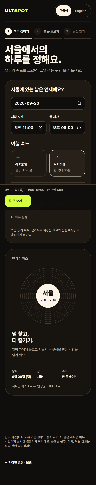 | 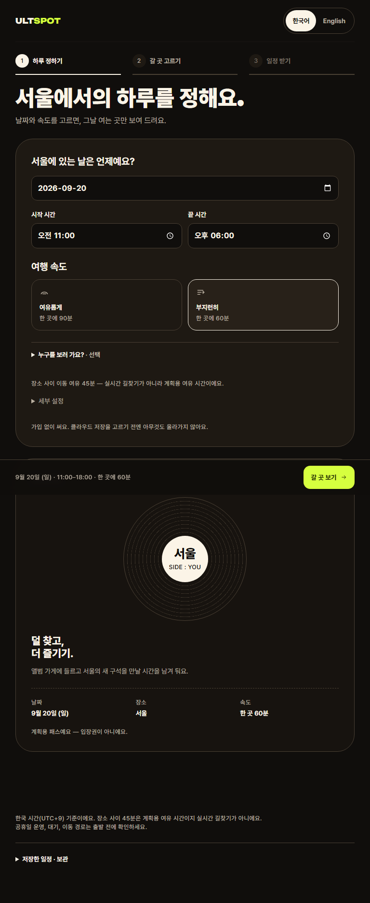 | 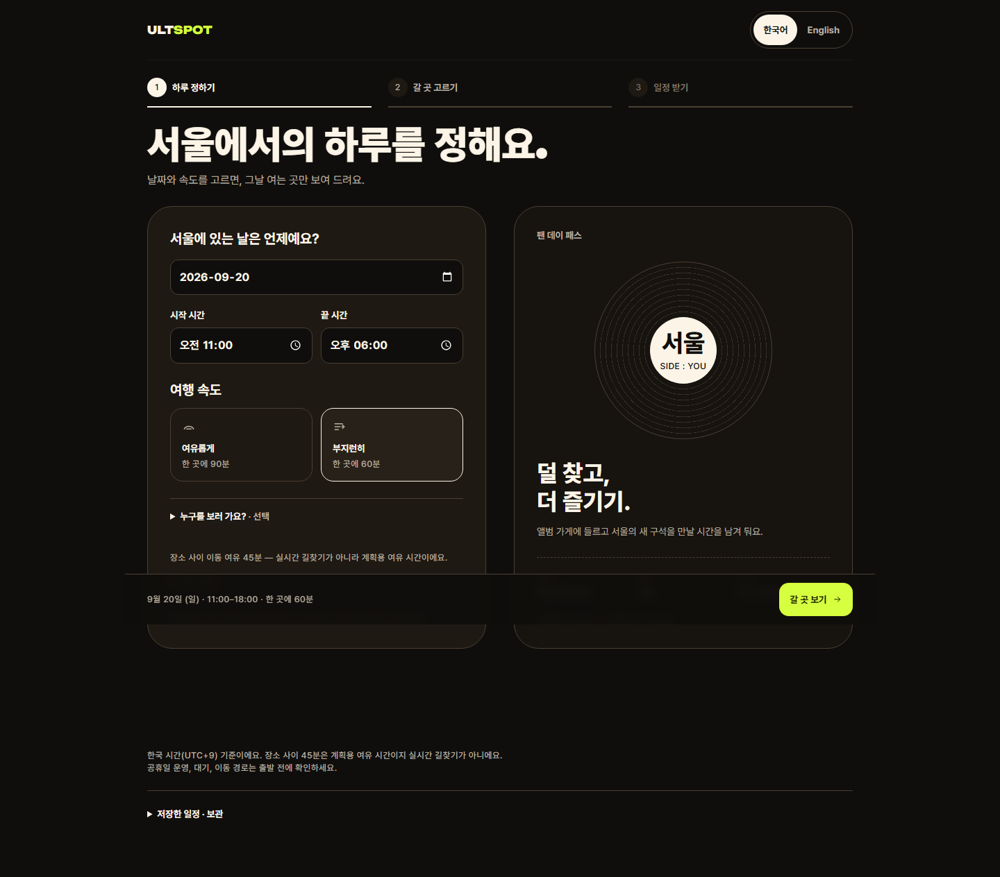 |
| 2단계 | 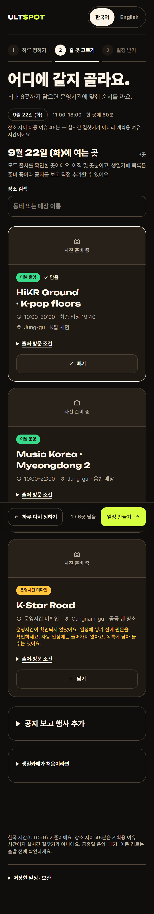 | 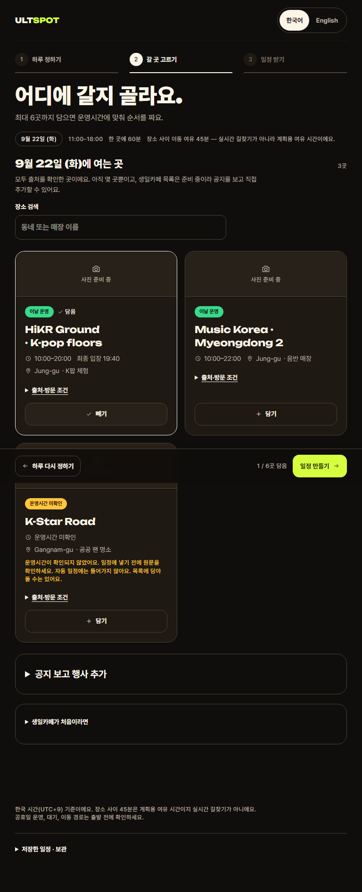 | 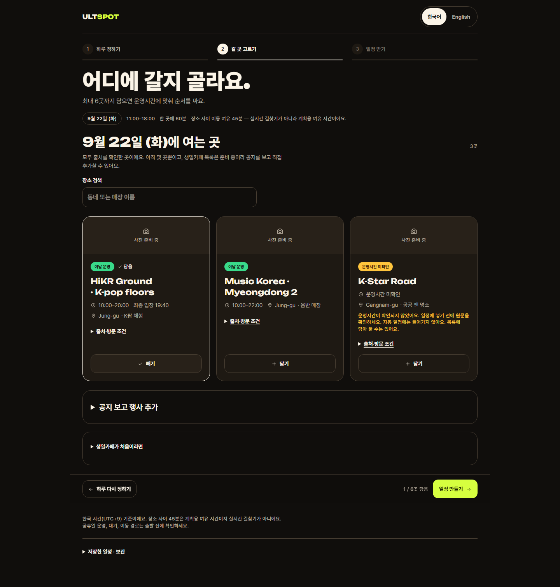 |
| 3단계 | 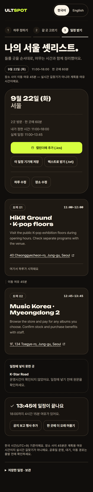 | 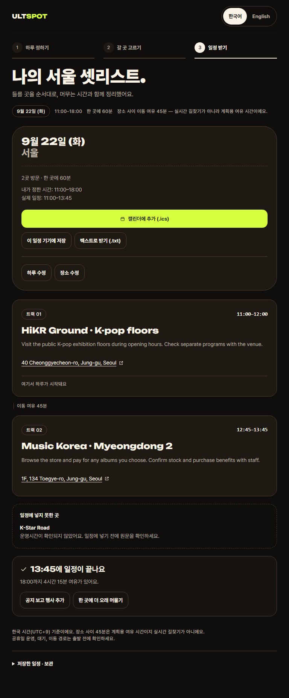 | 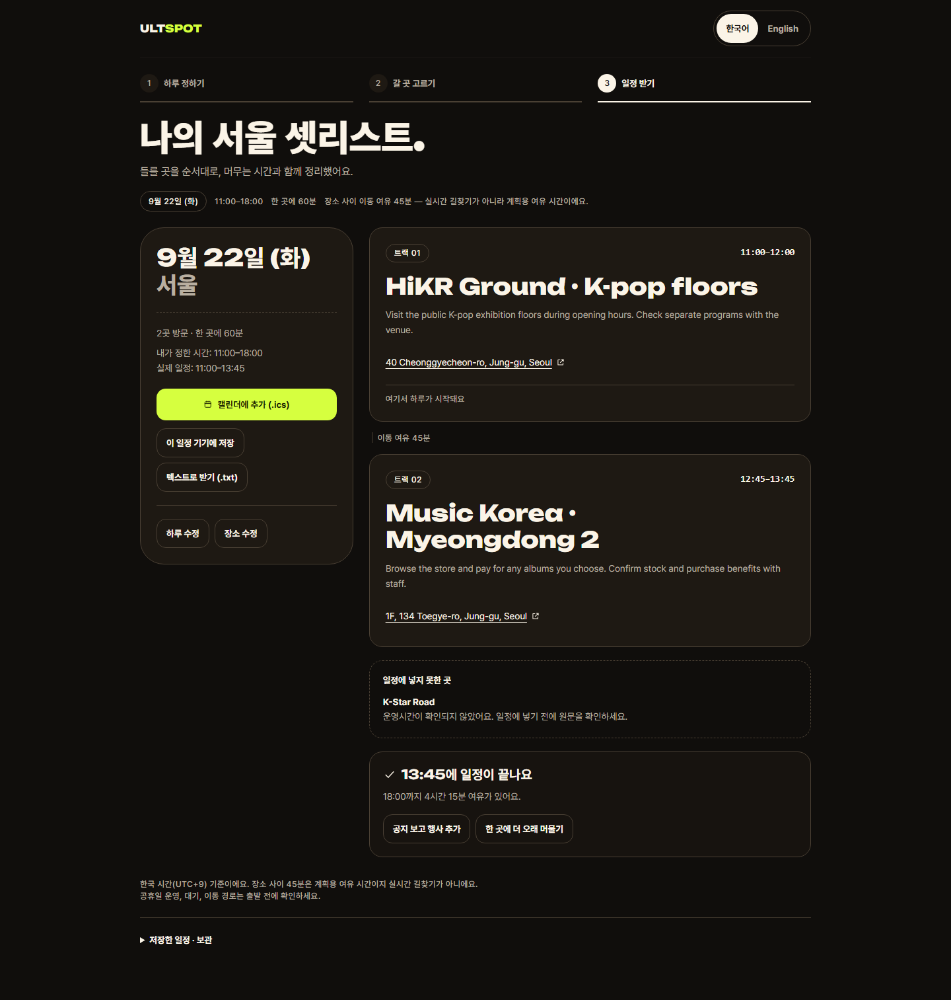 |
| 첫 화면 | 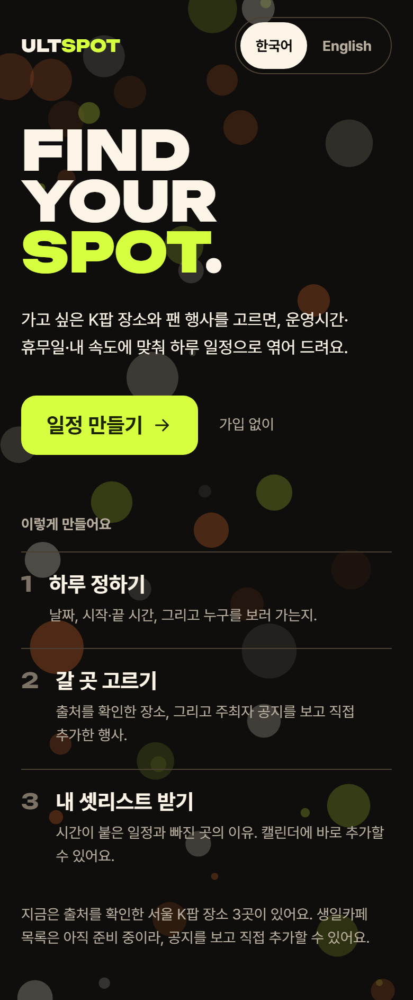 | 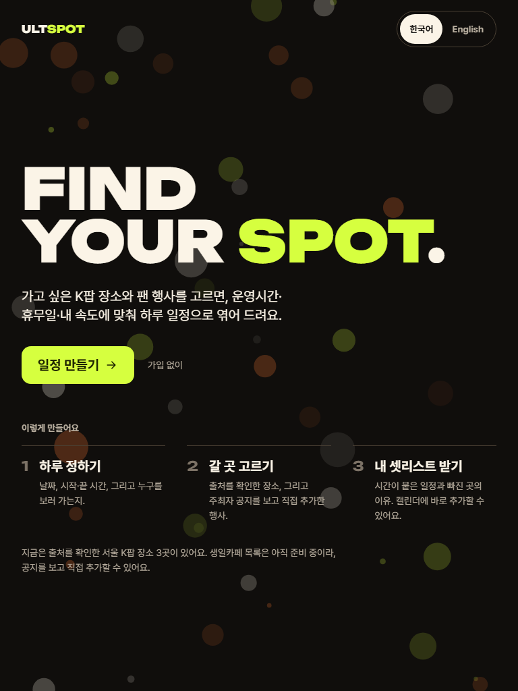 | 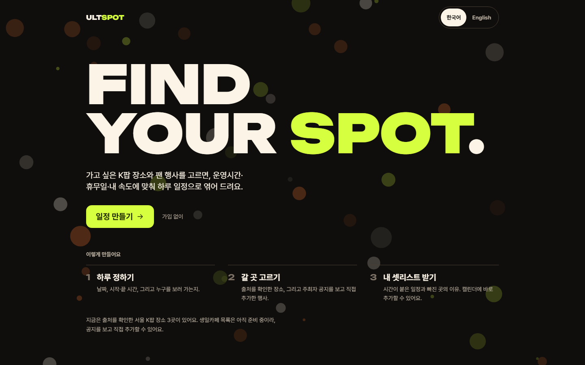 |

## 후속 작업

- 삭제 확인 단계와 날짜 변경 되돌리기
- Codex 데이터 필드가 오면 카드 한국어화
- critique 3회차로 29/40 이후 변화 확인
