# T-021 한국어 장소 데이터·교통·생일을 화면에 연결

| | |
|---|---|
| 상태 | 리뷰 중 |
| 브랜치 | `design/T-021-korean-data-ui` (기준: `main`) |
| PR | 아래 "진행 내역" 참고 |
| 기간 | 2026-09-20 |
| 근거 | [T-016 방문 데이터](../T-016/README.md) · [T-018 통합](../T-018/README.md) · [T-015의 Codex 요청](../T-015/README.md#codex에-요청) · [이미지 데이터 계약](../../data/image-data-contract.md) |

## 목표

T-016/T-018이 넣은 한국어 필드·교통·참여 조건·아티스트 생일을 실제 화면에 붙인다. 한국어 화면인데 가장 중요한 자리가 영어로 남아 있던 문제를 없앤다.

## 배경

T-015에서 한국어를 기본으로 만들 때 장소 이름·설명·지역명은 `src/lib/trip`이 변경 금지 범위여서 영어 원문 그대로 두고 `lang="en"`만 붙였다. critique 재실행에서 이 부분이 P1으로 지적됐다("한국어 화면이 가장 중요한 자리에서 반쯤 번역된 상태"). 그때 Codex에 요청한 5건 중 4건이 T-016/T-018로 들어와 이번에 연결한다.

## 연결한 것

| 데이터 | 화면 |
|---|---|
| `title_ko` `area_ko` `do_ko` `get_ko` | 장소 카드 이름·지역·상세, 일정 카드, 내려받는 `.txt`·`.ics`, 삭제 버튼 이름 |
| `transit` | 카드에 "종각역 1호선 5번 출구 · 도보 2분"과 확인일. 데이터가 있는 장소에만 |
| `participation` | 상세에 비용·현금 필요 여부·선착순·럭키드로우 |
| `birthday_mm_dd` | 아티스트 목록에 "생일 9월 15일" |

표시는 `eventCopy(event, locale)` 한 곳을 통한다. 이 함수는 검수된 장소에만 한국어를 쓰고, 개인 행사와 한국어 필드가 없는 장소는 원문을 그대로 돌려준다.

## 결정

- **번역 판단을 화면에서 다시 하지 않는다.** `eventCopy`가 원천이고 화면은 그 결과만 쓴다. 검수 여부·한국어 유무 조건을 UI에 복제하면 데이터가 바뀔 때 어긋난다.
- **`lang` 속성은 영어 원문일 때만 붙인다.** 한국어 표기가 나오면 붙이지 않고, 개인 행사는 사용자가 쓴 글이라 언어를 단정하지 않는다.
- **미확인을 "없음"이나 "무료"로 바꾸지 않는다.** `cash_required`가 null이면 "현금 필요 여부 미확인"으로 적는다.
- **생년은 쓰지 않는다.** 데이터에 월-일만 있고, 화면도 월-일만 보여준다.

## 하지 않은 것

- **이미지 연결** — 승인된 자산이 0건이다. "사진 준비 중" 상태를 그대로 둔다.
- **경로 검증 모듈(T-019) 연동** — `src/lib/routing/feasibility.ts`가 들어왔지만 일정 계산에 연결하지 않았다. 자동 일정 결과가 바뀌는 변경이라 별도 검증이 필요하다.
- **검색어에 한국어 이름 반영** — 장소 검색은 아직 영어 원문을 본다. 장소가 3곳이라 지금은 드러나지 않지만, 행사가 늘면 필요하다.
- **저장본 삭제 확인·날짜 변경 되돌리기** — T-020에서 미룬 그대로다.

## 검증

- E2E **69건 통과**, 3건 skip(클라우드 키 없음)
- 데이터 테스트 **13건 통과**, typecheck 오류 **0**, lint 오류 **0**(경고 94)
- 캡처 15장을 3개 뷰포트로 찍고 직접 확인. 한국어 이름·지역·교통 안내가 카드와 일정에 모두 나오는 것을 눈으로 확인했다
- 프로덕션 검사: 머지 후 실행

## 스크린샷

| 화면 | mobile | tablet | desktop |
|------|--------|--------|---------|
| 2단계 | 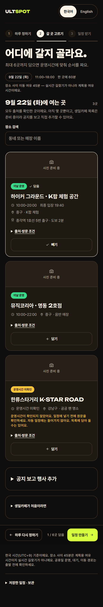 | 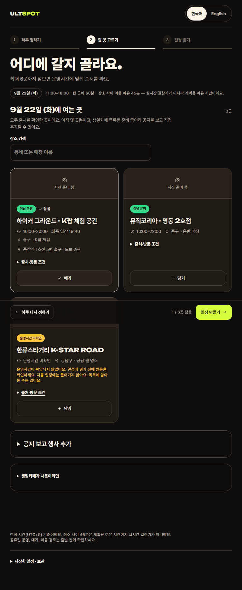 | 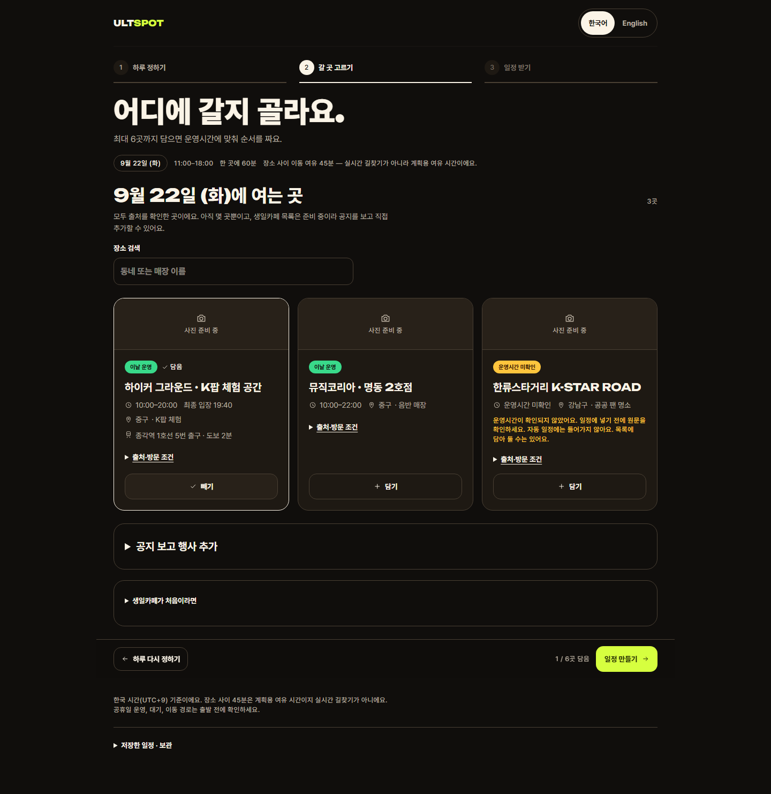 |
| 3단계 | 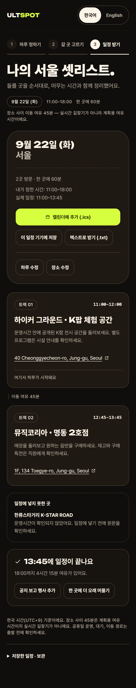 | 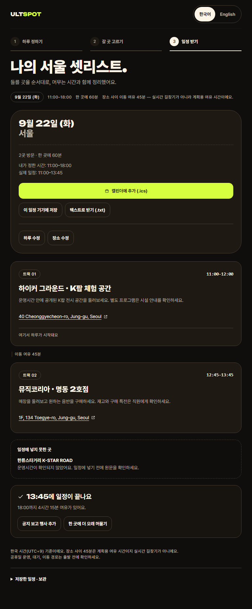 | 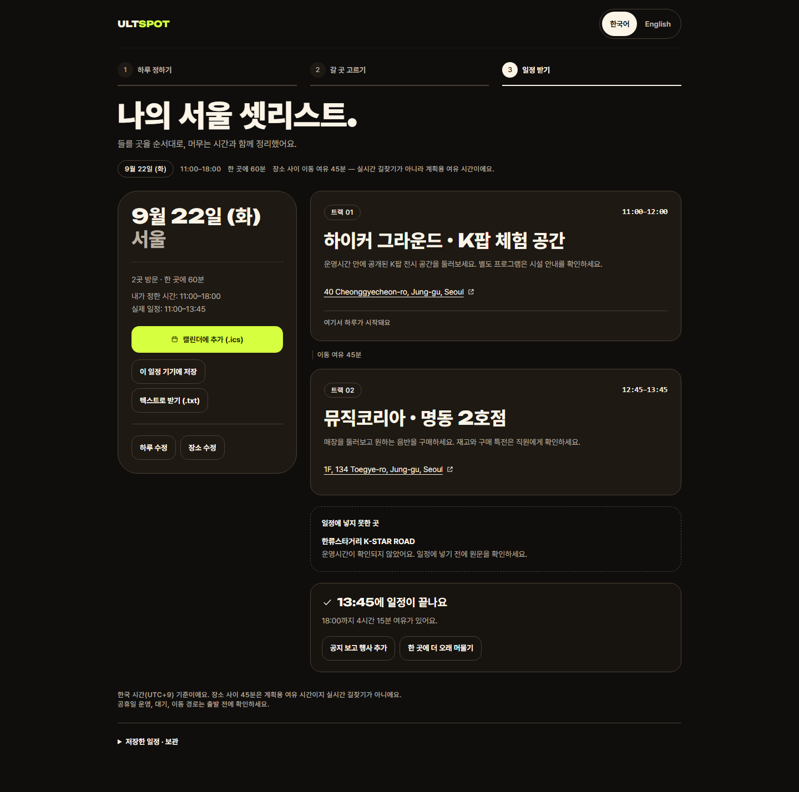 |
| 아티스트(생일) | 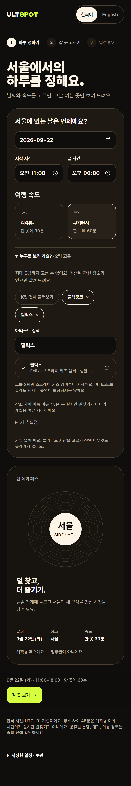 | 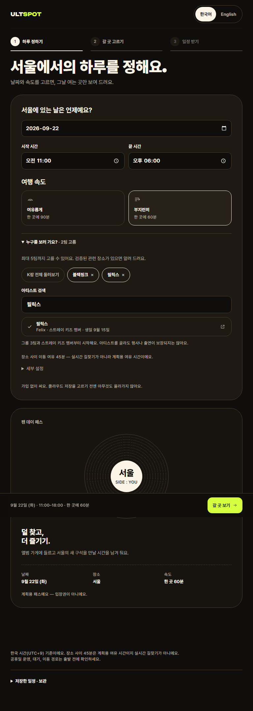 | 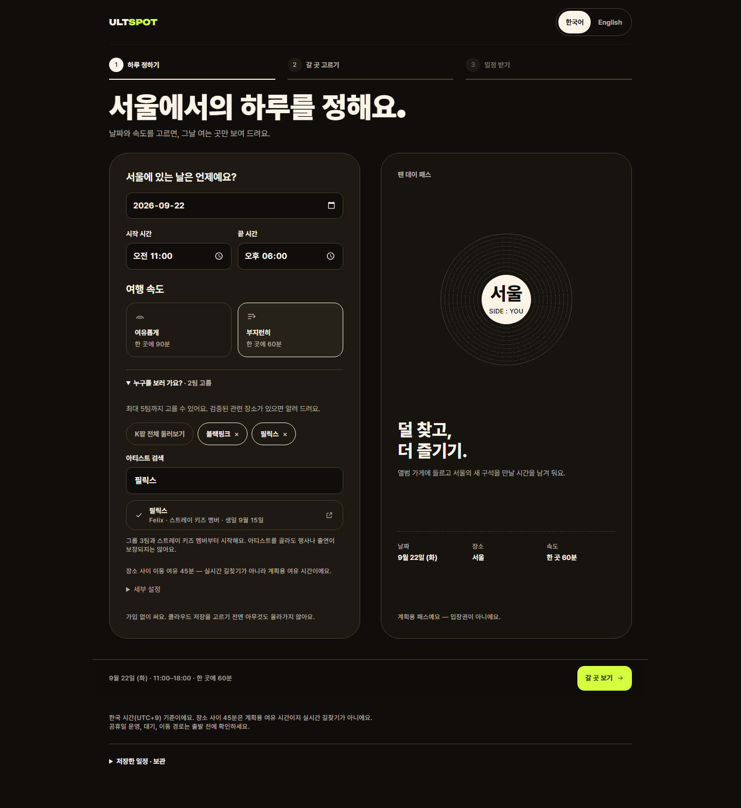 |
| 영어 화면 | 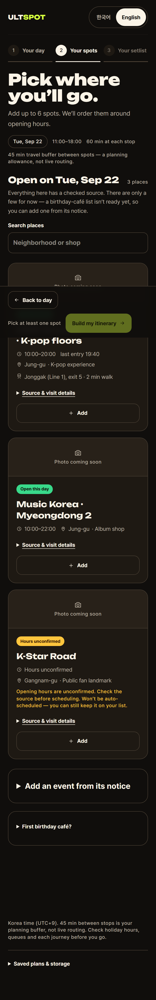 | 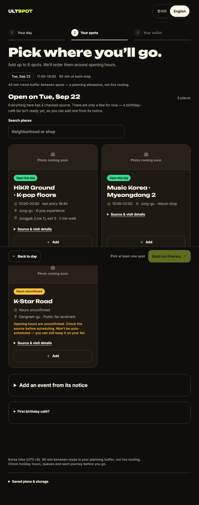 | 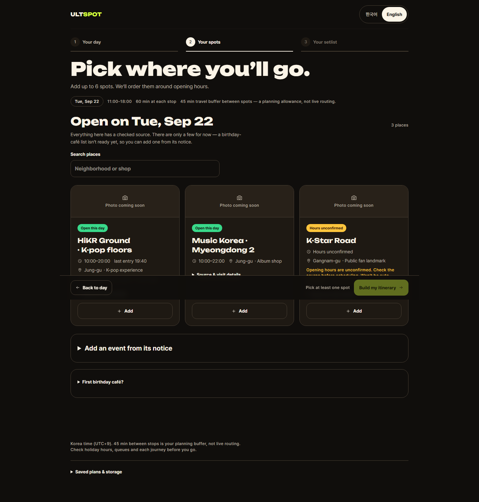 |

## 후속 작업

- 승인된 이미지가 오면 "사진 준비 중" 자리에 연결
- 경로 검증 모듈을 일정 계산에 연결할지 판단
- 검색이 한국어 이름도 찾게 하기
