# T-022 4개 언어 UI와 브라우저 언어 자동 감지

| | |
|---|---|
| 상태 | 완료·배포됨 |
| 브랜치 | `feat/T-022-multilingual` (기준: `design/T-021-korean-data-ui` → 머지 직전 `main`으로 변경) |
| PR | [#30](https://github.com/tlstkdgus/ULTSPOT/pull/30) |
| 기간 | 2026-09-20 |
| 근거 | 사용자 결정(2026-09-20, 외국인 팬이 주 대상) · [경쟁 조사](../T-015/README.md#경쟁-서비스에서-가져온-것) · [제출 요건](../../specs/submission-requirements.md) |

## 목표

외국인 팬이 첫 화면부터 자기 언어로 보게 한다. 한국어·영어·일본어·중국어를 지원하고, 첫 방문은 브라우저 언어로 결정한다.

## 결정

- **접속 즉시 언어 선택 모달을 띄우지 않는다.** 심사자가 핵심 기능에 닿기 전에 단계를 하나 더 만든다. 브라우저가 이미 아는 것을 묻는 셈이기도 하다. 모달은 중단이 필요하거나 포커스를 보호해야 하는 작업에만 쓴다.
- **우선순위는 고른 값(쿠키) → 브라우저 언어(`Accept-Language`) → 한국어.** 한국 심사자는 한국어, 일본 팬은 일본어로 첫 화면을 본다. 한 번 고르면 그 선택이 항상 이긴다.
- **장소 데이터는 번역하지 않는다.** 데이터에는 한국어와 영어만 있다. 일본어·중국어 화면에서는 영어 원문을 보여주고 `lang="en"`을 붙인다. 운영시간·참여 조건은 오역이 곧 잘못된 정보라, UI 문구만 번역했다.
- **언어 선택은 `select`로.** 4개를 칩으로 늘어놓으면 390px에서 두 줄이 되고 터치 영역이 좁아진다.
- **`zh`는 간체 기준**이며 `<html lang="zh-Hans">`로 표기한다. `zh-TW`·`zh-HK` 브라우저도 이 화면으로 보낸다. 번체 화면은 아직 없다.
- **날짜 표기는 `intlLocale` 한 곳에서 정한다.** 첫 캡처에서 일본어 화면에 "Sun, Sep 20"이 나왔다. 화면 언어와 날짜 표기가 어긋나지 않게 한 곳으로 모았다.

## 하지 않은 것

- **장소 이름·설명의 일본어·중국어화** — 데이터에 없다. Codex에 `title_ja` `do_ja` 같은 필드를 요청해야 한다. 지금은 영어 원문이 나간다.
- **번체 중국어(zh-Hant)** — 간체만 만들었다.
- **`/ja`, `/zh` 같은 URL 경로 분리** — 제출 주소를 하나로 유지한다.
- **번역 품질 검수** — 원어민 검수를 받지 않았다. 사실 관계를 바꾸는 문구(운영시간·조건)는 번역 대상에서 제외했지만, 표현은 검토가 필요하다.

## 검증

- E2E **84건 통과**, 3건 skip(클라우드 키 없음). 데이터 13건 통과, typecheck 0, lint 오류 0(경고 94)
- 새로 넣은 검증: 브라우저 언어별 첫 화면(ja·zh·en·fr→한국어 4건), 고른 언어가 브라우저 언어를 이기는지, 새로고침 후 유지
- 캡처 21장. 4개 언어 화면을 직접 열어 확인했다
- 첫 실행에서 시간 초과로 간헐 실패가 나왔다. 새 브라우저 컨텍스트를 여는 테스트라 느린 테스트로 표시하고, `playwright.config.ts`의 테스트 제한을 60초로 올렸다. 단독 실행에서 10초대인 테스트가 병렬 부하에서만 넘기던 문제다
- 프로덕션 검사(2026-09-20, `991efa7` 배포): **84건 통과**, 3건 skip. 브라우저 언어 감지 4건(ja·zh·en·fr)이 프로덕션에서도 통과했다
- 배포 확인: `Accept-Language: ja-JP`로 받은 응답이 `<html lang="ja">`였다. check:prod를 믿기 전에 실제 배포가 갈렸는지 먼저 확인했다 — 과거에 PR 스택이 `main`에 닿지 않아 제출 주소가 옛 화면을 내보낸 적이 있다

## 스크린샷

| 언어 | mobile | tablet | desktop |
|------|--------|--------|---------|
| 한국어(기본) | 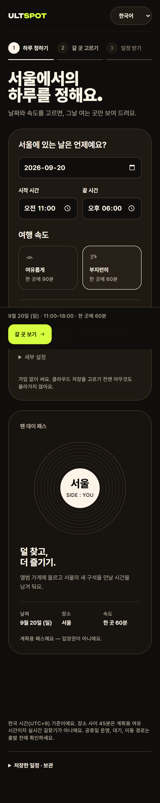 | 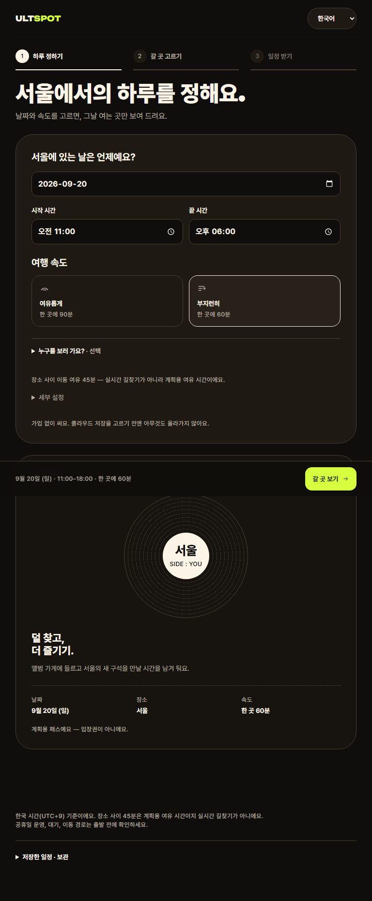 | 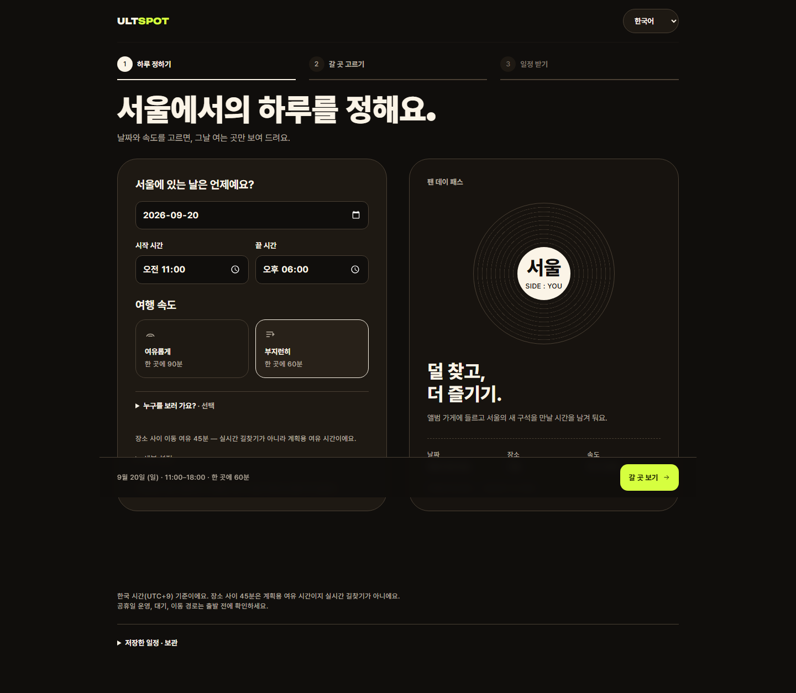 |
| English | 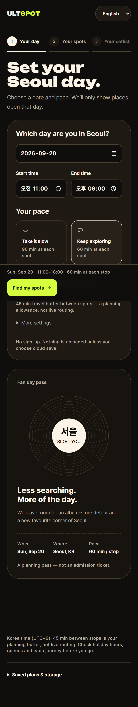 | 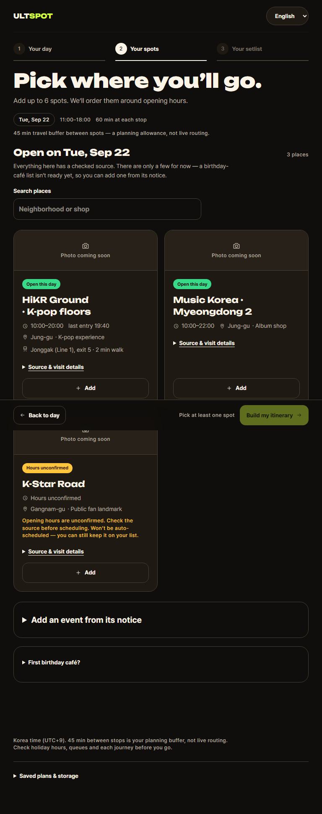 | 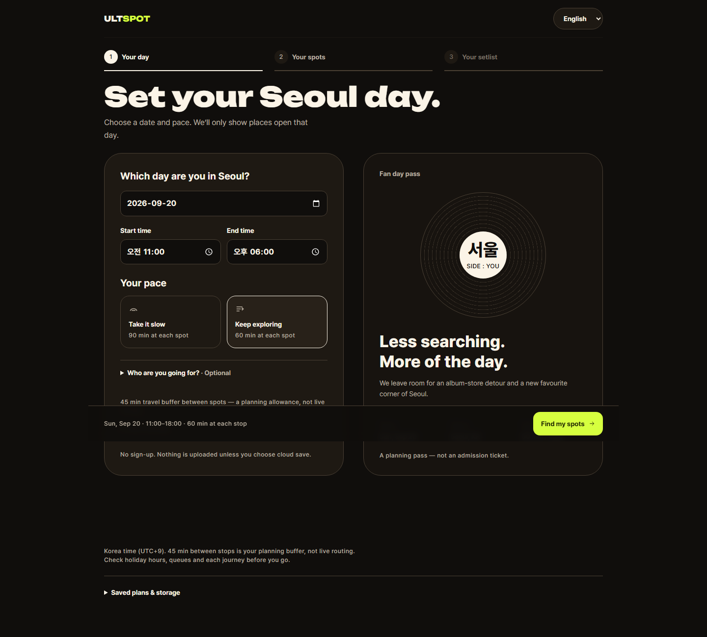 |
| 日本語 | 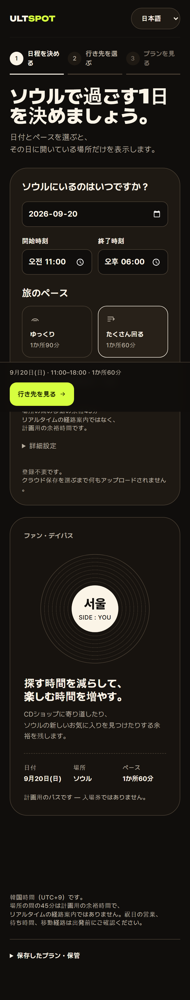 | 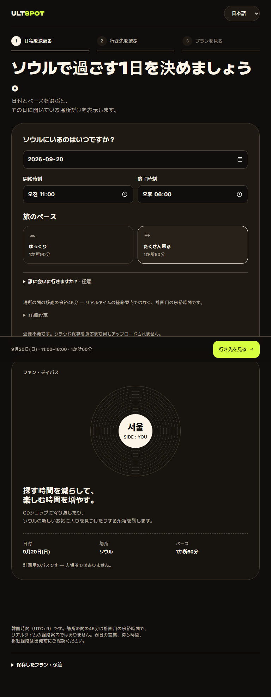 | 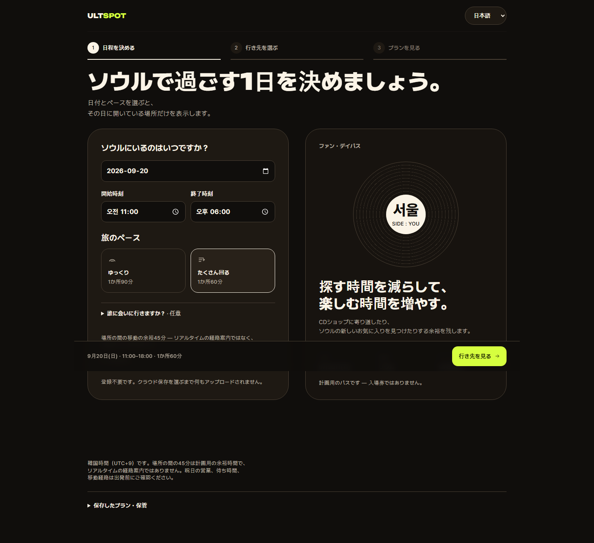 |
| 中文 | 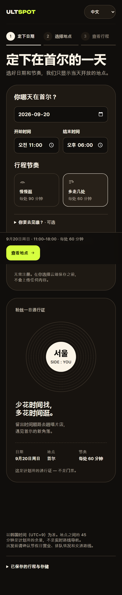 | 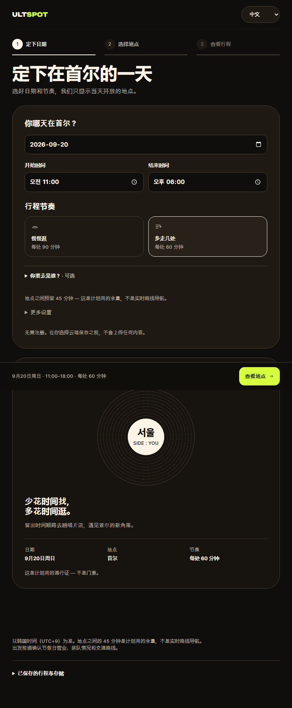 | 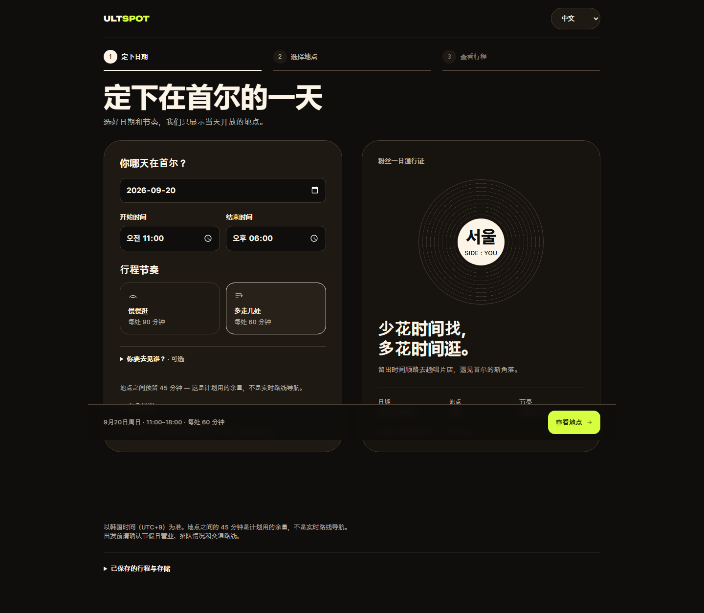 |

## 후속 작업

- Codex에 `title_ja` `title_zh` 등 데이터 필드 요청
- 일본어·중국어 문구 원어민 검수
- 번체 중국어 필요 여부 판단
