# T-026 critique 3회차 수정 — 일본어 화면의 한국어·조판 범위·버려진 번역

| | |
|---|---|
| 상태 | 리뷰 중 |
| 브랜치 | `design/T-026-critique-round3` (기준: `main` = `000e0f3`) |
| PR | 아래 참고 |
| 기간 | 2026-09-20 |
| 근거 | critique 3회차(`.impeccable/critique/2026-09-20T07-43-08Z__src-components-trip-planner-tsx.md`, 26/40) · 사용자 결정(2026-09-20, P0·P1·P2 전부) |

## 목표

critique 3회차에서 나온 P0 2건·P1 1건·P2 3건을 고친다. 1·2회차는 한국어 화면만 봤고, 이번에 일본어·중국어를 보자 점수가 29 → 26으로 내려갔다. 늘어난 평가 면적이 가장 덜 다듬어진 곳이었다.

## 결정

- **일본어 사전의 한글은 CI로 막는다.** `1か所以上선택してください`가 배포까지 나갔다. 주 버튼을 풀려면 뭘 해야 하는지 알려주는 문장인데, 그 3분의 1이 방문자가 읽을 수 없는 문자였다. 고치는 것만으로는 재발을 막지 못해 `e2e/i18n-guard.spec.ts`를 넣었다. 되돌려 넣어 실제로 잡는지 확인했다(`spots.pickFirst`를 정확히 지목).
- **조판 규칙은 언어별로 가르고, `@layer` 밖에 둔다.** `word-break: keep-all`은 한국어에 맞지만 일본어에 걸면 띄어쓰기 없는 문장 전체가 끊을 수 없는 덩어리가 되어 "K-POP"이 이름 중간에서 쪼개졌다. 글꼴도 한국어 목록을 전역에 두는 바람에 가나·한자가 한국어 자형으로 떨어졌다.
  레이어 밖에 두는 것이 핵심이다. `@layer base`에 적었더니 Tailwind의 `font-sans`(utilities 레이어)에 명시도와 무관하게 져서, 일본어 주 버튼만 Malgun Gothic으로 그려졌다.
- **일본어·중국어는 그 언어 글꼴을 Pretendard보다 앞에 둔다.** 뒤에 두면 Pretendard가 가진 한자만 가져가서 한 단어 안에서 서체가 갈린다(`行程节奏`의 앞뒤 굵기가 달랐다). 라틴까지 그 언어 글꼴로 넘어가지만 브랜드 라틴은 제목의 Unbounded가 맡는다.
- **분류 라벨은 번역한다.** `t.kinds`는 우리가 만든 라벨이지 수집한 원문이 아니라, 오역 위험 논리가 적용되지 않는다. 한국어에만 걸어둔 탓에 일본어·중국어 번역이 있는데도 화면에 닿지 않았다. 바로 위 상태 배지는 이미 번역돼 나가서 같은 카드가 자기모순이었다.
- **영어 원문에 이유를 적는다.** 정직함이 `lang="en"`과 코드 주석에만 있었다. 사용자 자리에서는 "오역을 피하려고 남긴 영어"와 "시간이 없어서 못 한 번역"이 똑같이 보인다. 영어 화면과 개인 행사에는 띄우지 않는다 — 설명할 것이 없다.
- **비활성은 투명도가 아니라 색으로.** 1단계 주 버튼은 장소를 고르기 전까지 비활성이 "기본" 상태다. `opacity-40`이면 3.4:1로 고장 난 버튼처럼 읽힌다. WCAG는 비활성을 면제하지만 그건 예외 상태를 전제한 규정이다. 별도 색으로 7.34:1을 준다.
- **일본어 단계 라벨은 명사로.** 동사까지 붙은 6글자가 390px 3분할에 안 들어가 마지막 한 글자만 다음 줄로 떨어졌다. 영어(`Your day`)·중국어(4글자)와 같은 밀도로 맞췄다.
- **`@theme inline` 안에는 주석을 넣지 않는다.** 넣었더니 theme 파싱이 통째로 깨져 색 토큰 104개가 전부 빈 값이 됐다. `tokens.spec.ts`가 잡았다.

## 하지 않은 것

- **아티스트 태깅** — 카탈로그에 `artistIds`가 0개라 어떤 아티스트를 골라도 100% 실패한다. `src/lib/trip/catalog.ts`가 Codex 범위라 직접 못 고친다. 사용자 결정(2026-09-20)에 따라 UI 우회(접힌 제목을 "준비 중"으로) 대신 **Codex 요청만** 남긴다. 그때까지 심사자가 이 기능을 열면 여전히 실망한다 — 알고 남기는 위험이다.
- **단계 레일의 비활성 대비** — 3단계 라벨이 4.09:1이다. WCAG가 면제하고, 여기서는 "아직 못 간다"는 신호가 실제로 필요하다. 주 버튼과 달리 예외 상태가 맞다.
- **토스트와 고정 바 겹침** — critique가 측정에서 추론한 항목이고 직접 관찰되지 않았다. 재현을 확인하지 못해 남긴다.
- **번체 중국어·주소 한국어화·경로 공유** — 범위 밖이거나 데이터가 없다.

## 검증

- E2E **108건 통과**, 3건 skip(클라우드 키 없음). 이전 96건에서 12건 늘었다(i18n 가드 4 + 조판 감사 4, 3개 뷰포트 중 일부)
- 데이터 **13건 통과**, typecheck 오류 **0**, lint 오류 **0**(경고 94, 기존)
- **가드가 실제로 잡는지 확인했다.** 한글 문자열을 되돌려 넣자 `spots.pickFirst`를 지목하며 실패했다. 통과하는 테스트만으로는 아무것도 증명되지 않는다
- **글꼴 혼용 실측**(CDP `getPlatformFontsForNode`, 4개 언어 × 2화면):
  - 고치기 전 — ja 주 버튼 `行き先を見る` = Malgun Gothic 3자 + Pretendard 3자
  - 고친 뒤 — ko/en: Unbounded + Pretendard · ja: Unbounded + Yu Gothic + Pretendard · zh: Unbounded + Microsoft YaHei + Pretendard. **한 요소 안에서 어족이 섞이는 곳 0건**
- 캡처 21장을 직접 열어 확인. 일본어 단계 라벨이 한 줄에 들어가고, 중국어 `行程节奏`의 굵기가 균일하다
- 프로덕션 검사: 머지 후 실행

### 검증 중 겪은 것

측정 도구를 두 번 믿었다가 두 번 틀렸다. 남겨둔다.

1. 임시 서버를 **3100 포트**에 띄웠는데 그게 Playwright의 기본 포트였다(`E2E_PORT ?? 3100`). `reuseExistingServer`가 내 깨진 서버를 물어서 "웹폰트가 하나도 안 실린다", "색 토큰 104개가 전부 빈 값"이라는 가짜 결과가 나왔다. 앱은 내내 멀쩡했다.
2. `document.fonts`로 건 유효성 검사가 0을 돌려줬는데 CDP는 Pretendard를 보고 있었다. 실제로 그려진 글꼴을 보는 CDP 쪽이 맞다.

빌드 산출물(`.next/static/chunks/*.css`)에서 규칙이 실제로 들어갔는지 확인하고 나서야 방향이 잡혔다.

## 스크린샷

| 언어 | mobile | tablet | desktop |
|------|--------|--------|---------|
| 한국어 | 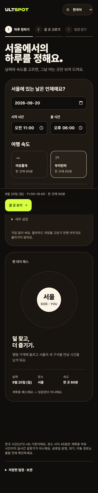 | 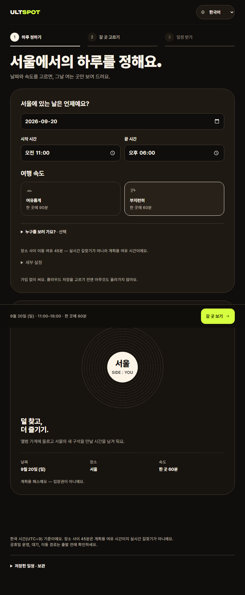 | 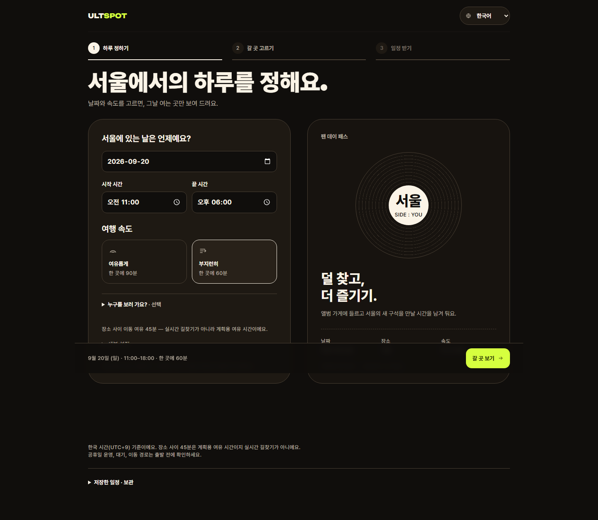 |
| English | 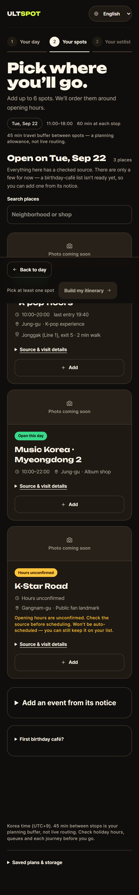 | 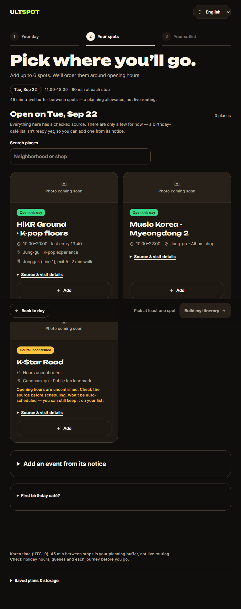 | 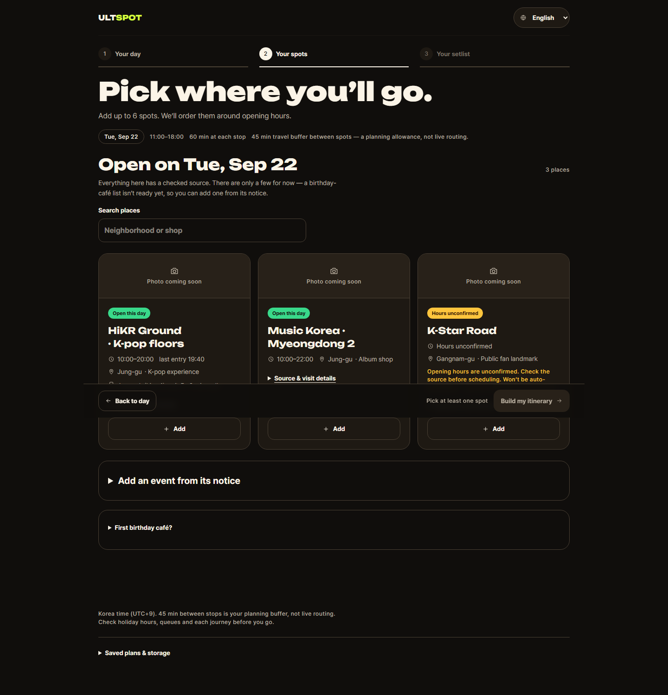 |
| 日本語 | 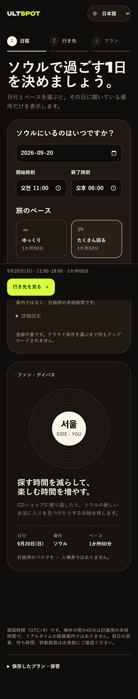 | 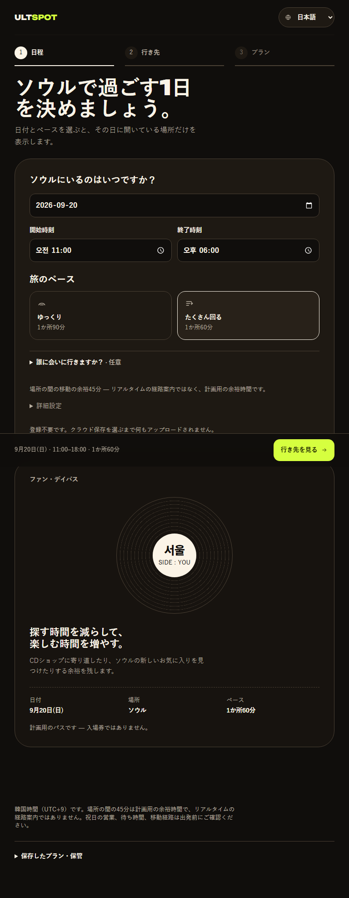 | 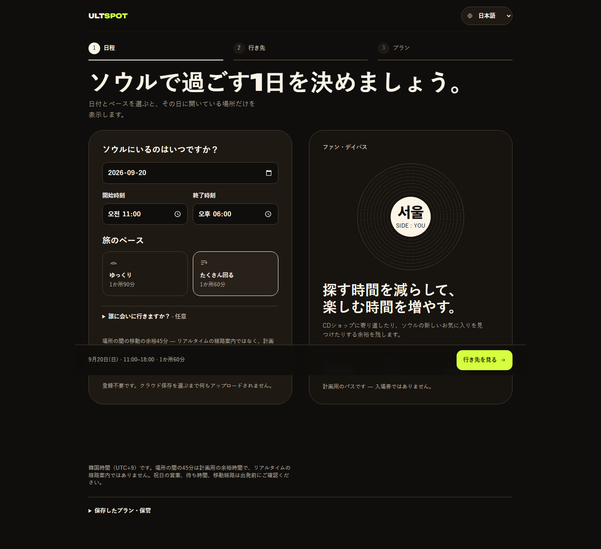 |
| 中文 | 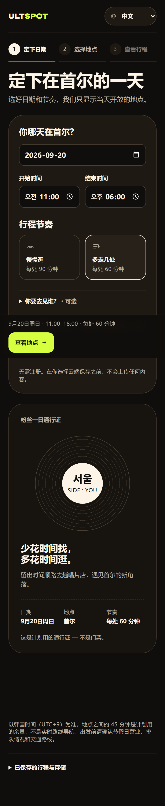 | 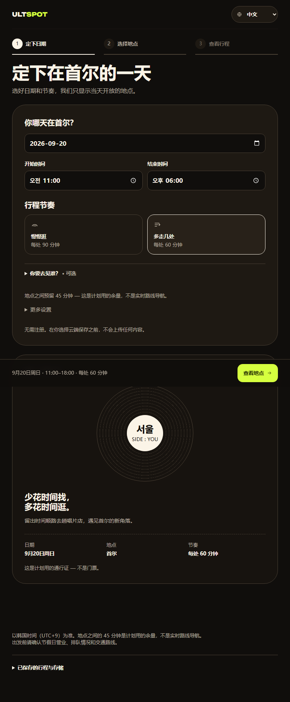 | 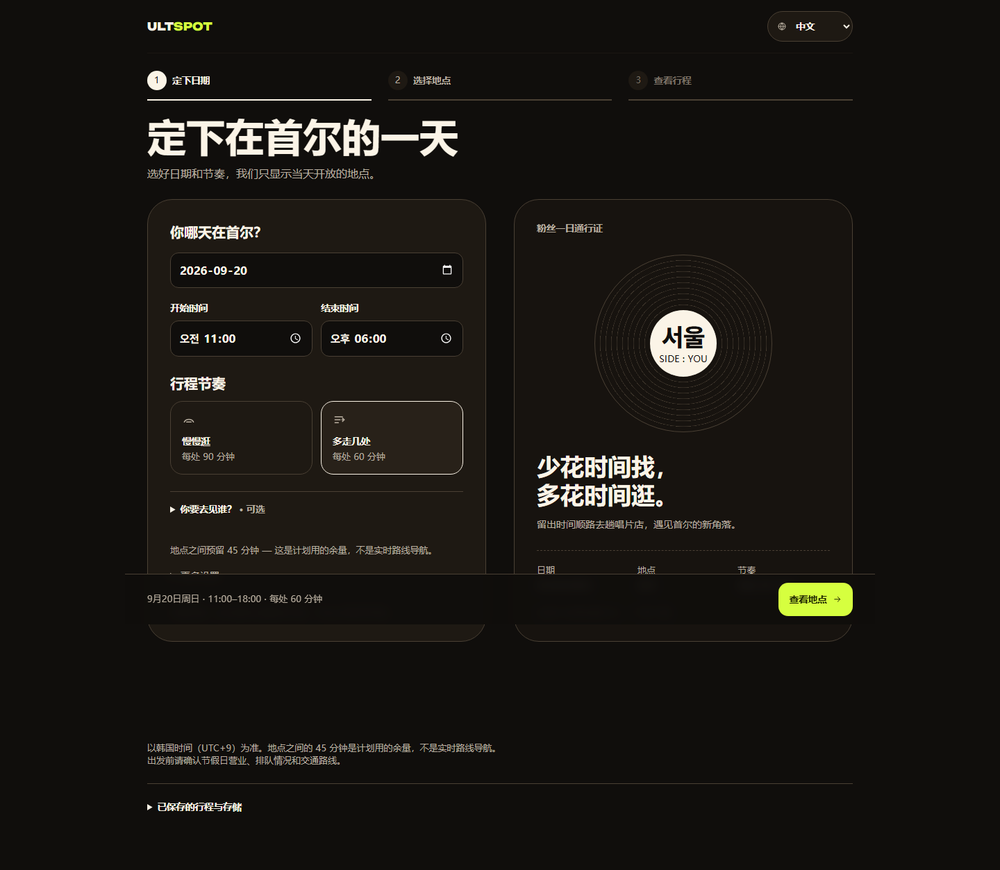 |

## 후속 작업

- Codex에 아티스트 태깅 요청 추가([T-025](../T-025/README.md) 요청서에 붙인다)
- 머지 후 `pnpm check:prod` 및 프로덕션에서 글꼴 혼용 재측정
- critique 4회차는 아티스트 태깅이 들어온 뒤가 의미 있다
