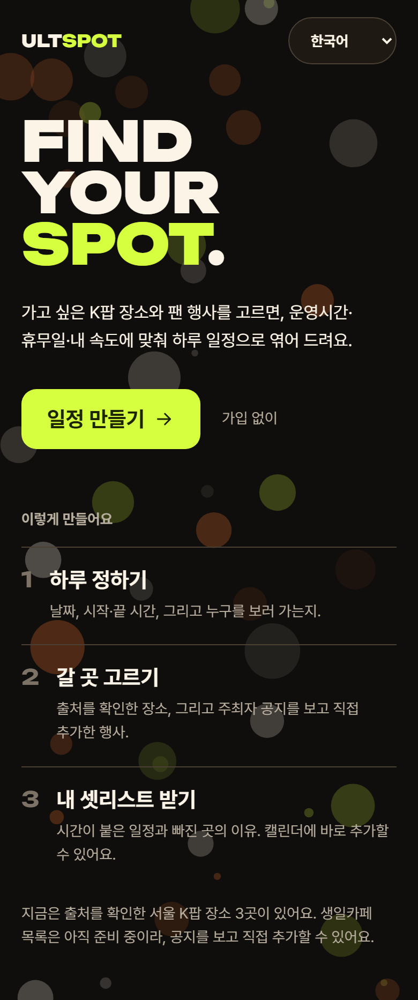
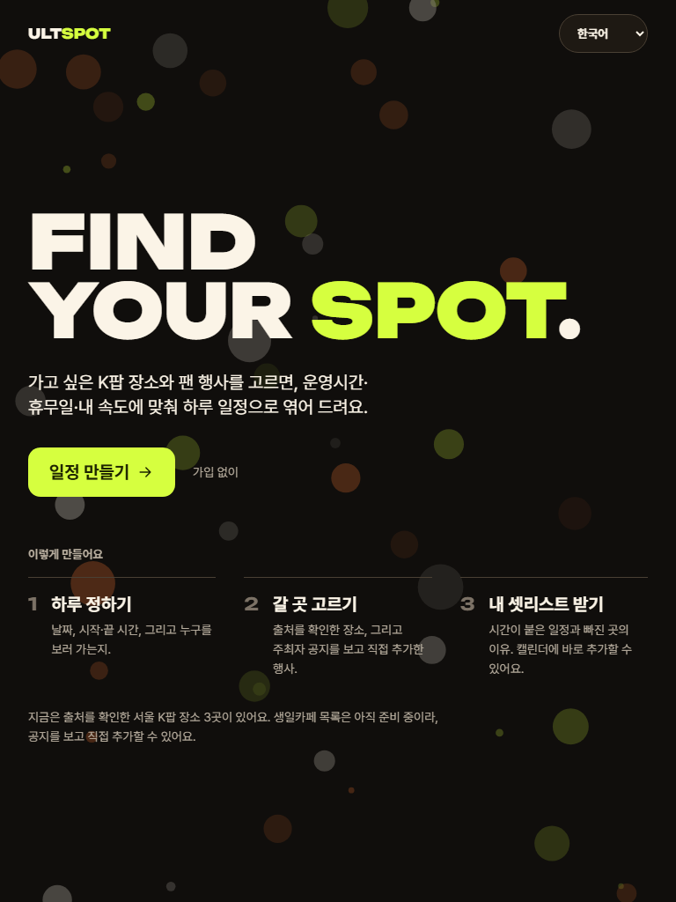
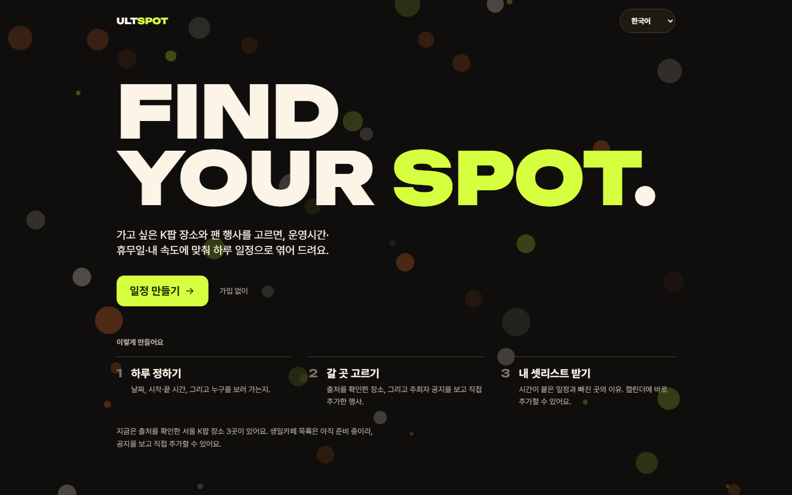
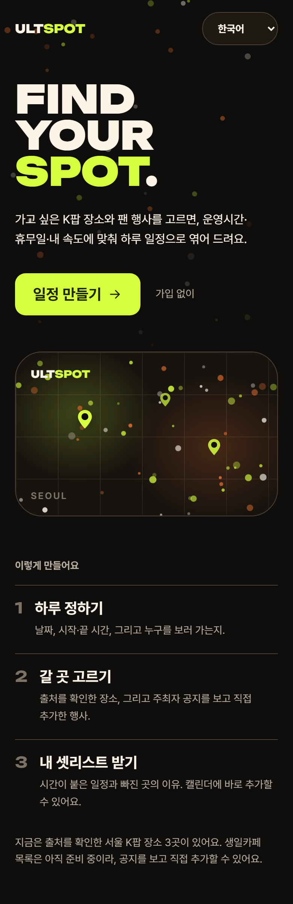
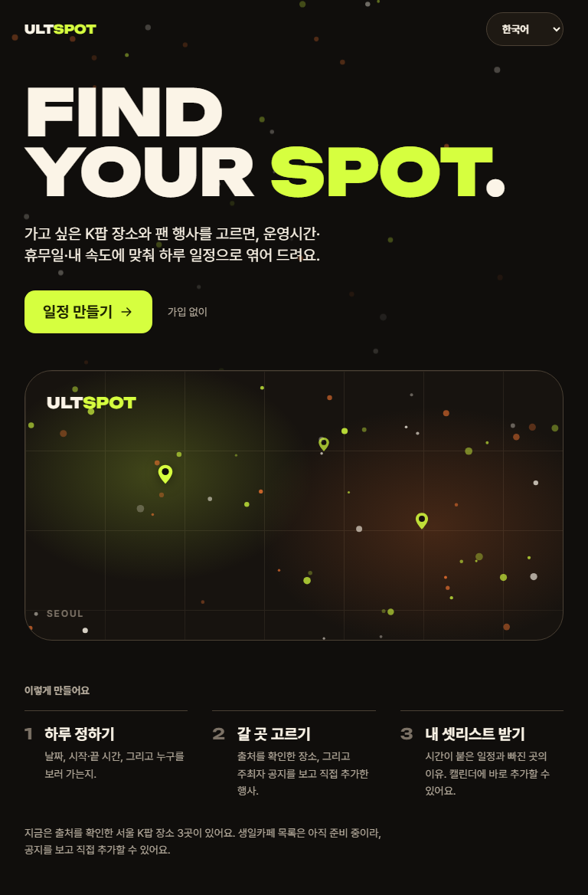
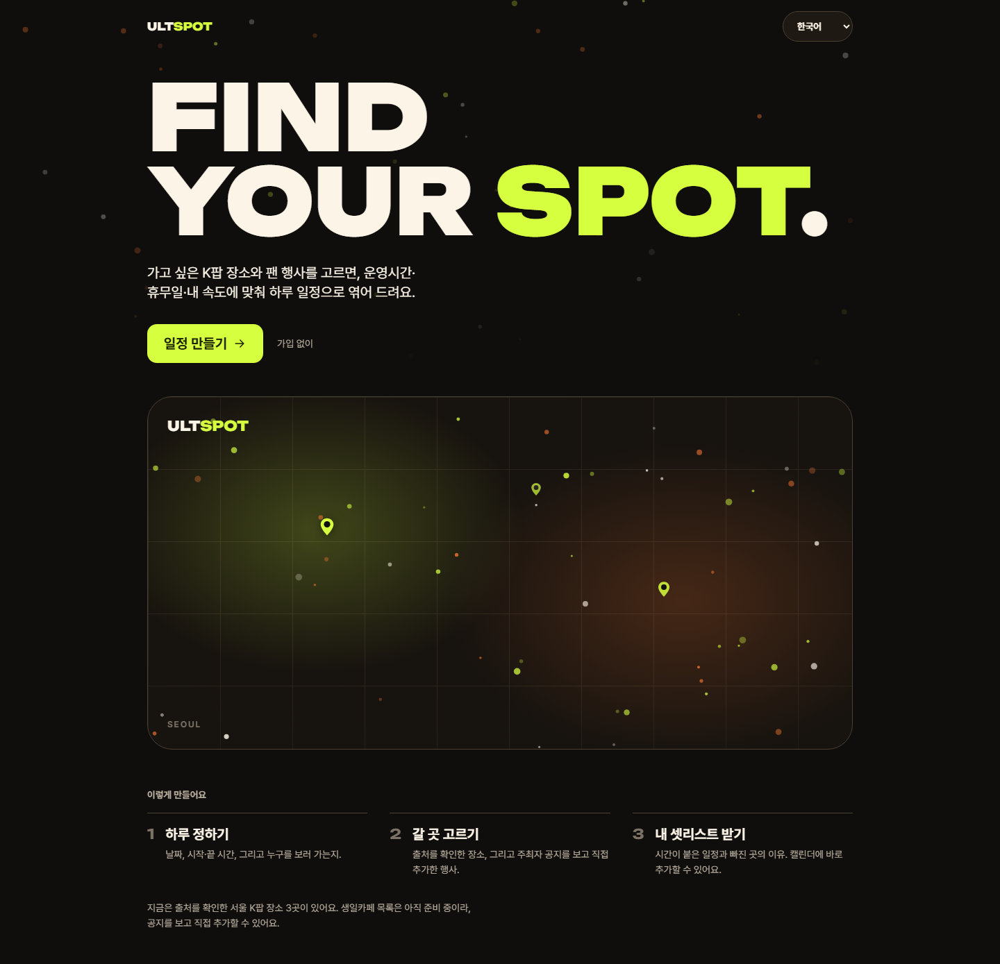

# T-032 기준 목업에 맞춘 홈 비주얼 정렬

| | |
|---|---|
| 상태 | 리뷰 중 |
| 브랜치 | `design/T-032-visual-alignment` (기준: `feat/T-029-full-ux`) |
| PR | 아래 참고 |
| 기간 | 2026-09-20 |
| 근거 | [Claude 비주얼 인계](../../handoff/claude-visual.md) · 기준 목업 `ULTSPOT UX Flow_files/saved_resource.html` · [디자인 시스템](../../design-system.md) |

## 목표

기준 목업의 첫인상을 홈에 옮긴다. 기능은 Kiro 담당이라 동작을 바꾸지 않는다.

## 결정

- **지도 배너를 넣되, 지도가 아니라 브랜드 모티프로 만든다.** 목업의 홈은 지도 배너로 "서울 곳곳에 스팟이 흩어져 있다"를 먼저 말한다. 그런데 목업의 지역 이름(홍대·성수·강남·건대)과 핀별 개수(12·7·9·4), `32 VERIFIED SPOTS`는 목업이 스스로 예시라고 적은 값이다. 검증된 장소는 3곳이고, 같은 화면 아래 정직 문구가 그걸 말한다. 배너가 지역과 개수를 그리면 한 화면이 자기모순이 된다.
  그래서 격자와 글로우는 장식으로, 핀은 라벨·개수 없는 [The Spot Motif](../../design-system.md)로 뒀다. 특정 장소를 가리키지 않는다.
- **번호가 T-030이 아니라 T-032다.** 인계 문서는 T-030을 제안했지만 `fix/T-030-english-fallback`이 이미 있었고 로컬에 `t031` 작업 폴더가 있었다. 번호를 미리 적었다가 어긋난 전례가 있어 원격을 먼저 확인했다.
- **입자를 줄였다.** 반지름이 26px까지 가고 불투명도가 0.5여서 라임·오렌지가 배경색에 섞여 얼룩처럼 보였다. 작업 전 캡처에서 "일정으로 엮어" 위에 라임 점이 얹혀 글자를 가리는 것을 확인했다. 반지름 4.5px·불투명도 0.45로 낮추고 위쪽 62vh로 좁혔으며, 밀도는 배너 안에 모았다.
- **`SEOUL` 라벨은 사전에 넣지 않았다.** 워드마크의 `ULTSPOT`, 목업의 `FAN TRAVEL FOOTPRINT`와 같은 브랜드 표기 층위라 번역 대상이 아니다.

## 하지 않은 것

- **문구 변경 일체** — `가입 없이` 배지는 기준 브랜치(`feat/T-029-full-ux`)에 아직 남아 있다. `main`의 #38(T-031)이 이미 지웠으므로 여기서 또 지우면 합칠 때 충돌만 난다. `src/i18n/**`은 Kiro 담당이기도 하다.
- **목업의 예시 값** — 가짜 장소(현진 아이스케이브 카페 등), 수치(32곳·+80P·8.4km·₩186,000), 후기(재이·민아)를 화면에 넣지 않았다.
- **`/plan` 4단계 화면** — Kiro 담당 파일이라 손대지 않았다. 이번은 홈과 브랜드 컴포넌트만이다.
- **정직 상태 표현 변경** — "사진 준비 중", 이동시간·운영시간 미확인, 카테고리 0건 표시는 건드리지 않았다.

## 검증

- E2E **165건 통과**, 3건 skip(클라우드 키 없음). typecheck 오류 **0**, lint 오류 **0**
- 캡처 3개 뷰포트를 직접 열어 확인했다. 작업 전 캡처는 `screenshots/before/`
- `e2e/tokens.spec.ts` 통과 — 토큰은 바꾸지 않았다
- `e2e/smoke.spec.ts` 통과 — 390px 가로 스크롤 없음

## 스크린샷

| | mobile | tablet | desktop |
|---|---|---|---|
| 작업 전 |  |  |  |
| 작업 후 |  |  |  |

## 후속 작업

- `/plan` 4단계 화면의 비주얼 정렬(스팟 카드·Day 탭·카테고리 필터) — Kiro의 T-029가 `main`에 들어간 뒤
- design-system 페이지에 `MapBanner` 추가
