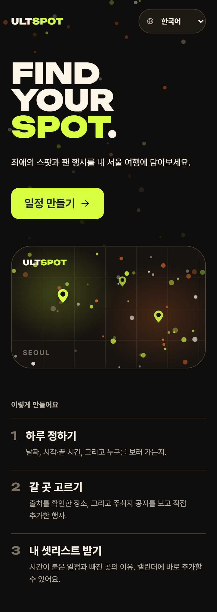
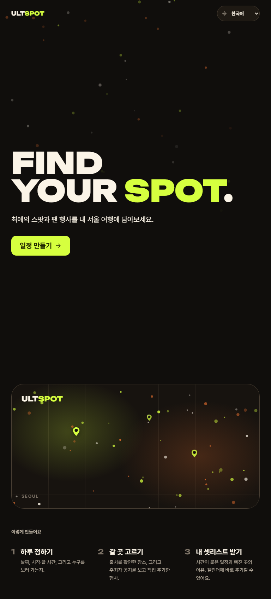
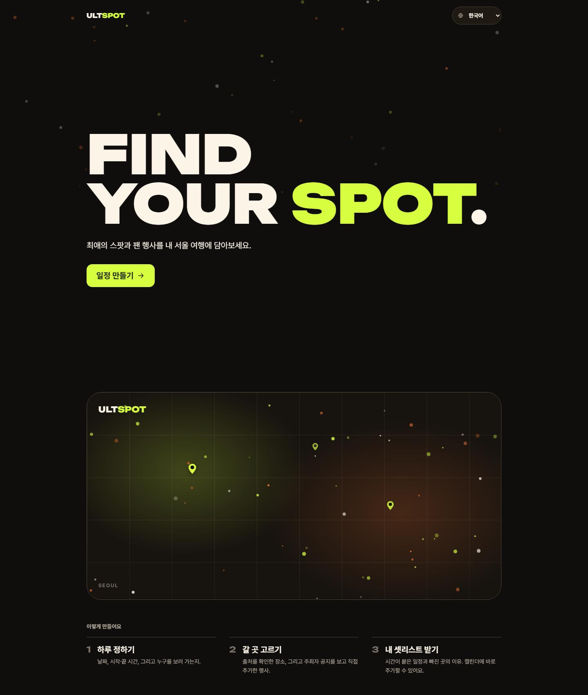

# T-033 첫 화면 구도 정리와 제출용 16:9 이미지

| | |
|---|---|
| 상태 | 리뷰 중 |
| 브랜치 | `design/T-033-visual-polish` (기준: `main`) |
| PR | 아래 참고 |
| 기간 | 2026-09-20 |
| 근거 | 사용자 지적(2026-09-20, "지도가 보이는 게 애매하다") · [Claude 비주얼 인계](../../handoff/claude-visual.md) · 기준 목업 |

## 목표

제출용 16:9 이미지를 만들고, 그 과정에서 드러난 첫 화면 구도 문제를 고친다.

## 결정

- **첫 화면은 슬로건·설명·시작 버튼까지만.** 16:9로 찍으니 지도 배너가 화면 하단에 반쯤 걸려 잘렸다. 의도한 구도가 아니라 사고처럼 보인다. 배너는 스크롤 뒤에 나오는 것이 목업 구성과도 맞는다.
- **커버를 잘라내는 방식은 버렸다.** 뷰포트를 길게 잡고 위쪽 16:9만 자르면 히어로가 아래로 치우쳐 CTA가 잘린다. 레이아웃을 고치는 쪽이 맞았고 실제 화면도 같이 좋아진다.
- **`flex-1`으로는 안 된다.** 페이지 전체가 이미 뷰포트보다 길어 나눠 줄 여유 공간이 없다. 히어로 블록에 `md:min-h-[calc(100dvh-4rem)]`로 높이를 명시했다(4rem은 헤더 높이). **모바일에는 걸지 않았다** — 390px에서는 히어로가 이미 화면을 채워서 높이를 강제하면 빈 공간만 생긴다.
- **제출 이미지는 실제 화면만 찍는다.** 따로 그린 포스터가 아니다. 심사자가 여는 화면과 제출 이미지가 어긋나면 그게 더 나쁘다. 흐름 5장은 실제로 버튼을 눌러 나온 상태다.
- **1920×1080을 뷰포트로 직접 잡지 않는다.** 본문이 shell(최대 1080px)에 갇혀 좌우가 크게 빈다. 1280×720 뷰포트 × 배율 1.5로 같은 크기를 만든다.

## 하지 않은 것

- **Kiro 담당 화면의 비주얼** — `spot-card.tsx`·`favorite-step.tsx`는 범위 밖이다. 대신 `PhotoPlaceholder`·`Avatar` 프리미티브를 만들어 [claude-visual.md](../../handoff/claude-visual.md#claude--kiro-요청)에 교체 요청을 남겼다(T-032).
- **발표자료용·다국어 증빙 이미지** — 대표 이미지와 흐름만 요청받았다.
- **목업의 예시 값** — 가짜 장소·수치·후기를 넣지 않았다.

## 검증

- E2E **213건 통과**, 3건 skip(클라우드 키 없음). typecheck 오류 **0**, lint 오류 **0**(경고 94, 기존)
- 제출 이미지 **7장이 모두 1920×1080 · 비율 1.778**인 것을 PNG 헤더에서 직접 확인했다
- 홈 3개 뷰포트를 직접 열어 모바일에 빈 공간이 생기지 않은 것을 확인했다
- 흐름 마지막 장이 실제 일정까지 갔고 "이동시간 미확인 · 계획용 여유 45분"이 그대로 보이는 것을 확인했다

## 제출 이미지

`docs/submission/` — `cover-home` · `cover-plan` · `flow-1-favorite` · `flow-2-spots` · `flow-2-spots-picked` · `flow-3-period` · `flow-4-itinerary`

다시 찍으려면 `pnpm exec playwright test e2e/cover.spec.ts --project=desktop`.

## 스크린샷

| | mobile | tablet | desktop |
|---|---|---|---|
| 홈 |  |  |  |
