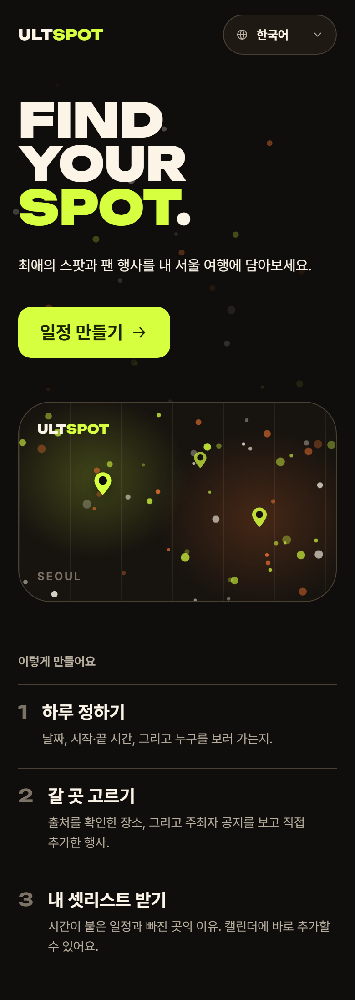
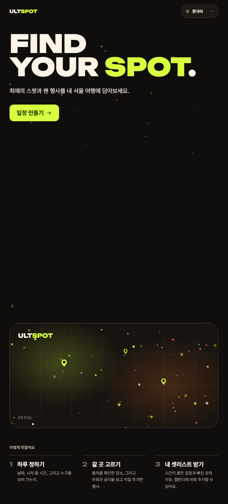
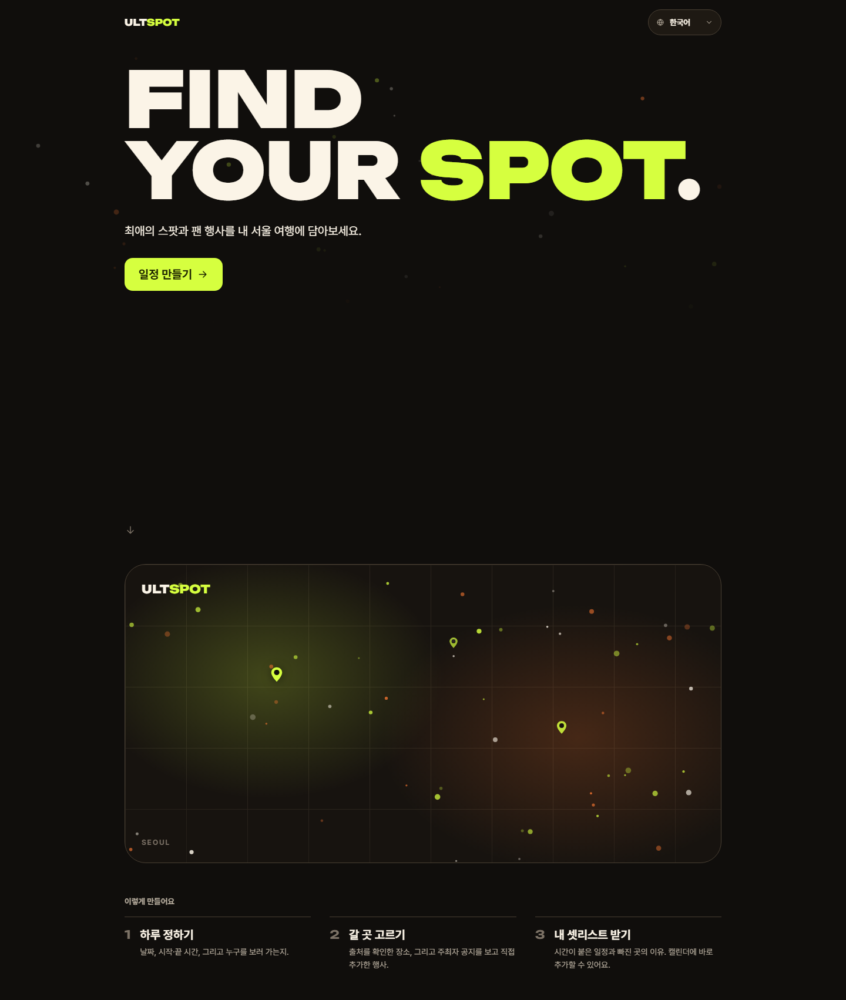
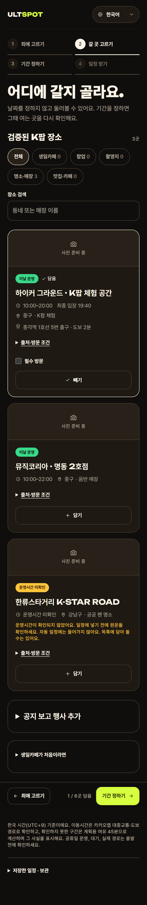
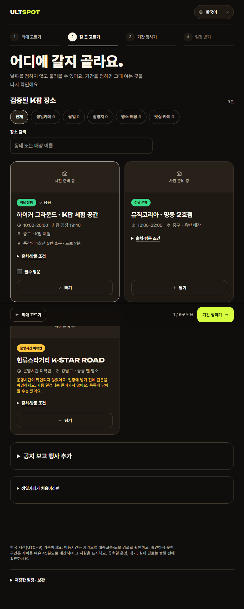
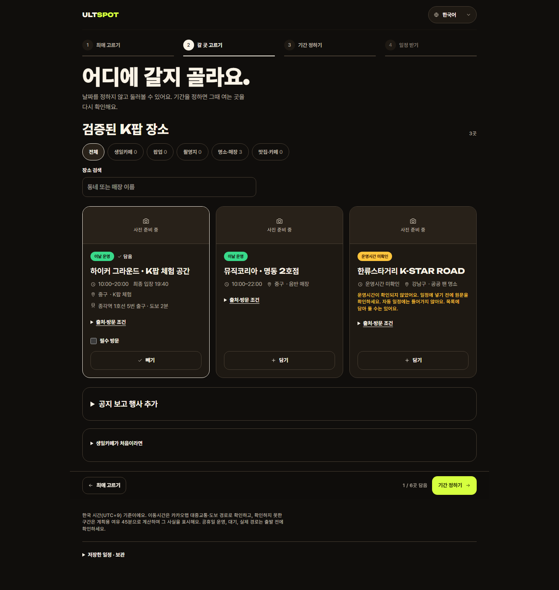

# T-034 critique 4회차 수정 — 정하지 않은 날짜 단언·한글 누수·언어 선택 여백

| | |
|---|---|
| 상태 | 리뷰 중 |
| 브랜치 | `fix/T-034-round4` (기준: `main`) |
| PR | 아래 참고 |
| 기간 | 2026-09-20 |
| 근거 | critique 4회차(`.impeccable/critique/2026-09-20T13-01-03Z__…`, 28/40) · 사용자 결정(2026-09-20, P0 + Claude 몫 둘 / 아티스트 1단계는 유지) |

## 결정

- **2단계에서 날짜를 모든 문구에서 뺐다.** 2단계는 날짜로 거르지 않는데 제목·배너·빈 상태가 기본 날짜를 사실처럼 단언했다. 사용자가 주지 않은 날짜에 대한 검증 안 된 단언은 지어낸 운영시간과 같은 부류다.
- **가드 테스트의 예외를 지웠다.** 3회차에서 `artists.placeholder`의 한글을 "검색 예시라 의도된 것"으로 풀어줬다가 4회차에서 같은 자리가 다시 잡혔다. 문자열 하나를 고치고 규칙을 안 세운 게 실수였다. 예시는 라틴 이름(Felix)으로 바꿨다.
- **언어 선택 화살표를 직접 그린다.** 브라우저 기본 화살표는 테두리에 붙어 여백을 줄 수 없다.
- **스크롤 단서는 배너 노출 대신 화살표.** critique는 배너를 살짝 보이게 하자고 했지만, 그러면 대표 이미지에 지도가 다시 들어온다(사용자가 명시적으로 뺀 것). 대안으로 히어로 아래에 아래 화살표를 둔다.

## 하지 않은 것

- **카드의 "이날 운영" 배지** — `SpotCard`의 계약(`spotStatus(event, date)`)을 바꿔야 해서 Kiro 요청으로 남겼다. P0의 나머지 절반이다.
- **아티스트 1단계** — 두 회차 연속 P1이지만 사용자 결정으로 그대로 둔다.
- **추천 패널의 영어 프롬프트·`lang="ko"` 하드코딩** — `suggestion-panel.tsx`는 Kiro 담당이고 이번 범위에서 빠졌다.
- **홈 3단계 안내** — `home.how`가 옛 3단계·날짜 우선을 설명한다(4회차 P2). 이번 범위에서 빠졌다.

## 검증

- E2E **213건 통과**, 3건 skip. typecheck 0, lint 오류 0
- 가드 예외를 지운 채 통과 — ja/zh 사전에 한글이 실제로 없다
- 캡처 3개 뷰포트·대표 이미지 7장 직접 확인

## 스크린샷

| | mobile | tablet | desktop |
|---|---|---|---|
| 홈 |  |  |  |
| 갈 곳 고르기 |  |  |  |
